# Blackdot - Dotfiles Management Framework

[](https://github.com/blackwell-systems)
[](https://pkg.go.dev/github.com/blackwell-systems/blackdot)
[](https://go.dev/)
[](https://www.zsh.org/)
[](https://docs.microsoft.com/powershell/)
[](https://github.com/blackwell-systems/blackdot/releases)

[](https://github.com/blackwell-systems/blackdot)
[](https://claude.ai/claude-code)
[](https://github.com/blackwell-systems/dotclaude)
[](https://github.com/blackwell-systems/blackdot#vault--secrets)

[](https://github.com/blackwell-systems/blackdot/actions)
[](LICENSE)
[](https://buymeacoffee.com/blackwellsystems)

> A dotfiles management framework built on **Feature Registry** (modular control plane), **Configuration Layers** (multi-machine settings), and **Claude Code Integration** (portable AI-assisted development). Designed for developers who work across machines. Everything is optional except shell config.

[Changelog](CHANGELOG.md) | [Full Documentation](docs/README-FULL.md)

---

## One-Line Install

Choose your install level:

**macOS / Linux / WSL:**
```bash
curl -fsSL https://raw.githubusercontent.com/blackwell-systems/blackdot/main/install.sh | bash
```

**Windows (PowerShell):**
```powershell
irm https://raw.githubusercontent.com/blackwell-systems/blackdot/main/install-windows.ps1 | iex
```

**Options:**
```bash
# Minimal: Just shell config (skip packages, vault, Claude, /workspace)
curl -fsSL https://raw.githubusercontent.com/blackwell-systems/blackdot/main/install.sh | bash -s -- --minimal

# Custom workspace: Install to ~/code instead of ~/workspace
WORKSPACE_TARGET=~/code curl -fsSL https://raw.githubusercontent.com/blackwell-systems/blackdot/main/install.sh | bash
```

### What "Full Install" Does

**For users with existing credentials (SSH keys, AWS config, Git config):**

```console
$ curl -fsSL ... | bash

    ____  __    ___   ________ ____  ____  ______
   / __ )/ /   /   | / ____/ //_/ / / / / / / __ \______
  / __  / /   / /| |/ /   / ,<  / / / / / / / / // __  /
 / /_/ / /___/ ___ / /___/ /| |/ /_/ / /_/ / /_/ // /_/ /
/_____/_____/_/  |_\____/_/ |_|\____/\____/\____/ \____/

              Setup Wizard

Current Status:
───────────────
  [ ] Workspace  (Workspace directory)
  [ ] Symlinks   (Shell config linked)
  [ ] Packages   (Homebrew packages)
  [ ] Vault      (Vault backend)
  [ ] Secrets    (SSH keys, AWS, Git)
  [ ] Claude     (Claude Code integration)
  [ ] Templates  (Machine-specific configs)

═══════════════════════════════════════════════════════════════
                    Setup Wizard Overview
═══════════════════════════════════════════════════════════════

This wizard will guide you through 7 steps:

  1. Workspace    - Configure workspace directory
     Default: ~/workspace (target for /workspace symlink)

  2. Symlinks     - Link shell config files
     Zsh: ~/.zshrc, ~/.p10k.zsh | PowerShell: profile auto-import

  3. Packages     - Install Homebrew packages
     Choose: minimal (18) | enhanced (43) | full (61)

  4. Vault        - Configure secret backend
     Bitwarden, 1Password, or pass

  5. Secrets      - Manage SSH keys, AWS, Git config
     Auto-discover and sync to vault

  6. Claude Code  - AI assistant integration
     Optional: dotclaude + portable sessions

  7. Templates    - Machine-specific configs
     Optional: work vs personal configs

✓ Safe to exit anytime - Progress is saved automatically
✓ Resume anytime - Just run 'blackdot setup' again

═══════════════════════════════════════════════════════════════

╔═══════════════════════════════════════════════════════════════╗
║ Step 3 of 7: Packages
╠═══════════════════════════════════════════════════════════════╣
║ ████████░░░░░░░░░░░░ 43%
╚═══════════════════════════════════════════════════════════════╝

Which package tier would you like?

  1) minimal    18 packages (~2 min)   # Essentials only
  2) enhanced   43 packages (~5 min)   # Modern tools ← RECOMMENDED
  3) full       61 packages (~10 min)  # Everything (Docker, etc.)

Your choice [2]: 2

→ Installing fzf... (1/43)
→ Installing ripgrep... (2/43)
...
✓ Packages installed successfully (enhanced tier)

╔═══════════════════════════════════════════════════════════════╗
║ Step 5 of 7: Secrets Management
╠═══════════════════════════════════════════════════════════════╣
║ ██████████████░░░░░░ 71%
╚═══════════════════════════════════════════════════════════════╝

Scanning secrets...

Secrets Status:
  Local only (not in vault):
    • SSH-GitHub-Personal → ~/.ssh/id_ed25519_personal
    • AWS-Config → ~/.aws/config
    • Git-Config → ~/.gitconfig

Found 3 local secret(s) not in vault.
Push these to bitwarden so you can restore on other machines.

Push local secrets to vault? [Y/n]: y

  Creating SSH-GitHub-Personal... done
  Creating AWS-Config... done
  Creating Git-Config... done

✓ Pushed 3 secret(s) to vault

═══════════════════════════════════════════════════════════════
╔════════════════════════════════════════════════════════════╗
║              Setup Complete!                               ║
╚════════════════════════════════════════════════════════════╝

Next steps based on your configuration:

  ✓ Vault configured (bitwarden)
    → blackdot vault validate    # Validate vault schema
    → blackdot vault pull        # Restore your secrets

  ✓ Templates configured
    → blackdot template render   # Generate configs

  ℹ Health check:
    → blackdot doctor            # Verify everything works

  ℹ Explore commands:
    → blackdot status            # Visual dashboard
    → blackdot sync              # Smart bidirectional vault sync
    → blackdot help              # See all commands

  ℹ Your new shell features:
    → ll, la, lt                 # Enhanced ls (eza with icons)
    → gst, gd, gco               # Git shortcuts
    → Ctrl+R                     # Fuzzy history search (fzf)
    → z [directory]              # Smart cd (learns your habits)
```

**What you get:**
- **Fully modular** - Everything optional except shell config. Use `--minimal` for just shell, or pick exactly what you need
- **Tiered packages** - Choose minimal, enhanced, or full (Homebrew on Unix, winget on Windows)
- **Smart credential onboarding** - Detects existing SSH/AWS/Git, offers to vault them
- **Smart bidirectional sync** - `blackdot sync` auto-detects push/pull direction per file
- **Claude Code + dotclaude integration** - Profile sync, git safety hooks, portable sessions. Built for AI-assisted development
- **Resume support** - Interrupted? Just run `blackdot setup` again

**5-minute setup. Works on macOS, Linux, Windows, WSL2, Docker.**

### Alternative: Try Before Installing

Test in a disposable Docker container (no installation):

```bash
docker run -it --rm ghcr.io/blackwell-systems/blackdot:lite
```

See [Docker Guide](docs/docker.md) for container options.

---

## Claude Code + dotclaude

**These dotfiles integrate with [dotclaude](https://github.com/blackwell-systems/dotclaude)** - a profile manager for Claude Code that syncs your AI assistant configurations across machines.

**What dotclaude adds:**
- **Profile sync** - Work/personal/client profiles follow you everywhere
- **Git safety hooks** - Prevents dangerous commands (force push, hard reset) before Claude runs them
- **Session portability** - `/workspace` paths work identically on macOS/Linux/WSL2 (target is configurable)
- **Context isolation** - Keep work and personal projects separate

**Automatically installed during `blackdot setup` (STEP 5).** Or install standalone:

```bash
curl -fsSL https://raw.githubusercontent.com/blackwell-systems/dotclaude/main/install.sh | bash
```

**Learn more:** [github.com/blackwell-systems/dotclaude](https://github.com/blackwell-systems/dotclaude)

---

## Pick What You Want

**Everything is optional except shell config.** Use only the parts you need.

### Component Matrix

| Component | What It Does | How to Skip | Still Works Without It? |
|-----------|--------------|-------------|-------------------------|
| **Shell Config** | Zsh (Unix) or PowerShell (Windows) + plugins, prompt, aliases | **Cannot skip** (core) | N/A (required) |
| **Packages** | CLI tools via Homebrew (Unix) or winget (Windows) | `--minimal` flag or select tier in wizard | Yes - install tools manually |
| **Vault System** | Multi-backend secrets (Bitwarden/1Password/pass) | Select "Skip" in wizard or `--minimal` | Yes - manage secrets manually |
| **Portable Sessions** | `/workspace` symlink for Claude sync | `SKIP_WORKSPACE_SYMLINK=true` | Yes - use OS-specific paths |
| **Workspace Target** | Directory `/workspace` points to | `WORKSPACE_TARGET=~/code` | N/A (uses ~/workspace by default) |
| **Claude Integration** | dotclaude + hooks + settings | `SKIP_CLAUDE_SETUP=true` or `--minimal` | Yes - works without Claude |
| **Template Engine** | Machine-specific configs | Don't run `blackdot template` | Yes - use static configs |

#### Package Tiers (Choose Your Level)

The `blackdot setup` wizard presents three package tiers **interactively** with real-time counts:

| Tier | Packages | Time | What's Included |
|------|----------|------|-----------------|
| **Minimal** | ~18 packages | ~2 min | Essentials only (git, shell, jq, shell plugins) |
| **Enhanced** | ~43 packages | ~5 min | Modern CLI tools (fzf, ripgrep, bat, eza, etc.) **← RECOMMENDED** |
| **Full** | ~61 packages | ~10 min | Everything including Docker, Node, advanced tools |

**How it works:**
- Setup wizard shows this menu with current package counts
- Your selection is saved in `~/.config/blackdot/config.json`
- Re-running setup reuses your saved preference
- **Unix:** Uses `Brewfile` with Homebrew
- **Windows:** Uses `packages.json` with winget

**Advanced:** Bypass wizard with environment variable:
```bash
# Unix (macOS/Linux)
BREWFILE_TIER=enhanced ./bootstrap/bootstrap-mac.sh

# Windows (PowerShell)
$env:PACKAGE_TIER = 'enhanced'; .\Install-Packages.ps1
```

### Modular By Design

**The feature registry controls all optional components:**

```bash
# See what's available and enabled
blackdot features                         # List all features and status

# Enable/disable features
blackdot features enable vault --persist  # Enable vault support
blackdot features disable drift_check     # Turn off drift checking

# Apply presets for quick setup
blackdot features preset minimal          # Just shell (fastest)
blackdot features preset developer        # vault, aws_helpers, git_hooks, modern_cli
blackdot features preset claude           # Claude Code optimized
blackdot features preset full --persist   # Everything, saved to config
```

**Enable features later if you change your mind:**

```bash
# Started with --minimal? Add vault later:
blackdot setup                    # Run wizard, select vault backend

# Want portable sessions now?
sudo ln -sfn ~/workspace /workspace  # Or use WORKSPACE_TARGET=~/code for custom location

# Install missing packages:
blackdot packages --install       # Uses Brewfile

# Setup templates:
blackdot template init            # Configure machine variables
blackdot template render          # Generate configs
```

**Use in offline/air-gapped environments:**

```bash
BLACKDOT_OFFLINE=1 ./bootstrap/bootstrap-linux.sh    # Skips all vault operations
BLACKDOT_SKIP_DRIFT_CHECK=1 blackdot vault pull   # No drift check (for CI/automation)
```

**All setup wizard steps are optional.** The wizard detects your choices and adjusts:
- No vault CLI? Offers to skip vault entirely
- Vault configured but want to skip secrets? Just say no
- Don't want Claude integration? Skip that step

**Philosophy:** Start minimal, add what you need, when you need it.

---

## Framework Architecture

```mermaid
graph TB
    subgraph CLI["blackdot CLI"]
        FR[Feature Registry]
        CL[Config Layers]
        VM[Vaultmux]
        TM[Templates]
    end

    FR -->|controls| Shell[Shell Modules]
    FR -->|controls| Hooks[Hook System]
    CL -->|resolves| Settings[5-Layer Priority]
    VM -->|unified API| BW[Bitwarden]
    VM -->|unified API| OP[1Password]
    VM -->|unified API| Pass[pass]
    TM -->|renders| Configs[Machine-Specific Configs]

    Shell --> ZSH[Zsh - zsh.d/]
    Shell --> PS[PowerShell - Blackdot.psm1]

    subgraph Portable[Portable Sessions]
        WS["/workspace → ~/workspace"]
        DC[dotclaude profiles]
    end
```



| System | Purpose |
|--------|---------|
| **Feature Registry** | Control plane for all functionality. Presets: minimal, developer, claude, full |
| **Config Layers** | 5-layer priority: Environment → Project → Machine → User → Defaults |
| **Vaultmux** | Unified secrets API across Bitwarden, 1Password, and pass |
| **Templates** | Handlebars templates with machine-specific variables for portable configs |
| **Portable Sessions** | `/workspace` symlink + dotclaude profiles for cross-machine continuity |

**Also included:** 19 lifecycle hooks, self-healing doctor, adaptive CLI completions

---

## Features

| Category | What You Get |
|----------|--------------|
| **Shell** | Zsh + Powerlevel10k, modular config (`zsh.d/`), PowerShell support |
| **Secrets** | Multi-vault (Bitwarden/1Password/pass), drift detection, auto-backup |
| **Claude Code** | Portable sessions (`/workspace`), dotclaude profiles, git safety hooks |
| **Templates** | Machine-specific configs via Handlebars (work vs personal, per-machine SSH) |
| **Dev Tools** | AWS, Rust, Go, Python, Docker, SSH, NVM, SDKMAN (90+ aliases) |
| **Framework** | Feature registry, 5-layer config, 19 lifecycle hooks, self-healing doctor |

```bash
blackdot features              # List all 25 features
blackdot features preset dev   # Enable developer tools
blackdot doctor                # Health check + auto-fix
```

**Presets:** `minimal` (shell only) → `developer` (+ vault, tools) → `claude` (+ portable sessions) → `full`

[Complete Feature Documentation →](docs/features.md) · [CLI Reference →](docs/cli-reference.md)

---

## Use Cases

**Perfect for:**

- **Claude Code users** working across macOS, Linux, Windows, and WSL2 with session portability
- **Team onboarding** - New developer setup in < 5 minutes with vault-backed credentials
- **Multi-cloud workflows** - AWS SSO, multiple profiles, automatic credential rotation
- **Security-conscious developers** - Multi-vault backends, schema validation, drift detection
- **CI/CD environments** - Docker containers, offline mode, state management

**Also great for:**

- Developers tired of manually copying SSH keys between machines
- Teams that need consistent tooling across heterogeneous environments
- Anyone managing multiple AWS accounts with SSO
- DevOps engineers who need reproducible, testable configurations

---

## Quick Start

See [One-Line Install](#one-line-install) above for the recommended installation. Use `--minimal` for shell config only.

### Manual Clone

```bash
# 1. Clone (to your workspace directory - defaults to ~/workspace)
git clone git@github.com:blackwell-systems/blackdot.git ~/workspace/blackdot
cd ~/workspace/blackdot

# Or use a custom workspace location
WORKSPACE_TARGET=~/code git clone git@github.com:blackwell-systems/blackdot.git ~/code/dotfiles

# 2. Run platform bootstrap
./bootstrap/bootstrap-mac.sh   # macOS
./bootstrap/bootstrap-linux.sh # Linux/WSL

# 3. Run interactive setup wizard
blackdot setup
```

### Windows (PowerShell)

**One-liner:**

```powershell
irm https://raw.githubusercontent.com/blackwell-systems/blackdot/main/install-windows.ps1 | iex
```

**Minimal mode:**

```powershell
$env:BLACKDOT_MINIMAL = '1'; irm https://raw.githubusercontent.com/blackwell-systems/blackdot/main/install-windows.ps1 | iex
```

**Manual installation:**

```powershell
# 1. Clone the repository
git clone https://github.com/blackwell-systems/blackdot.git $HOME\workspace\blackdot

# 2. Install PowerShell module
cd $HOME\workspace\blackdot\powershell
.\Install-Blackdot.ps1

# 3. Restart PowerShell and verify
Import-Module Blackdot
blackdot status
```

**You get:** SSH, AWS, Docker, Go, Rust, Python tool aliases, hook system, and full CLI access.

**Full guide:** [Windows Setup Guide](docs/windows-setup.md)

> **💡 Why `/workspace` symlink?**
>
> Bootstrap creates `/workspace → ~/workspace` symlink to enable **Claude Code session portability** across machines.
>
> **The problem:** Claude Code uses absolute paths for session folders. Without the symlink:
> - macOS: `/Users/you/workspace/dotfiles` → session `Users-you-workspace-dotfiles`
> - Linux: `/home/you/workspace/dotfiles` → session `home-you-workspace-dotfiles`
> - Different paths = different sessions = **lost conversation history** when switching machines
>
> **The solution:** `/workspace` is the same absolute path everywhere:
> - All machines: `/workspace/dotfiles` → session `workspace-dotfiles` ✨
> - Same session folder across macOS, Linux, WSL2 = **full history syncs**
>
> **Customization:** The target directory is configurable via `WORKSPACE_TARGET=~/code` - the `/workspace` symlink name stays the same for portability.
>
> **Skip if:** You only use one machine or don't use Claude Code (`SKIP_WORKSPACE_SYMLINK=true`)
>
> [Learn more](docs/README-FULL.md#canonical-workspace-workspace)

---

## What Gets Installed

### Shell & Prompt
- **Unix:** Zsh with Powerlevel10k theme, auto-suggestions, syntax highlighting
- **Windows:** PowerShell with Blackdot module, hook system, aliases
- **Both:** Modern CLI replacements (eza, bat, fd, ripgrep)

### Development Tools
- **Unix:** Homebrew package manager, Lima (Linux VM on macOS)
- **Windows:** winget package manager
- **Both:** Git, GitHub CLI, Node.js, Docker, AWS CLI, Vault CLI

### Configurations
- SSH keys and config (from vault)
- AWS credentials and config (from vault)
- Git configuration (from vault)
- Environment secrets (from vault)
- Claude Code settings (shared workspace)

See [Brewfile](Brewfile) (Unix) or [packages.json](powershell/packages.json) (Windows) for complete package lists.

---

## Documentation

- **[Complete Guide](docs/README-FULL.md)** - Everything in detail (2,300+ lines)
- **[Vault System](docs/vault-README.md)** - Multi-backend secrets management
- **[Backup System](docs/backup.md)** - Snapshot and restore configuration
- **[Hook System](docs/hooks.md)** - Lifecycle hooks for custom behavior
- **[Developer Tools](docs/developer-tools.md)** - AWS, CDK, Rust, Go, Python, NVM, SDKMAN integrations
- **[Configuration Layers](docs/configuration-layers.md)** - Hierarchical config resolution
- **[Templates](docs/templates.md)** - Machine-specific configuration
- **[Architecture](docs/architecture.md)** - System design and components
- **[CLI Reference](docs/cli-reference.md)** - All commands and flags
- **[Troubleshooting](docs/troubleshooting.md)** - Common issues and solutions
- **[Test Drive Guide](docs/TESTDRIVE.md)** - Try in Docker before installing
- **[dotclaude Integration](docs/DOTCLAUDE-INTEGRATION.md)** - Profile management
- **[State Management](docs/state-management.md)** - Setup wizard internals

**GitHub Pages:** [https://blackwell-systems.github.io/dotfiles/](https://blackwell-systems.github.io/dotfiles/)

---

## Platform Support

| Platform | Status | Notes |
|----------|--------|-------|
| macOS (Apple Silicon) | Fully tested | Primary development environment |
| macOS (Intel) | Fully tested | Auto-detects architecture |
| Windows (PowerShell) | Fully tested | Native PowerShell module (85+ functions) |
| WSL2 (Windows) | Auto-detected | Uses Linux bootstrap |
| Lima (Ubuntu 24.04) | Fully tested | Recommended Linux VM for macOS |
| Ubuntu/Debian | Compatible | Tested on Ubuntu 24.04 |
| Arch/Fedora/BSD | Experimental | 15-30 min adaptation needed |

---

## How This Compares

<details>
<summary><b>Comparison vs chezmoi, thoughtbot, holman, and other dotfiles</b></summary>

### Quick Comparison: This Repo vs Typical Dotfiles

| Capability           | This Repo                                      | Typical Dotfiles                 |
|----------------------|-----------------------------------------------|----------------------------------|
| **Feature Registry** | Central control plane with presets              | None                             |
| **Configuration Layers** | 5-layer priority (env/project/machine/user/defaults) | Single config file        |
| **Claude Code Integration** | Portable sessions, dotclaude, git hooks   | None                             |
| **Secrets management** | Multi-vault (Bitwarden, 1Password, pass)      | Manual copy between machines     |
| **Health validation**  | Checker with `--fix`                          | None                             |
| **Drift detection**    | Compare local vs vault state                  | None                             |
| **Schema validation**  | Validates SSH keys & config structure         | None                             |
| **Unit tests**         | 124+ bats-core tests                          | Rare                             |
| **Docker support**     | 4 container sizes for testing                 | Rare                             |
| **Modular shell config** | 10 modules in `zsh.d/`                      | Single monolithic file           |
| **Optional components** | Feature Registry with presets                | All-or-nothing                   |
| **Cross-platform**     | macOS, Linux, Windows, WSL2, Docker           | Usually single-platform          |

### Why This Repo vs chezmoi?

chezmoi is the most popular dotfiles manager. Here's how we compare:

| Feature | This Repo | chezmoi |
|---------|-----------|---------|
| **Feature Registry** | Central control plane with presets | None |
| **Configuration Layers** | 5-layer priority system | `.chezmoi.toml` only |
| **Claude Code Integration** | Portable sessions, dotclaude, git hooks | None |
| **Secret Management** | 3 vault backends (bw/op/pass) with unified API | External tools only (no unified API) |
| **Bidirectional Sync** | Local ↔ Vault | Templates only (one-way) |
| **Health Checks** | Yes, with auto-fix | None |
| **Drift Detection** | Local vs Vault comparison | `chezmoi diff` (files only) |
| **Schema Validation** | SSH keys, configs | None |
| **Machine Templates** | Custom engine | Go templates |
| **Cross-Platform** | 5 platforms + Docker | Excellent |
| **Learning Curve** | Shell scripts | YAML + Go templates |

### Detailed Comparison vs Popular Dotfiles

| Feature | This Repo | thoughtbot | holman | mathiasbynens | YADR |
|---------|-----------|------------|--------|---------------|------|
| **Feature Registry** | Central control plane | No | No | No | No |
| **Configuration Layers** | 5-layer priority | No | No | No | No |
| **Claude Code Integration** | Portable sessions, dotclaude, git hooks | No | No | No | No |
| **Secrets Management** | Multi-vault (bw/op/pass) | Manual | Manual | Manual | Manual |
| **Bidirectional Sync** | Local ↔ Vault | No | No | No | No |
| **Cross-Platform** | macOS, Linux, Windows, WSL2, Docker | Limited | macOS only | macOS only | Limited |
| **Health Checks** | Yes, with auto-fix | No | No | No | No |
| **Drift Detection** | Local vs Vault | No | No | No | No |
| **Schema Validation** | SSH keys, configs | No | No | No | No |
| **Unit Tests** | 124+ bats tests | No | No | No | No |
| **CI/CD Integration** | GitHub Actions | Basic | No | No | No |
| **Modular Shell Config** | 10 modules | Monolithic | Monolithic | Monolithic | Partial |
| **Docker Bootstrap** | 4 container sizes | No | No | No | No |
| **One-Line Installer** | Interactive mode | Basic | No | No | Yes |
| **Documentation Site** | Docsify (searchable) | README only | README only | README only | Wiki |
| **Active Maintenance** | 2025 | Sporadic | Archived | Sporadic | Minimal |

### What Makes This Unique

1. **Only dotfiles built for Claude Code** - Portable sessions, dotclaude profiles, git safety hooks, multi-backend support
2. **Only dotfiles with Feature Registry architecture** - Central control plane with presets and dependency resolution
3. **Only dotfiles with Configuration Layers** - 5-layer priority system (env → project → machine → user → defaults)
4. **Only dotfiles with multi-vault backend support** - Bitwarden, 1Password, or pass with unified API
5. **Only dotfiles with comprehensive health checks** - Validator with auto-fix
6. **Only dotfiles with drift detection** - Compare local vs vault state
7. **Only dotfiles with schema validation** - Ensures SSH keys/configs are valid before restore
8. **Only dotfiles with Docker bootstrap testing** - Reproducible CI/CD environments
9. **Only dotfiles with machine-specific templates** - Auto-generate configs for work vs personal machines

</details>

---

## Common Tasks

### Update Dotfiles

```bash
blackdot upgrade  # Pull latest, run bootstrap, check health
```

### Sync Secrets

```bash
# Update SSH config locally, then sync to vault
vim ~/.ssh/config
blackdot vault push SSH-Config

# View what would be synced (dry run)
blackdot vault push --dry-run --all
```

### Add New SSH Key

```bash
# 1. Generate key
ssh-keygen -t ed25519 -f ~/.ssh/id_ed25519_newkey

# 2. Add to vault config
vim ~/.config/blackdot/vault-items.json

# 3. Sync to vault
blackdot vault push SSH-GitHub-NewKey

# 4. Update SSH config
vim ~/.ssh/config
blackdot vault push SSH-Config
```

See [Maintenance Checklists](docs/README-FULL.md#maintenance-checklists) for more.

---

## Troubleshooting

<details>
<summary><b>Quick Fixes & Common Issues</b></summary>

### Quick Fixes

```bash
# Run diagnostics
blackdot doctor          # Check all systems
blackdot doctor --fix    # Auto-repair issues
blackdot status          # Visual dashboard
```

### Common Issues

**SSH keys not working:**
```bash
blackdot doctor --fix    # Fix permissions
ssh-add -l               # Verify keys loaded
ssh -T git@github.com    # Test connection
```

**Vault session expired:**
```bash
# Bitwarden
export BW_SESSION="$(bw unlock --raw)"

# 1Password - re-sign in
op signin
```

**Tab completion not working:**
```bash
# Zsh
rm -f ~/.zcompdump*      # Clear completion cache
exec zsh                 # Reload shell

# PowerShell
Remove-Module Blackdot; Import-Module Blackdot  # Reload module
```

See **[Troubleshooting Guide](docs/troubleshooting.md)** for complete solutions.

</details>

---

## Contributing

Contributions are welcome! Please read [CONTRIBUTING.md](CONTRIBUTING.md) for:
- Development workflow
- Testing requirements
- Commit conventions
- Pull request process

See [CODE_OF_CONDUCT.md](CODE_OF_CONDUCT.md) for community guidelines.

---

## Security

- All secrets stored in vault (encrypted)
- Session caching with 600 permissions
- Pre-commit hooks prevent secret leaks
- Regular security audits (see [SECURITY.md](SECURITY.md))

**Report vulnerabilities:** Use [GitHub Security Advisories](https://github.com/blackwell-systems/blackdot/security/advisories)

---

## Acknowledgments

<details>
<summary><b>Credits & Inspiration</b></summary>

**AI & Development:**
- [Anthropic](https://anthropic.com/) - Claude AI and Claude Code
- [Claude Code](https://claude.ai/code) - AI-assisted development

**Tools:**
- [Bitwarden](https://bitwarden.com/) - Secret management
- [Homebrew](https://brew.sh/) - Package management
- [Powerlevel10k](https://github.com/romkatv/powerlevel10k) - Zsh theme
- [Modern CLI Tools](https://github.com/ibraheemdev/modern-unix) - eza, fzf, ripgrep, etc.

**Inspiration:**
- [holman/dotfiles](https://github.com/holman/dotfiles) - Topic-based organization
- [thoughtbot/dotfiles](https://github.com/thoughtbot/dotfiles) - rcm tool
- [mathiasbynens/dotfiles](https://github.com/mathiasbynens/dotfiles) - macOS defaults

</details>

---

## Trademarks

Blackwell Systems™ and the Blackwell Systems logo are trademarks of Dayna Blackwell.
You may use the name "Blackwell Systems" to refer to this project, but you may not
use the name or logo in a way that suggests endorsement or official affiliation
without prior written permission. See [BRAND.md](BRAND.md) for usage guidelines.

---

## License

Apache License 2.0 - see [LICENSE](LICENSE) for details.

---

**Questions?** Open an [issue](https://github.com/blackwell-systems/blackdot/issues) or check the [full documentation](docs/README-FULL.md).
