# Blackdot - Dotfiles Management Framework

[](https://github.com/blackwell-systems)
[](https://pkg.go.dev/github.com/blackwell-systems/blackdot)
[](https://go.dev/)
[](https://www.zsh.org/)
[](https://docs.microsoft.com/powershell/)
[](https://github.com/blackwell-systems/blackdot/releases)

[](https://github.com/blackwell-systems/blackdot)
[](https://claude.ai/claude-code)
[](https://github.com/blackwell-systems/dotclaude)
[](https://github.com/blackwell-systems/blackdot#vault--secrets)

[](https://github.com/blackwell-systems/blackdot/actions)
[](LICENSE)
[](https://buymeacoffee.com/blackwellsystems)

> A dotfiles management framework built on **Feature Registry** (modular control plane), **Configuration Layers** (multi-machine settings), and **Claude Code Integration** (portable AI-assisted development). Designed for developers who work across machines. Everything is optional except shell config.

[Changelog](CHANGELOG.md) | [Full Documentation](docs/README-FULL.md)

---

## One-Line Install

Choose your install level:

**macOS / Linux / WSL:**
```bash
curl -fsSL https://raw.githubusercontent.com/blackwell-systems/blackdot/main/install.sh | bash
```

**Windows (PowerShell):**
```powershell
irm https://raw.githubusercontent.com/blackwell-systems/blackdot/main/install-windows.ps1 | iex
```

**Options:**
```bash
# Minimal: Just shell config (skip Homebrew, vault, Claude, /workspace)
curl -fsSL https://raw.githubusercontent.com/blackwell-systems/blackdot/main/install.sh | bash -s -- --minimal

# Custom workspace: Install to ~/code instead of ~/workspace
WORKSPACE_TARGET=~/code curl -fsSL https://raw.githubusercontent.com/blackwell-systems/blackdot/main/install.sh | bash
```

### What "Full Install" Does

**For users with existing credentials (SSH keys, AWS config, Git config):**

```console
$ curl -fsSL ... | bash

    ____  __    ___   ________ ____  ____  ______
   / __ )/ /   /   | / ____/ //_/ / / / / / / __ \______
  / __  / /   / /| |/ /   / ,<  / / / / / / / / // __  /
 / /_/ / /___/ ___ / /___/ /| |/ /_/ / /_/ / /_/ // /_/ /
/_____/_____/_/  |_\____/_/ |_|\____/\____/\____/ \____/

              Setup Wizard

Current Status:
───────────────
  [ ] Workspace  (Workspace directory)
  [ ] Symlinks   (Shell config linked)
  [ ] Packages   (Homebrew packages)
  [ ] Vault      (Vault backend)
  [ ] Secrets    (SSH keys, AWS, Git)
  [ ] Claude     (Claude Code integration)
  [ ] Templates  (Machine-specific configs)

═══════════════════════════════════════════════════════════════
                    Setup Wizard Overview
═══════════════════════════════════════════════════════════════

This wizard will guide you through 7 steps:

  1. Workspace    - Configure workspace directory
     Default: ~/workspace (target for /workspace symlink)

  2. Symlinks     - Link shell config files
     Zsh: ~/.zshrc, ~/.p10k.zsh | PowerShell: profile auto-import

  3. Packages     - Install Homebrew packages
     Choose: minimal (18) | enhanced (43) | full (61)

  4. Vault        - Configure secret backend
     Bitwarden, 1Password, or pass

  5. Secrets      - Manage SSH keys, AWS, Git config
     Auto-discover and sync to vault

  6. Claude Code  - AI assistant integration
     Optional: dotclaude + portable sessions

  7. Templates    - Machine-specific configs
     Optional: work vs personal configs

✓ Safe to exit anytime - Progress is saved automatically
✓ Resume anytime - Just run 'blackdot setup' again

═══════════════════════════════════════════════════════════════

╔═══════════════════════════════════════════════════════════════╗
║ Step 3 of 7: Packages
╠═══════════════════════════════════════════════════════════════╣
║ ████████░░░░░░░░░░░░ 43%
╚═══════════════════════════════════════════════════════════════╝

Which package tier would you like?

  1) minimal    18 packages (~2 min)   # Essentials only
  2) enhanced   43 packages (~5 min)   # Modern tools ← RECOMMENDED
  3) full       61 packages (~10 min)  # Everything (Docker, etc.)

Your choice [2]: 2

→ Installing fzf... (1/43)
→ Installing ripgrep... (2/43)
...
✓ Packages installed successfully (enhanced tier)

╔═══════════════════════════════════════════════════════════════╗
║ Step 5 of 7: Secrets Management
╠═══════════════════════════════════════════════════════════════╣
║ ██████████████░░░░░░ 71%
╚═══════════════════════════════════════════════════════════════╝

Scanning secrets...

Secrets Status:
  Local only (not in vault):
    • SSH-GitHub-Personal → ~/.ssh/id_ed25519_personal
    • AWS-Config → ~/.aws/config
    • Git-Config → ~/.gitconfig

Found 3 local secret(s) not in vault.
Push these to bitwarden so you can restore on other machines.

Push local secrets to vault? [Y/n]: y

  Creating SSH-GitHub-Personal... done
  Creating AWS-Config... done
  Creating Git-Config... done

✓ Pushed 3 secret(s) to vault

═══════════════════════════════════════════════════════════════
╔════════════════════════════════════════════════════════════╗
║              Setup Complete!                               ║
╚════════════════════════════════════════════════════════════╝

Next steps based on your configuration:

  ✓ Vault configured (bitwarden)
    → blackdot vault validate    # Validate vault schema
    → blackdot vault pull        # Restore your secrets

  ✓ Templates configured
    → blackdot template render   # Generate configs

  ℹ Health check:
    → blackdot doctor            # Verify everything works

  ℹ Explore commands:
    → blackdot status            # Visual dashboard
    → blackdot sync              # Smart bidirectional vault sync
    → blackdot help              # See all commands

  ℹ Your new shell features:
    → ll, la, lt                 # Enhanced ls (eza with icons)
    → gst, gd, gco               # Git shortcuts
    → Ctrl+R                     # Fuzzy history search (fzf)
    → z [directory]              # Smart cd (learns your habits)
```

**What you get:**
- **Fully modular** - Everything optional except shell config. Use `--minimal` for just ZSH, or pick exactly what you need
- **Tiered packages** - Choose minimal (18), enhanced (43), or full (61) - or skip with `--minimal`
- **Smart credential onboarding** - Detects existing SSH/AWS/Git, offers to vault them
- **Smart bidirectional sync** - `blackdot sync` auto-detects push/pull direction per file
- **Claude Code + dotclaude integration** - Profile sync, git safety hooks, portable sessions. Built for AI-assisted development
- **Resume support** - Interrupted? Just run `blackdot setup` again

**5-minute setup. Works on macOS, Linux, WSL2, Docker.**

### Alternative: Try Before Installing

Test in a disposable Docker container (no installation):

```bash
docker run -it --rm ghcr.io/blackwell-systems/blackdot:lite
```

See [Docker Guide](docs/docker.md) for container options.

---

## Claude Code + dotclaude

**These dotfiles integrate with [dotclaude](https://github.com/blackwell-systems/dotclaude)** - a profile manager for Claude Code that syncs your AI assistant configurations across machines.

**What dotclaude adds:**
- **Profile sync** - Work/personal/client profiles follow you everywhere
- **Git safety hooks** - Prevents dangerous commands (force push, hard reset) before Claude runs them
- **Session portability** - `/workspace` paths work identically on macOS/Linux/WSL2 (target is configurable)
- **Context isolation** - Keep work and personal projects separate

**Automatically installed during `blackdot setup` (STEP 5).** Or install standalone:

```bash
curl -fsSL https://raw.githubusercontent.com/blackwell-systems/dotclaude/main/install.sh | bash
```

**Learn more:** [github.com/blackwell-systems/dotclaude](https://github.com/blackwell-systems/dotclaude)

---

## Pick What You Want

**Everything is optional except shell config.** Use only the parts you need.

### Component Matrix

| Component | What It Does | How to Skip | Still Works Without It? |
|-----------|--------------|-------------|-------------------------|
| **Shell Config** | ZSH + plugins, prompt, aliases | **Cannot skip** (core) | N/A (required) |
| **Homebrew + Packages** | 18-61 CLI tools (tier selection in wizard) | `--minimal` flag or select tier in wizard | Yes - install tools manually |
| **Vault System** | Multi-backend secrets (Bitwarden/1Password/pass) | Select "Skip" in wizard or `--minimal` | Yes - manage secrets manually |
| **Portable Sessions** | `/workspace` symlink for Claude sync | `SKIP_WORKSPACE_SYMLINK=true` | Yes - use OS-specific paths |
| **Workspace Target** | Directory `/workspace` points to | `WORKSPACE_TARGET=~/code` | N/A (uses ~/workspace by default) |
| **Claude Integration** | dotclaude + hooks + settings | `SKIP_CLAUDE_SETUP=true` or `--minimal` | Yes - works without Claude |
| **Template Engine** | Machine-specific configs | Don't run `blackdot template` | Yes - use static configs |

#### Brewfile Tiers (Choose Your Package Level)

The `blackdot setup` wizard presents three package tiers **interactively** with real-time counts:

| Tier | Packages | Time | What's Included |
|------|----------|------|-----------------|
| **Minimal** | 18 packages | ~2 min | Essentials only (git, zsh, jq, shell plugins) |
| **Enhanced** | 43 packages | ~5 min | Modern CLI tools (fzf, ripgrep, bat, eza, etc.) **← RECOMMENDED** |
| **Full** | 61 packages | ~10 min | Everything including Docker, Node, advanced tools |

**How it works:**
- Setup wizard shows this menu with current package counts
- Your selection is saved in `~/.config/blackdot/config.json`
- Re-running setup reuses your saved preference

**Advanced:** Bypass wizard with environment variable:
```bash
BREWFILE_TIER=enhanced ./bootstrap/bootstrap-mac.sh
```

### Modular By Design

**The feature registry controls all optional components:**

```bash
# See what's available and enabled
blackdot features                         # List all features and status

# Enable/disable features
blackdot features enable vault --persist  # Enable vault support
blackdot features disable drift_check     # Turn off drift checking

# Apply presets for quick setup
blackdot features preset minimal          # Just shell (fastest)
blackdot features preset developer        # vault, aws_helpers, git_hooks, modern_cli
blackdot features preset claude           # Claude Code optimized
blackdot features preset full --persist   # Everything, saved to config
```

**Enable features later if you change your mind:**

```bash
# Started with --minimal? Add vault later:
blackdot setup                    # Run wizard, select vault backend

# Want portable sessions now?
sudo ln -sfn ~/workspace /workspace  # Or use WORKSPACE_TARGET=~/code for custom location

# Install missing packages:
blackdot packages --install       # Uses Brewfile

# Setup templates:
blackdot template init            # Configure machine variables
blackdot template render          # Generate configs
```

**Use in offline/air-gapped environments:**

```bash
BLACKDOT_OFFLINE=1 ./bootstrap/bootstrap-linux.sh    # Skips all vault operations
BLACKDOT_SKIP_DRIFT_CHECK=1 blackdot vault pull   # No drift check (for CI/automation)
```

**All setup wizard steps are optional.** The wizard detects your choices and adjusts:
- No vault CLI? Offers to skip vault entirely
- Vault configured but want to skip secrets? Just say no
- Don't want Claude integration? Skip that step

**Philosophy:** Start minimal, add what you need, when you need it.

---

## Framework Architecture

```mermaid
graph TB
    subgraph CLI["blackdot CLI"]
        FR[Feature Registry]
        CL[Config Layers]
        VM[Vaultmux]
    end

    FR -->|controls| Shell[Shell Modules]
    FR -->|controls| Hooks[Hook System]
    CL -->|resolves| Settings[5-Layer Priority]
    VM -->|unified API| BW[Bitwarden]
    VM -->|unified API| OP[1Password]
    VM -->|unified API| Pass[pass]

    Shell --> ZSH[zsh.d/]
    Shell --> PS[PowerShell]

    subgraph Portable[Portable Sessions]
        WS["/workspace → ~/workspace"]
        DC[dotclaude profiles]
    end
```



| System | Purpose |
|--------|---------|
| **Feature Registry** | Control plane for all functionality. Presets: minimal, developer, claude, full |
| **Config Layers** | 5-layer priority: Environment → Project → Machine → User → Defaults |
| **Vaultmux** | Unified secrets API across Bitwarden, 1Password, and pass |
| **Portable Sessions** | `/workspace` symlink + dotclaude profiles for cross-machine continuity |

**Also included:** 19 lifecycle hooks, self-healing doctor, machine templates, adaptive CLI completions

---

## Features

<details>
<summary><b>View All Features (24)</b></summary>

### Framework Systems

<details>
<summary><b>Feature Registry</b> - Central control plane for all functionality</summary>

```bash
blackdot features              # List all features with status
blackdot features enable X     # Enable a feature
blackdot features preset Y     # Apply preset (minimal/developer/claude/full)
```

The Feature Registry controls what's enabled/disabled across the system. Features can depend on other features (e.g., `claude_integration` requires `workspace_symlink`). Dependencies are resolved automatically.

**Presets:**
- `minimal` - Shell config only
- `developer` - Shell + vault + AWS helpers + git hooks + modern CLI
- `claude` - Developer preset + Claude Code integration
- `full` - All features enabled

**Persistence:** Use `--persist` flag to save settings across shell restarts.

</details>

<details>
<summary><b>Configuration Layers</b> - 5-layer priority hierarchy for settings</summary>

```bash
blackdot config layers         # Show all config with sources
blackdot config get vault.backend
```

Settings resolve through 5 layers (highest to lowest priority):

1. **Environment** - `$BLACKDOT_*` variables (CI/CD, temporary overrides)
2. **Project** - `.blackdot.local` in current directory
3. **Machine** - `~/.config/blackdot/machine.json` (per-machine settings)
4. **User** - `~/.config/blackdot/config.json` (user preferences)
5. **Defaults** - Built-in fallbacks

This allows machine-specific overrides without editing the main config, project-level settings for repositories, and environment-based CI/CD configuration.

</details>

<details>
<summary><b>Claude Code Integration</b> - Portable AI-assisted development</summary>

```bash
blackdot setup     # Step 6: Claude Code integration
blackdot doctor    # Validates Claude setup
```

**Portable sessions:** `/workspace` symlink provides consistent paths across machines, so Claude Code conversations continue seamlessly between macOS, Linux, and WSL2.

**Profile management:** Integrates with [dotclaude](https://github.com/blackwell-systems/dotclaude) for managing multiple Claude contexts (work, personal, client projects). Profiles sync via vault.

**Git safety hooks:** PreToolUse hook blocks dangerous commands like `git push --force`. SessionStart hook validates branch sync status.

**Multi-backend:** Works with Anthropic Max, AWS Bedrock, and Google Vertex AI.

</details>

<details>
<summary><b>Hook System</b> - Custom behavior at lifecycle points</summary>

```bash
blackdot hook list              # Show all available hook points
blackdot hook list post_vault_pull  # Show hooks for specific point
blackdot hook test post_vault_pull  # Dry-run hooks
```

**19 lifecycle hooks** let you inject custom scripts at key moments:

| Hook Point | When | Example Use |
|------------|------|-------------|
| `post_vault_pull` | After secrets restored | Fix SSH permissions, run ssh-add |
| `post_install` | After bootstrap | Install extra packages |
| `pre_doctor` | Before health check | Custom validations |
| `shell_init` | Shell startup | Load project-specific env |

**Creating a hook:**
```bash
mkdir -p ~/.config/blackdot/hooks/post_vault_pull
cat > ~/.config/blackdot/hooks/post_vault_pull/10-ssh-agent.sh << 'EOF'
#!/bin/bash
ssh-add ~/.ssh/id_ed25519 2>/dev/null
EOF
chmod +x ~/.config/blackdot/hooks/post_vault_pull/10-ssh-agent.sh
```

Hooks run in numeric order (10-*, 20-*, etc.). [Full documentation](docs/hooks.md)

</details>

<details>
<summary><b>Portable Workspace</b> - Consistent paths across machines</summary>

```bash
# Default setup
/workspace → ~/workspace

# Custom target directory
WORKSPACE_TARGET=~/code ./install.sh
# Result: /workspace → ~/code
```

**The problem:** Claude Code session folders are based on absolute paths:
- macOS: `/Users/you/projects/app` → session `Users-you-projects-app`
- Linux: `/home/you/projects/app` → session `home-you-projects-app`

Different paths = different sessions = lost conversation history.

**The solution:** `/workspace` symlink provides the same absolute path everywhere:
- All machines: `/workspace/app` → session `workspace-app` ✨

**Customization:** Set `WORKSPACE_TARGET=~/code` to point the symlink at a different directory. The `/workspace` path stays consistent for portability.

**Skip if:** Single-machine setup or no Claude Code: `SKIP_WORKSPACE_SYMLINK=true`

</details>

### Core Features

<details>
<summary><b>Interactive Setup Wizard</b> - One command, complete setup</summary>

```bash
blackdot setup  # Guides you through everything
```

Auto-detects your platform (macOS, Linux, WSL2), detects available vault CLIs (Bitwarden, 1Password, pass), prompts you to choose. Option to skip vault entirely for minimal setups. One command handles bootstrap, vault selection, secret restoration, and health validation. Progress is saved—resume anytime if interrupted.

**Visual progress tracking (v3.0+):** Unicode progress bars show your current step with percentage completion:
```
╔═══════════════════════════════════════════════════════════════╗
║ Step 4 of 7: Vault Configuration
╠═══════════════════════════════════════════════════════════════╣
║ ██████████░░░░░░░░░░ 57%
╚═══════════════════════════════════════════════════════════════╝
```

**State persistence:** If interrupted, just run `blackdot setup` again—it picks up where you left off.

</details>

<details>
<summary><b>Smart Secrets Onboarding</b> - Auto-discovery & guided vault setup</summary>

```bash
blackdot vault setup       # Configure vault backend
blackdot vault scan   # Auto-detect existing secrets
```

**Auto-Discovery** - Automatically finds your existing secrets:
- Scans `~/.ssh/` for SSH keys (all types: rsa, ed25519, ecdsa)
- Discovers AWS configs (`~/.aws/config`, `~/.aws/credentials`)
- Finds Git config (`~/.gitconfig`)
- Detects other secrets (npm, pypi, docker configs)
- Generates `vault-items.json` with smart naming (e.g., `id_ed25519_github` → `SSH-GitHub`)
- Supports custom paths: `--ssh-path` and `--config-path` options

**Manual Setup** - For non-standard configurations:
- Copy example: `cp vault/vault-items.example.json ~/.config/blackdot/vault-items.json`
- Edit to match your setup
- Validates schema before sync

Perfect for users with existing credentials who want to sync them across machines with zero manual JSON editing.

</details>

<details>
<summary><b>Multi-Vault Secrets</b> - Choose your vault backend</summary>

```bash
export BLACKDOT_VAULT_BACKEND=bitwarden  # or 1password, pass
blackdot sync              # Smart bidirectional sync (auto push/pull)
blackdot vault push --all  # Push local secrets to vault
blackdot vault pull        # Pull secrets on new machine
blackdot vault validate    # Validate configuration schema (v3.0+)
```

Unified API across Bitwarden, 1Password, and pass. Syncs SSH keys, AWS credentials, Git config, environment secrets. **Smart bidirectional sync** automatically detects which direction each item needs (local→vault or vault→local). Drift detection warns before overwrites.

**Schema validation (v3.0+):** Automatic validation before all sync operations catches configuration errors early. Validates JSON syntax, required fields, type values, and naming conventions. Interactive error recovery offers to open your editor for immediate fixes.

**What credentials can I store?**

All credential types are stored as vault items (secure notes):

- **SSH Keys** - Private/public key pairs with optional passphrases, SSH config file
- **Cloud Credentials** - AWS config and credentials (extensible to GCP, Azure)
- **Development Tools** - Git configuration (name, email, signing keys), environment secrets (API keys, tokens)
- **AI Tools** - Claude Code profiles (optional)

[Complete list and vault item formats →](vault/README.md#vault-items-complete-list)

</details>

<details>
<summary><b>Age Encryption</b> - Encrypt non-vault secrets</summary>

```bash
blackdot encrypt init              # Generate age key pair
blackdot encrypt <file>            # Encrypt a file
blackdot encrypt decrypt <file>    # Decrypt a file
blackdot encrypt edit <file>       # Decrypt, edit, re-encrypt
blackdot encrypt push-key          # Backup key to vault
```

**The problem:** Vault stores secrets remotely, but some files need to be committed to git (template variables, local configs with emails/signing keys).

**The solution:** `age` encryption for files that live in your repo:
- Template variables (`_variables.local.sh`) with emails, signing keys
- Local config files with hostnames, IPs
- Any `*.secret` or `*.private` files

**Workflow:**
```bash
# Encrypt and commit
blackdot encrypt templates/_variables.local.sh
git add templates/_variables.local.sh.age
git commit -m "Add encrypted template vars"

# On new machine
blackdot vault pull          # Restores age key via hook
blackdot template render     # Auto-decrypts via hook
```

**Key insight:** Vault is for secrets that live remotely. Encryption is for secrets that live in git.

</details>

<details>
<summary><b>Claude Code Integration</b> - Resume conversations anywhere</summary>

```bash
# On macOS
cd /workspace/my-project && claude
# ... work, exit ...

# On Linux - SAME conversation!
cd /workspace/my-project && claude
```

The `/workspace` symlink creates identical paths across platforms. Claude Code session folders match everywhere. Start on Mac, continue on Linux, full history intact. Multiple backends: Anthropic Max (consumer) or AWS Bedrock (enterprise SSO). No other dotfiles does this.

**Custom workspace:** Set `WORKSPACE_TARGET=~/code` to use a different directory (symlink still points to `/workspace`).

**Auto-redirect:** The `claude` wrapper detects `~/workspace/*` and automatically redirects to `/workspace/*` with an educational message.

</details>

### Safety & Reliability

<details>
<summary><b>Self-Healing Configuration</b> - Never breaks</summary>

```bash
blackdot doctor           # Validate everything
blackdot doctor --fix     # Auto-repair issues
blackdot drift            # Check local vs vault
```

Validates symlinks, SSH keys (permissions 600/644), AWS config, vault status, shell setup. Auto-repair fixes permissions, broken symlinks, missing dependencies. Drift detection catches unsync'd changes before switching machines.

**Metrics collection:** Tracks health over time in `~/.blackdot-metrics.jsonl` for trend analysis.

</details>

<details>
<summary><b>Git Safety Hooks</b> - Prevent disasters</summary>

**Blocked commands:**
- `git push --force origin main`
- `git reset --hard` (without confirmation)
- `git clean -f` (removes untracked files)
- `git rebase -i` (not supported in non-interactive environments)

**SessionStart hook:** Fetches latest from remote and warns if branch has diverged.

Pre-commit and pre-push hooks catch accidents before they happen. Configurable per-repository. [Setup guide](docs/claude-code.md)

</details>

<details>
<summary><b>Comprehensive Testing</b> - 124 tests and counting</summary>

```bash
./test/run_tests.sh          # All tests
./test/run_tests.sh unit     # Unit tests only
./test/run_tests.sh error    # Error scenarios
```

**Test coverage:**
- 32 dotclaude integration tests
- 23 vault function tests
- 22 error scenarios (permissions, missing files, edge cases)
- 21 integration tests (mock Bitwarden, backup cycles)
- 16 CLI command tests
- 10 template engine tests

CI runs shellcheck, zsh validation, all tests on every push. Code coverage via kcov + Codecov.

</details>

### Advanced Features

<details>
<summary><b>Machine-Specific Templates</b> - One config, many machines</summary>

```bash
blackdot template init    # Setup machine variables
blackdot template render  # Generate configs from templates
blackdot template link    # Symlink generated configs to destinations
```

**The Problem:** You have work laptop, personal desktop, home server. Each needs different:
- Git email (`work@company.com` vs `personal@gmail.com`)
- SSH config (different keys per machine)
- Environment variables (dev vs prod API keys)
- Shell aliases (work-specific commands)

**The Solution:** One template file → Multiple machine-specific configs

**Use cases:** Work vs personal emails/SSH keys, multi-cloud AWS profiles, team onboarding.

```bash
blackdot template init    # Setup machine variables
blackdot template render  # Generate configs from templates
blackdot template link    # Symlink to destinations
```

[Complete Template Guide with Examples →](docs/templates.md)

</details>

<details>
<summary><b>dotclaude Integration</b> - Profile management meets secrets management</summary>

```bash
# Switch Claude contexts while keeping secrets synced
dotclaude activate client-work
blackdot vault pull     # Secrets follow your profile

# Profiles managed by dotclaude, secrets by dotfiles
# Both use /workspace for portability
```

Seamless integration with [dotclaude](https://github.com/blackwell-systems/dotclaude). dotclaude manages Claude profiles (CLAUDE.md, agents, standards). dotfiles manages secrets (SSH, AWS, Git). Switch between OSS, client, and work contexts while vault secrets stay synced. Both respect `/workspace` paths for portable sessions (target directory is configurable via `WORKSPACE_TARGET`).

[Integration Guide](docs/DOTCLAUDE-INTEGRATION.md)

</details>

<details>
<summary><b>Backup & Restore</b> - Time-travel for your dotfiles</summary>

```bash
blackdot backup           # Create timestamped backup
blackdot backup --list    # Show available backups
blackdot backup restore   # Interactive restore
```

Timestamped tar.gz archives in `~/.blackdot-backups/`. Includes all dotfiles, configs, optional secrets. Interactive restore with preview. Auto-cleanup keeps only 10 most recent.

</details>

### Tools & Utilities

<details>
<summary><b>Unified CLI Interface</b> - Everything under one command</summary>

```bash
blackdot status    # Visual dashboard
blackdot doctor    # Health check
blackdot vault     # Secret management
blackdot template  # Config generation
blackdot backup    # Backup/restore
blackdot packages  # Package management
blackdot help      # Full command list
```

Consistent flags across all subcommands. Full tab completion for commands, flags, and context-aware arguments.

[CLI Reference](docs/cli-reference.md)

</details>

<details>
<summary><b>Modern CLI Stack</b> - Batteries included</summary>

```bash
eza      # Modern ls with icons, git status
fzf      # Fuzzy finder (Ctrl+R, Ctrl+T, Alt+C)
rg       # ripgrep - fast grep
z        # zoxide - smart cd
bat      # cat with syntax highlighting
yazi     # Terminal file manager
glow     # Markdown renderer
dust     # Visual disk usage
```

All configured and ready. Lazy-loaded for fast shell startup (< 100ms). Unified keybindings work out of the box.

</details>

<details>
<summary><b>AWS Workflow Helpers</b> - SSO made simple</summary>

```bash
awsswitch     # Interactive profile picker (auto-login)
awsprofiles   # List all profiles
awswho        # Current identity (account, user, ARN)
awsassume     # Assume role
```

`awsswitch` detects expired SSO and runs `aws sso login` automatically. Fuzzy search profiles, auto-login if expired. Makes multi-account workflows painless.

</details>

<details>
<summary><b>Package Management</b> - Keep tools in sync</summary>

```bash
blackdot packages            # Check Brewfile status
blackdot packages --install  # Install missing packages
```

Shows which Brewfile packages are installed, missing, or outdated. Works across macOS (Homebrew) and Linux (Linuxbrew). Unified Brewfile means same tools everywhere. Supports conditional packages (macOS-only casks, Linux-only tools).

</details>

<details>
<summary><b>Developer Tools Integrations</b> - 90+ aliases across all major toolchains</summary>

Comprehensive productivity integrations for AWS, CDK, Rust, Go, Python, Node.js (NVM), and Java (SDKMAN). All features are opt-in via Feature Registry.

**AWS Tools** (`aws_helpers`):
```bash
awsswitch      # Interactive profile picker with auto-login
awsprofiles    # List all profiles
awswho         # Current identity (account, user, ARN)
awsassume      # Assume role
awslogin       # SSO login with profile picker
```

**CDK Tools** (`cdk_tools`): 10 aliases + helpers for AWS CDK deployments (`cdkd`, `cdks`, `cdkdf`, `cdkw`), stack management, hotswap deploys

**Rust Tools** (`rust_tools`): 10 aliases for cargo workflows (`cb`, `cr`, `ct`, `cc`, `cf`), toolchain switching, expand macros, outdated checks

**Go Tools** (`go_tools`): 9 aliases for Go development (`gob`, `gor`, `got`, `gof`, `gom`), coverage, benchmarks, linting

**Python Tools** (`python_tools`):
- **uv** integration: 10 aliases for fast package management (`uvs`, `uvr`, `uva`, `uvl`, `uvu`)
- **pytest** integration: 8 aliases (`pt`, `ptv`, `ptx`, `ptc`, `pts`)
- **Auto-venv**: Prompts to activate virtualenv on `cd` (configurable: notify/auto/off)

**NVM** (`nvm_integration`): Lazy-loaded Node.js version management, auto-switches based on `.nvmrc`

**SDKMAN** (`sdkman_integration`): Lazy-loaded Java SDK management (Java, Gradle, Maven, Kotlin, Scala, etc.)

All tools include shell completions and helper functions. See [Developer Tools Documentation](docs/developer-tools.md) for full reference.

Enable individual tools:
```bash
blackdot features enable rust_tools
blackdot features enable python_tools
# Or use presets:
blackdot features preset developer  # Enables all dev tools
```

</details>

### Additional Features

<details>
<summary><b>Modular Shell Config</b> - Organized, not monolithic</summary>

**Zsh (macOS/Linux):**
```
zsh.d/
├── 00-init.zsh          # Powerlevel10k, OS detection
├── 10-plugins.zsh       # Plugin loading
├── 20-env.zsh           # Environment variables
├── 40-aliases.zsh       # Aliases + blackdot command
├── 50-functions.zsh     # Shell functions
├── 60-aws.zsh           # AWS helpers
├── 70-claude.zsh        # Claude wrapper
├── 80-git.zsh           # Git shortcuts
└── 99-local.zsh         # Machine-specific (gitignored)
```

**PowerShell (Windows):**
```
powershell/
├── Blackdot.psm1        # Main module (hooks, aliases, tools)
├── Blackdot.psd1        # Module manifest
├── Install-Blackdot.ps1 # Module installer
└── Install-Packages.ps1 # Winget package installer
```

Both shells get equivalent aliases (`gst`, `gd`, `ll`), tool wrappers (AWS, Claude, Docker), and hooks.

</details>

<details>
<summary><b>Cross-Platform Portability</b> - 90% shared, 10% platform-specific</summary>

**Supported platforms:** macOS, Linux, Windows (Git Bash/MSYS2), WSL2, Lima, Docker

Platform detection auto-adapts (macOS uses `pbcopy`, Linux uses `xclip`/`wl-copy`). Brewfile works on both Homebrew and Linuxbrew. One codebase, many platforms. Vault system, health checks, CLI tools—all platform-independent. Adding a new platform takes ~30 lines.

</details>

<details>
<summary><b>Metrics & Observability</b> - Track health over time</summary>

```bash
blackdot doctor    # Auto-collects metrics
blackdot metrics   # Visualize trends
```

Writes to `~/.blackdot-metrics.jsonl`: timestamp, hostname, OS, errors, warnings, fixes, health score (0-100), git branch/commit. ASCII graphs show health trends. Track average score, total errors/warnings, perfect run percentage.

</details>

<details>
<summary><b>Clean Uninstall</b> - Leave no trace</summary>

```bash
blackdot uninstall                # Full removal
blackdot uninstall --dry-run      # Preview only
blackdot uninstall --keep-secrets # Keep SSH/AWS/Git
```

Removes all dotfiles, symlinks, configurations. Interactive confirmation prevents accidents. Dry-run shows exactly what would be deleted.

</details>

<details>
<summary><b>Idempotent Design</b> - Safe to run anytime</summary>

Bootstrap scripts check current state before changes. Already symlinked? Skip. Already installed? Skip. Wrong target? Fix it. Safe to re-run after updates, failed installs, or manual changes. No destructive operations without confirmation.

</details>

---

**→ [View detailed feature documentation](docs/README-FULL.md#features)**

</details>

---

## Use Cases

**Perfect for:**

- **Claude Code users** working across macOS, Linux, and WSL2 with session portability
- **Team onboarding** - New developer setup in < 5 minutes with vault-backed credentials
- **Multi-cloud workflows** - AWS SSO, multiple profiles, automatic credential rotation
- **Security-conscious developers** - Multi-vault backends, schema validation, drift detection
- **CI/CD environments** - Docker containers, offline mode, state management

**Also great for:**

- Developers tired of manually copying SSH keys between machines
- Teams that need consistent tooling across heterogeneous environments
- Anyone managing multiple AWS accounts with SSO
- DevOps engineers who need reproducible, testable configurations

---

## Quick Start

See [One-Line Install](#one-line-install) above for the recommended installation. Use `--minimal` for shell config only.

### Manual Clone

```bash
# 1. Clone (to your workspace directory - defaults to ~/workspace)
git clone git@github.com:blackwell-systems/blackdot.git ~/workspace/dotfiles
cd ~/workspace/dotfiles

# Or use a custom workspace location
WORKSPACE_TARGET=~/code git clone git@github.com:blackwell-systems/blackdot.git ~/code/dotfiles

# 2. Run platform bootstrap
./bootstrap/bootstrap-mac.sh   # macOS
./bootstrap/bootstrap-linux.sh # Linux/WSL

# 3. Run interactive setup wizard
blackdot setup
```

### Windows (PowerShell)

**One-liner:**

```powershell
irm https://raw.githubusercontent.com/blackwell-systems/blackdot/main/install-windows.ps1 | iex
```

**Minimal mode:**

```powershell
$env:BLACKDOT_MINIMAL = '1'; irm https://raw.githubusercontent.com/blackwell-systems/blackdot/main/install-windows.ps1 | iex
```

**Manual installation:**

```powershell
# 1. Clone the repository
git clone https://github.com/blackwell-systems/blackdot.git $HOME\workspace\blackdot

# 2. Install PowerShell module
cd $HOME\workspace\blackdot\powershell
.\Install-Blackdot.ps1

# 3. Restart PowerShell and verify
Import-Module Blackdot
blackdot status
```

**You get:** SSH, AWS, Docker, Go, Rust, Python tool aliases, hook system, and full CLI access.

**Full guide:** [Windows Setup Guide](docs/windows-setup.md)

> **💡 Why `/workspace` symlink?**
>
> Bootstrap creates `/workspace → ~/workspace` symlink to enable **Claude Code session portability** across machines.
>
> **The problem:** Claude Code uses absolute paths for session folders. Without the symlink:
> - macOS: `/Users/you/workspace/dotfiles` → session `Users-you-workspace-dotfiles`
> - Linux: `/home/you/workspace/dotfiles` → session `home-you-workspace-dotfiles`
> - Different paths = different sessions = **lost conversation history** when switching machines
>
> **The solution:** `/workspace` is the same absolute path everywhere:
> - All machines: `/workspace/dotfiles` → session `workspace-dotfiles` ✨
> - Same session folder across macOS, Linux, WSL2 = **full history syncs**
>
> **Customization:** The target directory is configurable via `WORKSPACE_TARGET=~/code` - the `/workspace` symlink name stays the same for portability.
>
> **Skip if:** You only use one machine or don't use Claude Code (`SKIP_WORKSPACE_SYMLINK=true`)
>
> [Learn more](docs/README-FULL.md#canonical-workspace-workspace)

---

## What Gets Installed

### Shell & Prompt
- Zsh with Powerlevel10k theme
- Auto-suggestions and syntax highlighting
- Modern CLI replacements (eza, bat, fd, ripgrep)

### Development Tools
- Homebrew package manager
- Git, GitHub CLI, Node.js
- Docker, Lima (Linux VM)
- AWS CLI, Vault CLI (Bitwarden/1Password/pass)

### Configurations
- SSH keys and config (from vault)
- AWS credentials and config (from vault)
- Git configuration (from vault)
- Environment secrets (from vault)
- Claude Code settings (shared workspace)

See [Brewfile](Brewfile) for complete package list.

---

## Documentation

- **[Complete Guide](docs/README-FULL.md)** - Everything in detail (2,300+ lines)
- **[Vault System](docs/vault-README.md)** - Multi-backend secrets management
- **[Backup System](docs/backup.md)** - Snapshot and restore configuration
- **[Hook System](docs/hooks.md)** - Lifecycle hooks for custom behavior
- **[Developer Tools](docs/developer-tools.md)** - AWS, CDK, Rust, Go, Python, NVM, SDKMAN integrations
- **[Configuration Layers](docs/configuration-layers.md)** - Hierarchical config resolution
- **[Templates](docs/templates.md)** - Machine-specific configuration
- **[Architecture](docs/architecture.md)** - System design and components
- **[CLI Reference](docs/cli-reference.md)** - All commands and flags
- **[Troubleshooting](docs/troubleshooting.md)** - Common issues and solutions
- **[Test Drive Guide](docs/TESTDRIVE.md)** - Try in Docker before installing
- **[dotclaude Integration](docs/DOTCLAUDE-INTEGRATION.md)** - Profile management
- **[State Management](docs/state-management.md)** - Setup wizard internals

**GitHub Pages:** [https://blackwell-systems.github.io/dotfiles/](https://blackwell-systems.github.io/dotfiles/)

---

## Platform Support

| Platform | Status | Notes |
|----------|--------|-------|
| macOS (Apple Silicon) | Fully tested | Primary development environment |
| macOS (Intel) | Fully tested | Auto-detects architecture |
| Lima (Ubuntu 24.04) | Fully tested | Recommended Linux VM for macOS |
| WSL2 (Windows) | Auto-detected | Uses Linux bootstrap |
| Windows (Git Bash/MSYS2) | Native support | Uses Windows bootstrap |
| Ubuntu/Debian | Compatible | Tested on Ubuntu 24.04 |
| Arch/Fedora/BSD | Experimental | 15-30 min adaptation needed |

---

## How This Compares

<details>
<summary><b>Comparison vs chezmoi, thoughtbot, holman, and other dotfiles</b></summary>

### Quick Comparison: This Repo vs Typical Dotfiles

| Capability           | This Repo                                      | Typical Dotfiles                 |
|----------------------|-----------------------------------------------|----------------------------------|
| **Feature Registry** | Central control plane with presets              | None                             |
| **Configuration Layers** | 5-layer priority (env/project/machine/user/defaults) | Single config file        |
| **Claude Code Integration** | Portable sessions, dotclaude, git hooks   | None                             |
| **Secrets management** | Multi-vault (Bitwarden, 1Password, pass)      | Manual copy between machines     |
| **Health validation**  | Checker with `--fix`                          | None                             |
| **Drift detection**    | Compare local vs vault state                  | None                             |
| **Schema validation**  | Validates SSH keys & config structure         | None                             |
| **Unit tests**         | 124+ bats-core tests                          | Rare                             |
| **Docker support**     | 4 container sizes for testing                 | Rare                             |
| **Modular shell config** | 10 modules in `zsh.d/`                      | Single monolithic file           |
| **Optional components** | Feature Registry with presets                | All-or-nothing                   |
| **Cross-platform**     | macOS, Linux, Windows, WSL2, Docker           | Usually single-platform          |

### Why This Repo vs chezmoi?

chezmoi is the most popular dotfiles manager. Here's how we compare:

| Feature | This Repo | chezmoi |
|---------|-----------|---------|
| **Feature Registry** | Central control plane with presets | None |
| **Configuration Layers** | 5-layer priority system | `.chezmoi.toml` only |
| **Claude Code Integration** | Portable sessions, dotclaude, git hooks | None |
| **Secret Management** | 3 vault backends (bw/op/pass) with unified API | External tools only (no unified API) |
| **Bidirectional Sync** | Local ↔ Vault | Templates only (one-way) |
| **Health Checks** | Yes, with auto-fix | None |
| **Drift Detection** | Local vs Vault comparison | `chezmoi diff` (files only) |
| **Schema Validation** | SSH keys, configs | None |
| **Machine Templates** | Custom engine | Go templates |
| **Cross-Platform** | 5 platforms + Docker | Excellent |
| **Learning Curve** | Shell scripts | YAML + Go templates |

### Detailed Comparison vs Popular Dotfiles

| Feature | This Repo | thoughtbot | holman | mathiasbynens | YADR |
|---------|-----------|------------|--------|---------------|------|
| **Feature Registry** | Central control plane | No | No | No | No |
| **Configuration Layers** | 5-layer priority | No | No | No | No |
| **Claude Code Integration** | Portable sessions, dotclaude, git hooks | No | No | No | No |
| **Secrets Management** | Multi-vault (bw/op/pass) | Manual | Manual | Manual | Manual |
| **Bidirectional Sync** | Local ↔ Vault | No | No | No | No |
| **Cross-Platform** | macOS, Linux, Windows, WSL2, Docker | Limited | macOS only | macOS only | Limited |
| **Health Checks** | Yes, with auto-fix | No | No | No | No |
| **Drift Detection** | Local vs Vault | No | No | No | No |
| **Schema Validation** | SSH keys, configs | No | No | No | No |
| **Unit Tests** | 124+ bats tests | No | No | No | No |
| **CI/CD Integration** | GitHub Actions | Basic | No | No | No |
| **Modular Shell Config** | 10 modules | Monolithic | Monolithic | Monolithic | Partial |
| **Docker Bootstrap** | 4 container sizes | No | No | No | No |
| **One-Line Installer** | Interactive mode | Basic | No | No | Yes |
| **Documentation Site** | Docsify (searchable) | README only | README only | README only | Wiki |
| **Active Maintenance** | 2025 | Sporadic | Archived | Sporadic | Minimal |

### What Makes This Unique

1. **Only dotfiles built for Claude Code** - Portable sessions, dotclaude profiles, git safety hooks, multi-backend support
2. **Only dotfiles with Feature Registry architecture** - Central control plane with presets and dependency resolution
3. **Only dotfiles with Configuration Layers** - 5-layer priority system (env → project → machine → user → defaults)
4. **Only dotfiles with multi-vault backend support** - Bitwarden, 1Password, or pass with unified API
5. **Only dotfiles with comprehensive health checks** - Validator with auto-fix
6. **Only dotfiles with drift detection** - Compare local vs vault state
7. **Only dotfiles with schema validation** - Ensures SSH keys/configs are valid before restore
8. **Only dotfiles with Docker bootstrap testing** - Reproducible CI/CD environments
9. **Only dotfiles with machine-specific templates** - Auto-generate configs for work vs personal machines

</details>

---

## Common Tasks

### Update Dotfiles

```bash
blackdot upgrade  # Pull latest, run bootstrap, check health
```

### Sync Secrets

```bash
# Update SSH config locally, then sync to vault
vim ~/.ssh/config
blackdot vault push SSH-Config

# View what would be synced (dry run)
blackdot vault push --dry-run --all
```

### Add New SSH Key

```bash
# 1. Generate key
ssh-keygen -t ed25519 -f ~/.ssh/id_ed25519_newkey

# 2. Add to vault config
vim ~/.config/blackdot/vault-items.json

# 3. Sync to vault
blackdot vault push SSH-GitHub-NewKey

# 4. Update SSH config
vim ~/.ssh/config
blackdot vault push SSH-Config
```

See [Maintenance Checklists](docs/README-FULL.md#maintenance-checklists) for more.

---

## Troubleshooting

<details>
<summary><b>Quick Fixes & Common Issues</b></summary>

### Quick Fixes

```bash
# Run diagnostics
blackdot doctor          # Check all systems
blackdot doctor --fix    # Auto-repair issues
blackdot status          # Visual dashboard
```

### Common Issues

**SSH keys not working:**
```bash
blackdot doctor --fix    # Fix permissions
ssh-add -l               # Verify keys loaded
ssh -T git@github.com    # Test connection
```

**Vault session expired:**
```bash
# Bitwarden
export BW_SESSION="$(bw unlock --raw)"

# 1Password - re-sign in
op signin
```

**Tab completion not working:**
```bash
rm -f ~/.zcompdump*      # Clear completion cache
exec zsh                 # Reload shell
```

See **[Troubleshooting Guide](docs/troubleshooting.md)** for complete solutions.

</details>

---

## Contributing

Contributions are welcome! Please read [CONTRIBUTING.md](CONTRIBUTING.md) for:
- Development workflow
- Testing requirements
- Commit conventions
- Pull request process

See [CODE_OF_CONDUCT.md](CODE_OF_CONDUCT.md) for community guidelines.

---

## Security

- All secrets stored in vault (encrypted)
- Session caching with 600 permissions
- Pre-commit hooks prevent secret leaks
- Regular security audits (see [SECURITY.md](SECURITY.md))

**Report vulnerabilities:** Use [GitHub Security Advisories](https://github.com/blackwell-systems/blackdot/security/advisories)

---

## Acknowledgments

<details>
<summary><b>Credits & Inspiration</b></summary>

**AI & Development:**
- [Anthropic](https://anthropic.com/) - Claude AI and Claude Code
- [Claude Code](https://claude.ai/code) - AI-assisted development

**Tools:**
- [Bitwarden](https://bitwarden.com/) - Secret management
- [Homebrew](https://brew.sh/) - Package management
- [Powerlevel10k](https://github.com/romkatv/powerlevel10k) - Zsh theme
- [Modern CLI Tools](https://github.com/ibraheemdev/modern-unix) - eza, fzf, ripgrep, etc.

**Inspiration:**
- [holman/dotfiles](https://github.com/holman/dotfiles) - Topic-based organization
- [thoughtbot/dotfiles](https://github.com/thoughtbot/dotfiles) - rcm tool
- [mathiasbynens/dotfiles](https://github.com/mathiasbynens/dotfiles) - macOS defaults

</details>

---

## Trademarks

Blackwell Systems™ and the Blackwell Systems logo are trademarks of Dayna Blackwell.
You may use the name "Blackwell Systems" to refer to this project, but you may not
use the name or logo in a way that suggests endorsement or official affiliation
without prior written permission. See [BRAND.md](BRAND.md) for usage guidelines.

---

## License

Apache License 2.0 - see [LICENSE](LICENSE) for details.

---

**Questions?** Open an [issue](https://github.com/blackwell-systems/blackdot/issues) or check the [full documentation](docs/README-FULL.md).
