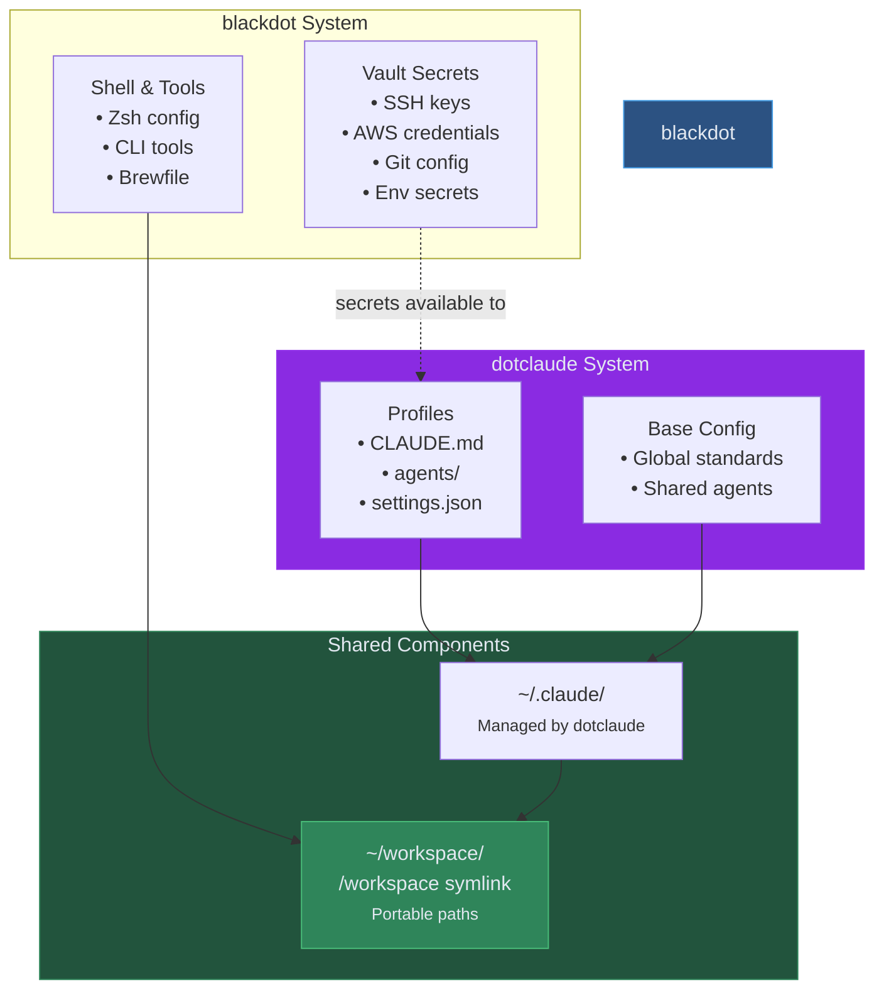

# dotclaude + blackdot Integration Guide

## Overview

**[dotclaude](https://github.com/blackwell-systems/dotclaude)** and **dotfiles** are complementary systems that work together seamlessly:

- **dotclaude**: Manages Claude Code profiles (CLAUDE.md, agents, standards, settings)
- **dotfiles**: Manages secrets (SSH, AWS, Git), shell configuration, and multi-platform setup

Together, they enable context switching with synchronized secrets across all your machines.

## Architecture



## Division of Responsibilities

### dotclaude Manages:
- **Claude profiles**: Different contexts (OSS, client-work, employer)
- **CLAUDE.md files**: Base + profile-specific instructions
- **Agents**: Custom Claude agents (definitions, prompts)
- **settings.json**: Claude Code settings per profile
- **Profile switching**: `dotclaude activate <profile>`

### blackdot Manages:
- **Secrets**: SSH keys, AWS credentials, Git config, environment variables
- **Vault sync**: Multi-backend (Bitwarden, 1Password, pass)
- **Shell configuration**: Zsh, Powerlevel10k, CLI tools
- **Platform setup**: macOS, Linux, WSL2, Docker bootstraps
- **Workspace paths**: `/workspace` symlink for portability

### Shared Components:
- **~/workspace/**: Both systems use this for portable paths
- **~/.claude/**: dotclaude manages, blackdot respects
- **Portable sessions**: Both contribute to session portability

## Setup

### Prerequisites

Both systems installed:
```bash
# Install blackdot first
curl -fsSL https://raw.githubusercontent.com/blackwell-systems/blackdot/main/install.sh | bash

# Then install dotclaude
curl -fsSL https://raw.githubusercontent.com/blackwell-systems/dotclaude/main/install.sh | bash
```

### Automatic Integration

The bootstrap scripts detect each other:

```bash
# blackdot bootstrap detects dotclaude
./bootstrap/bootstrap-mac.sh
# Detected: dotclaude is installed
# Ensuring compatibility with dotclaude profile management...
# Skipping ~/.claude setup (managed by dotclaude)
```

No manual configuration needed. Both systems coordinate automatically.

### Manual Verification

```bash
# Check blackdot setup
blackdot doctor

# Check dotclaude setup
dotclaude show

# Verify /workspace symlink
ls -la / | grep workspace
# lrwxr-xr-x  1 user  wheel  20 Dec  2 10:00 /workspace -> /Users/user/workspace
```

## Usage Patterns

### Pattern 1: Profile Per Client

**Scenario**: Freelancer with multiple clients

```bash
# Setup client profiles in dotclaude
dotclaude create client-acme    # Acme Corp project
dotclaude create client-beta    # Beta Inc project

# Store client-specific secrets in vault
blackdot vault create          # Interactive prompts
# Item: acme-ssh-key
# Item: acme-aws-creds
# Item: beta-ssh-key
# Item: beta-aws-creds

# Switch contexts
dotclaude activate client-acme
blackdot vault pull acme-*   # Restore Acme secrets

# Later: switch to Beta
dotclaude activate client-beta
blackdot vault pull beta-*   # Restore Beta secrets
```

**Result**: Profile standards change, secrets change, both synced across machines.

### Pattern 2: OSS vs Work Split

**Scenario**: Open source contributor with day job

```bash
# OSS profile (dotclaude)
dotclaude activate oss-projects
# - Permissive coding standards
# - Public licensing agents
# - Community-friendly tone

# OSS secrets (dotfiles)
blackdot vault pull oss-*
# - Personal SSH key
# - Personal AWS (for demos)
# - GitHub personal account Git config

# Work profile (dotclaude)
dotclaude activate work-employer
# - Strict enterprise standards
# - Compliance agents
# - Corporate tone

# Work secrets (dotfiles)
blackdot vault pull work-*
# - Corporate SSH key
# - Corporate AWS
# - GitLab work account Git config
```

**Result**: Complete context isolation. No accidentally committing work code with personal email.

### Pattern 3: Multi-Machine Development

**Scenario**: macOS laptop + Lima VM for testing

```bash
# On macOS
dotclaude activate my-project
blackdot vault pull
cd /workspace/my-project && claude
# ... work, exit ...

# In Lima VM
dotclaude activate my-project  # Same profile name
blackdot vault pull         # Same secrets
cd /workspace/my-project && claude
# SAME conversation continues!
```

**Result**: Profile and secrets follow you across machines. Workspace paths match everywhere.

## Workflow Examples

### New Machine Setup

```bash
# 1. Bootstrap blackdot (handles /workspace, vault, shell)
curl -fsSL https://raw.githubusercontent.com/blackwell-systems/blackdot/main/install.sh | bash

# 2. Install dotclaude
curl -fsSL https://raw.githubusercontent.com/blackwell-systems/dotclaude/main/install.sh | bash

# 3. Pull dotclaude profiles (from git)
cd ~/workspace/dotclaude-profiles
git pull

# 4. Restore secrets
blackdot vault pull

# 5. Activate profile
dotclaude activate my-preferred-profile

# Done! Identical environment to other machines
```

### Daily Context Switching

```bash
# Morning: Personal projects
dotclaude activate personal
cd /workspace/personal/blog && claude

# Afternoon: Client work
dotclaude activate client-work
cd /workspace/client/api && claude
# Different CLAUDE.md, same secrets (if shared), different context

# Evening: Open source
dotclaude activate oss
cd /workspace/oss/contrib && claude
```

### Secrets Rotation

```bash
# Generate new SSH key
ssh-keygen -t ed25519 -f ~/.ssh/id_ed25519_newkey

# Update vault
blackdot vault push ssh

# Propagate to other machines
# (on other machine)
blackdot vault pull ssh
```

## Configuration

### blackdot Configuration

Located in `~/workspace/dotfiles/`:

```bash
~/workspace/dotfiles/
├── vault/
│   ├── restore-ssh.sh       # SSH key restoration
│   ├── restore-aws.sh       # AWS credential restoration
│   └── restore-git.sh       # Git config restoration
├── zsh/
│   └── zshrc                # Shell config (respects dotclaude)
└── Brewfile                 # Packages for both systems
```

### dotclaude Configuration

Located in your dotclaude repository (typically `~/workspace/dotclaude-profiles/`):

```bash
~/workspace/dotclaude-profiles/
├── base/
│   ├── CLAUDE.md            # Global standards
│   └── agents/
├── profiles/
│   ├── personal/
│   │   └── CLAUDE.md
│   ├── work/
│   │   └── CLAUDE.md
│   └── client-acme/
│       └── CLAUDE.md
```

### Integration Points

The systems coordinate via:

1. **~/.claude/**: dotclaude manages, blackdot respects
2. **~/workspace/**: Both use for portable paths
3. **/workspace symlink**: Created by dotfiles, used by dotclaude

## Troubleshooting

### Issue: Profile Switch Doesn't Load Secrets

**Symptom**: Switched dotclaude profile but still have old SSH key

**Solution**: dotclaude only manages Claude config. Secrets are separate:
```bash
dotclaude activate new-profile    # Changes Claude context
blackdot vault pull new-*      # Manually restore new secrets
```

**Future enhancement**: Hook in dotclaude to auto-run `blackdot vault pull`

### Issue: /workspace Paths Don't Work

**Symptom**: dotclaude profiles reference `/workspace/...` but symlink missing

**Solution**: Run blackdot bootstrap:
```bash
cd ~/workspace/dotfiles
./bootstrap/bootstrap-blackdot.sh
# Creates /workspace -> ~/workspace symlink
```

### Issue: Conflicting ~/.claude Management

**Symptom**: Both systems trying to manage `~/.claude/`

**Solution**: dotclaude takes precedence. blackdot will detect and skip:
```bash
blackdot doctor
# ~/.claude managed by dotclaude: OK
```

If you uninstall dotclaude, blackdot can take over:
```bash
dotclaude uninstall
blackdot doctor --fix
# ~/.claude now managed by dotfiles
```

### Issue: Vault Items Not Found After Profile Switch

**Symptom**: `blackdot vault pull` fails after switching profile

**Cause**: Vault item names don't match profile names

**Solution**: Use consistent naming convention:
```bash
# In vault:
profile-name-ssh-key
profile-name-aws-creds
profile-name-git-config

# Restore by pattern:
blackdot vault pull "profile-name-*"
```

## Advanced Integration

### Custom Profile Hooks

Add to your dotclaude profile's `settings.json`:

```json
{
  "hooks": {
    "PostActivate": [
      {
        "type": "command",
        "command": "bash -c 'cd ~/workspace/blackdot && ./vault/restore-ssh.sh $DOTCLAUDE_PROFILE'"
      }
    ]
  }
}
```

This auto-restores secrets when activating a profile.

### Environment Variables

Both systems can use environment variables:

```bash
# In ~/.zshrc (managed by dotfiles)
export DOTCLAUDE_PROFILE_DIR="$HOME/workspace/dotclaude-profiles"
export BLACKDOT_VAULT_BACKEND="bitwarden"

# Now both systems know where to find things
```

### Shared Workspace Structure

Recommended workspace organization:

```bash
~/workspace/
├── dotfiles/              # blackdot repo
├── dotclaude-profiles/    # dotclaude repo
├── .claude/              # Claude state (symlinked)
├── code/
│   ├── personal/         # Personal projects
│   ├── work/            # Work projects
│   └── oss/             # Open source contributions
└── .zsh_history         # Shared shell history
```

Both systems respect this structure.

## Security Considerations

### Secrets Storage

- **blackdot vault**: Encrypted in Bitwarden/1Password/pass
- **dotclaude profiles**: Version controlled, no secrets
- **Never**: Store secrets in dotclaude profiles

### Profile Sharing

Safe to share dotclaude profiles publicly:
```bash
cd ~/workspace/dotclaude-profiles
git remote add origin git@github.com:user/dotclaude-profiles.git
git push
# Safe: No secrets, only Claude configuration
```

Dotfiles vault items stay private in your vault.

### Machine-Specific Secrets

Some secrets are per-machine (not synced):
```bash
# blackdot handles per-machine secrets
~/.ssh/config             # Can include machine-specific entries
~/.aws/config             # Can have machine-specific profiles

# Use blackdot templates for customization
blackdot template init    # Set machine variables
```

## Migration Guides

### From Standalone dotfiles

Already using dotfiles? Add dotclaude:

```bash
# Install dotclaude
curl -fsSL https://raw.githubusercontent.com/blackwell-systems/dotclaude/main/install.sh | bash

# Convert your ~/.claude to dotclaude profile
mkdir -p ~/workspace/dotclaude-profiles/profiles/my-profile
cp ~/.claude/CLAUDE.md ~/workspace/dotclaude-profiles/profiles/my-profile/

# Let dotclaude take over
dotclaude activate my-profile
```

### From Standalone dotclaude

Already using dotclaude? Add dotfiles:

```bash
# Install dotfiles
curl -fsSL https://raw.githubusercontent.com/blackwell-systems/blackdot/main/install.sh | bash

# It detects dotclaude and coordinates automatically
# Your existing ~/.claude profiles stay intact

# Add secret management
blackdot vault push --all    # Push current secrets to vault
```

## Best Practices

1. **Consistent naming**: Match profile names to vault item prefixes
   ```bash
   # Profile: client-acme
   # Vault items: client-acme-ssh-key, client-acme-aws-creds
   ```

2. **Use /workspace paths**: Always reference `/workspace/...` in both systems
   ```bash
   # dotclaude profiles can reference:
   # "Project located at /workspace/client/api"
   ```

3. **Separate concerns**: Claude config in dotclaude, secrets in dotfiles
   ```bash
   # Don't put AWS keys in CLAUDE.md
   # Don't put coding standards in vault
   ```

4. **Test on VM**: Use Lima/Docker to test integration
   ```bash
   lima shell dotfiles
   # Install both, verify they work together
   ```

5. **Document custom workflows**: Add notes to profile READMEs
   ```bash
   # In ~/workspace/dotclaude-profiles/profiles/client-acme/README.md
   # Requires: blackdot vault pull client-acme-*
   ```

## Further Reading

- **[dotclaude Documentation](https://github.com/blackwell-systems/dotclaude)** - Profile management
- **[blackdot Vault Guide](VAULT.md)** - Secret management
- **[Workspace Architecture](README-FULL.md#canonical-workspace)** - How /workspace works

## Support

Issues with integration:
- **dotfiles**: https://github.com/blackwell-systems/blackdot/issues
- **dotclaude**: https://github.com/blackwell-systems/dotclaude/issues
- **Integration**: Open issue in either repo, tag with `integration`
