# Dotfiles & Vault Setup - Full Documentation

[](https://github.com/blackwell-systems)
[](https://claude.ai/claude-code)
[](https://github.com/blackwell-systems/dotclaude)
[](https://github.com/blackwell-systems/dotfiles#vault--secrets)
[](https://github.com/blackwell-systems/dotfiles)

[](https://www.zsh.org/)
[](https://github.com/blackwell-systems/dotfiles/actions)
[](../test/)
[](https://github.com/blackwell-systems/dotfiles/releases)
[](../LICENSE)
[](https://buymeacoffee.com/blackwellsystems)

> **Enterprise-grade dotfiles** with multi-vault secret management (Bitwarden, 1Password, pass), machine-specific templates, portable Claude Code sessions, and automated health checks. Works across macOS, Linux, Windows, WSL2, and Docker.

[Changelog](../CHANGELOG.md) | [Quick Start Guide](../README.md)

This is the comprehensive reference documentation for the dotfiles system. It covers configurations for **Zsh**, **Powerlevel10k**, **Homebrew**, **Claude Code**, and a **multi-vault secret bootstrap** (supporting Bitwarden, 1Password, and pass) for SSH keys, AWS credentials, and environment secrets across **macOS**, **Windows**, **WSL2**, **Lima**, and **Linux**.

---

## Table of Contents

- [Quick Start](#quick-start)
  - [One-Line Install](#one-line-install)
  - [Manual Install](#manual-install)
- [Directory Structure](#directory-structure)
- [Canonical Workspace](#canonical-workspace-workspace)
- [Global Prerequisites](#global-prerequisites)
- [Bootstrap Overview](#bootstrap-overview)
  - [Interactive Mode](#interactive-mode)
- [Bootstrapping macOS from Scratch](#bootstrapping-macos-from-scratch)
- [Bootstrapping Lima / Linux Guest](#bootstrapping-lima--linux-guest)
- [Dotfiles Bootstrap Details](#dotfiles-bootstrap-details)
- [Homebrew & Brewfile](#homebrew--brewfile)
- [Vault System Bootstrap](#vault-system-bootstrap)
- [Restoring from Vault on Any Machine](#restoring-from-vault-on-any-machine)
- [Scripts: What Each Restore Script Expects](#scripts-what-each-restore-script-expects)
- [Validating Vault Items Before Restore](#validating-vault-items-before-restore)
- [One-Time: Push Current Files into Vault](#one-time-push-current-files-into-vault-for-future-you)
- [Rotating / Updating Secrets in Vault](#rotating--updating-secrets-in-vault)
- [Adding New SSH Keys](#adding-new-ssh-keys)
- [Syncing Local Changes to Vault](#syncing-local-changes-to-vault)
- [Maintenance Checklists](#maintenance-checklists)
- [Using the Dotfiles Day-to-Day](#using-the-dotfiles-day-to-day)
- [Health Check](#health-check)
  - [The dotfiles Command](#the-dotfiles-command)
- [Metrics & Observability](#metrics--observability)
- [CI/CD & Testing](#cicd--testing)
- [Troubleshooting](#troubleshooting)
- [License](#license)

---

## Quick Start

### One-Line Install

```bash
curl -fsSL https://raw.githubusercontent.com/blackwell-systems/dotfiles/main/install.sh | bash
```

Options:
- `--minimal` - Skip optional features (vault, Claude setup)
- `--ssh` - Clone using SSH instead of HTTPS

After installation, run `dotfiles setup` for interactive configuration.

### Manual Install

```bash
# 1. Clone repository
git clone git@github.com:blackwell-systems/dotfiles.git ~/workspace/dotfiles
cd ~/workspace/dotfiles

# 2. Run platform bootstrap
./bootstrap/bootstrap-mac.sh   # macOS
./bootstrap/bootstrap-linux.sh # Linux/WSL

# 3. Run interactive setup wizard
dotfiles setup
```

**That's it!** The wizard handles platform detection, vault selection, and secret restoration. Progress is saved—resume anytime if interrupted.

**Alternative (non-interactive):**
```bash
# Run bootstrap only (no vault setup)
./bootstrap/bootstrap-mac.sh      # macOS
./bootstrap/bootstrap-linux.sh    # Linux / WSL2

# Then manually configure secrets or run:
dotfiles vault restore  # (requires vault CLI login first)

# Verify installation
dotfiles doctor
```

**What gets installed:**
- Zsh + Powerlevel10k + plugins (autosuggestions, syntax highlighting)
- All Homebrew packages from `Brewfile`
- SSH keys, AWS credentials, and environment secrets from vault (Bitwarden/1Password/pass)
- Claude Code configuration via `/workspace` symlink
- The `dotfiles` command for ongoing management

### 💡 Critical: Use `/workspace` for Claude Code

After bootstrap, **always** use `/workspace` paths:

```bash
cd /workspace/dotfiles  # ✅ Portable sessions
claude                  # Same session on ALL machines

cd ~/workspace/dotfiles # ❌ Non-portable (different paths per OS)
```

The `/workspace → ~/workspace` symlink ensures Claude Code sessions use identical paths across macOS, Lima, and WSL, preserving your conversation history when switching machines.

---

## Directory Structure

<details>
<summary><b>Click to expand full directory tree</b> (zoomable)</summary>

```
~/workspace/dotfiles/
│
├── install.sh                          # One-line installer (curl | bash)
├── Brewfile                            # Unified Homebrew bundle (macOS + Lima)
├── CHANGELOG.md                        # Version history
├── LICENSE                             # MIT License
├── README.md                           # Main documentation
├── .gitignore                          # Excludes .bw-session, secrets, temp files
│
├── bootstrap/                          # Platform bootstrap scripts
│   ├── bootstrap-mac.sh                # macOS-specific bootstrap
│   ├── bootstrap-linux.sh              # Linux-specific bootstrap
│   ├── bootstrap-dotfiles.sh           # Shared symlink bootstrap
│   └── _common.sh                      # Shared bootstrap functions
│
├── bin/                                # CLI management tools
│   ├── dotfiles                        # Main CLI entry point (symlinked to PATH)
│   ├── dotfiles-backup                 # Backup/restore dotfiles
│   ├── dotfiles-diff                   # Preview changes before applying
│   ├── dotfiles-doctor                 # Health check validation
│   ├── dotfiles-drift                  # Detect config drift from repo
│   ├── dotfiles-setup                  # Interactive setup wizard
│   ├── dotfiles-lint                   # Lint shell scripts for errors
│   ├── dotfiles-metrics                # Collect system metrics
│   ├── dotfiles-packages               # List/validate installed packages
│   ├── dotfiles-template               # Generate machine-specific templates
│   └── dotfiles-uninstall              # Clean removal of dotfiles
│
├── claude/                             # Claude Code configuration
│   ├── settings.json                   # Claude settings (permissions, hooks)
│   └── commands/                       # Custom slash commands
│       └── health.md                   # /health - run dotfiles health check
│
├── docs/                               # Documentation
│   ├── README.md                       # Docs index
│   ├── README-FULL.md                  # Comprehensive guide (this file)
│   ├── VAULT.md                        # Vault system documentation
│   └── TROUBLESHOOTING.md              # Common issues and solutions
│
├── ghostty/                            # Ghostty terminal configuration
│   └── config                          # Ghostty settings
│
├── lima/                               # Lima VM configuration
│   └── lima.yaml                       # Lima VM definition (host-side)
│
├── macos/                              # macOS-specific settings
│   ├── apply-settings.sh               # Apply macOS system preferences
│   ├── discover-settings.sh            # Capture/diff macOS settings
│   ├── settings.sh                     # Actual settings to apply
│   └── snapshots/                      # Setting snapshots for comparison
│
├── tests/                              # Test suite
│   ├── test-bootstrap.sh               # Bootstrap script tests
│   ├── test-vault.sh                   # Vault system tests
│   └── test-symlinks.sh                # Symlink validation tests
│
├── vault/                              # Multi-vault secret management
│   ├── _common.sh                      # Shared library (colors, logging, SSH_KEYS)
│   ├── backends/                       # Vault backend implementations
│   │   ├── bitwarden.sh                # Bitwarden CLI integration
│   │   ├── 1password.sh                # 1Password CLI integration
│   │   └── pass.sh                     # pass (GPG) integration
│   ├── restore.sh                      # Orchestrates all vault restores
│   ├── check-vault-items.sh            # Validates required vault items exist
│   ├── create-vault-item.sh            # Creates new vault secure notes
│   ├── delete-vault-item.sh            # Deletes items from vault (with safety)
│   ├── list-vault-items.sh             # Lists all vault items (debug/inventory)
│   ├── sync-to-vault.sh                # Syncs local changes back to vault
│   ├── validate-schema.sh              # Validates vault item schemas
│   ├── restore-ssh.sh                  # Restores SSH keys and config
│   ├── restore-aws.sh                  # Restores ~/.aws/config & credentials
│   ├── restore-env.sh                  # Restores environment secrets
│   ├── restore-git.sh                  # Restores ~/.gitconfig
│   ├── template-aws-config             # Reference template for AWS config
│   ├── template-aws-credentials        # Reference template for AWS credentials
│   └── README.md                       # Vault documentation
│
├── zellij/                             # Zellij multiplexer configuration
│   └── config.kdl                      # Zellij keybindings and layout
│
└── zsh/                                # Zsh shell configuration
    ├── zshrc                           # Main Zsh config (~820 lines)
    └── p10k.zsh                        # Powerlevel10k theme configuration

Deployed files (after bootstrap):
~/.zshrc                 → ~/workspace/dotfiles/zsh/zshrc (symlink)
~/.p10k.zsh              → ~/workspace/dotfiles/zsh/p10k.zsh (symlink)
~/.config/ghostty/config → ~/workspace/dotfiles/ghostty/config (symlink)
~/.config/zellij/        → ~/workspace/dotfiles/zellij/ (symlink)
~/.claude/               → ~/workspace/.claude/ (symlink)
~/bin/dotfiles           → ~/workspace/dotfiles/bin/dotfiles (symlink in PATH)
```

</details>

Key pieces:

- **zsh/zshrc**: Main Zsh configuration file (~820 lines, well-organized sections)
- **zsh/p10k.zsh**: Powerlevel10k theme configuration
- **ghostty/config**: Ghostty terminal configuration
- **zellij/config.kdl**: Zellij multiplexer configuration
- **vault/**: Multi-vault secure bootstrap for SSH, AWS, and environment secrets (Bitwarden, 1Password, pass)
- **claude/**: Claude Code configuration (settings, slash commands)
- **Brewfile**: Shared Homebrew definition used by both macOS and Lima bootstrap scripts
- **Claude Workspace Symlink** inside `bootstrap-dotfiles.sh` ensures that both macOS and Lima point to the shared workspace directory:

  ```
  ~/.claude → ~/workspace/.claude
  ```

---

## Multi-Platform Architecture

This dotfiles system is designed for extensibility across multiple platforms with **90% shared code**.

### Currently Supported Platforms

| Platform | Bootstrap Script | Status | Notes |
|----------|-----------------|---------|-------|
| **macOS** | `bootstrap-mac.sh` | ✅ Fully tested | Apple Silicon & Intel |
| **Lima VM** | `bootstrap-linux.sh` | ✅ Fully tested | Ubuntu 24.04 |
| **WSL2** | `bootstrap-linux.sh` | ✅ Auto-detected | Windows 10/11 |
| **Ubuntu/Debian** | `bootstrap-linux.sh` | ✅ Compatible | Bare metal or VM |

### Extensible to (15-30 minutes each):
- Docker containers
- Arch Linux
- Fedora/RHEL
- FreeBSD/OpenBSD
- Any POSIX-compliant system with ZSH

### Architecture Layers

```mermaid
flowchart TB
    platform["<b>Platform-Specific Bootstrap</b><br/>(10% of code)<br/>━━━━━━━━━━━━━━━━━━━━━<br/>• Package manager setup (apt/brew/pacman)<br/>• System-specific configuration<br/>• GUI tool installation"]

    shared["<b>Shared Dotfiles Layer</b><br/>(90% of code)<br/>━━━━━━━━━━━━━━━━━━━━━<br/>• Symlink management (bootstrap-dotfiles)<br/>• Shell configuration (zshrc)<br/>• Vault system (all scripts)<br/>• Health checks & metrics<br/>• Tab completions"]

    platform --> shared

    style platform fill:#2c5282,stroke:#4299e1,color:#e2e8f0
    style shared fill:#1a365d,stroke:#2c5282,color:#e2e8f0
```



### Platform-Independent Components

These work on **any platform** without modification:

**Vault System** (100% portable)
- All `vault/*.sh` scripts with multi-backend support
- Backends: Bitwarden (`bw`), 1Password (`op`), pass (`pass/gpg`)
- Just needs: `zsh`, vault CLI, `jq`
- Works on Linux, macOS, BSD, WSL, Docker

**Health & Metrics** (100% portable)
- `bin/dotfiles-doctor` / `bin/dotfiles-drift`
- `bin/dotfiles-metrics`
- Cross-platform file permissions handling

**Shell Configuration** (OS-aware)
- `zshrc` with OS detection
- Conditional loading for macOS/Linux
- Portable modern CLI tools (eza, fzf, etc.)

**Package Management** (cross-platform)
- `Brewfile` works on macOS + Linux (Linuxbrew)
- Conditional sections (`on_macos`, `on_linux`)

### Adding a New Platform

Example: Adding Arch Linux support (~30 lines)

```bash
#!/usr/bin/env bash
set -euo pipefail

DOTFILES_DIR="$(cd "$(dirname "${BASH_SOURCE[0]}")" && pwd)"

# 1. System packages (platform-specific)
sudo pacman -Syu --noconfirm git zsh curl base-devel

# 2. Install package manager (Homebrew recommended)
# ... setup ...

# 3. SHARED: Use same Brewfile
brew bundle --file="$DOTFILES_DIR/Brewfile"

# 4. SHARED: Use same dotfiles bootstrap
"$DOTFILES_DIR/bootstrap-dotfiles.sh"

# 5. Set shell to zsh
chsh -s $(command -v zsh)
```

Everything else (vault, health checks, configs, metrics) works without modification.

### Platform Detection in Scripts

The bootstrap scripts auto-detect their environment:

```bash
# bootstrap-linux.sh detects:
if grep -qiE "(microsoft|wsl)" /proc/version; then
  PLATFORM="WSL2"
  # Install Windows interop tools
elif [[ -n "${LIMA_INSTANCE:-}" ]]; then
  PLATFORM="Lima"
  # Lima-specific tips
fi
```

The `zshrc` also detects OS:

```bash
OS="$(uname -s)"
case "$OS" in
  Darwin)  # macOS-specific settings ;;
  Linux)   # Linux-specific settings ;;
  FreeBSD) # BSD-specific settings ;;
esac
```

### Why This Architecture Matters

**Portability**: Use the same dotfiles across:
- Work and personal machines (macOS/Linux)
- Development VMs (Lima/WSL)
- CI/CD containers (Docker)
- Cloud instances

**Maintainability**: Fix bugs or add features **once**, benefits **all platforms**.

**Extensibility**: New platform = ~30 lines of platform-specific code + reuse 90%.

---

## Canonical Workspace (`~/workspace`)

A key architectural decision is the **canonical workspace directory** at `~/workspace`. This serves multiple purposes:

### 1. Username-Agnostic Paths

Home directory paths vary by platform and username:
- macOS: `/Users/username`
- Lima: `/home/username.linux` or `/home/ubuntu`
- WSL2: `/home/username`

By standardizing on `~/workspace`, all scripts, aliases, and configurations can reference a **predictable location** regardless of the underlying username or OS.

### 2. Cross-Platform Mount Point

Lima mounts the macOS home directory into the VM. With `~/workspace` as the canonical location, both environments see the **same files**:
- macOS: `/Users/username/workspace` → actual files
- Lima: `/home/username.linux/workspace` → mounted from macOS

This enables:
- Edit code on macOS, run tests in Lima
- Same dotfiles repo accessible from both platforms
- Claude Code shares state via `~/.claude → ~/workspace/.claude`

### 3. Organizational Structure

The workspace provides a consistent hierarchy:


**Structure breakdown:**
- **Shared State**: `.claude/` (Claude sessions), `.zsh_history` (shell history)
- **Work Files**: `dotfiles/` (this repo), `code/` (projects), `whitepapers/` (docs)
- **Navigation**: `cws` → workspace, `ccode` → code/, `dotfiles` → dotfiles/

**Shared shell history**: Command history is stored in `~/workspace/.zsh_history` and syncs between macOS and Lima sessions.

Navigation aliases make this seamless:
- `cws` → `cd ~/workspace`
- `ccode` → `cd ~/workspace/code`
- `dotfiles` → `cd ~/workspace/dotfiles`

### 4. Decoupled from User Identity

Secrets (SSH keys, AWS credentials) live in `~/.ssh` and `~/.aws` (user-specific), while work files live in `~/workspace` (portable). This separation means:

- Secrets are restored per-machine via vault (Bitwarden/1Password/pass)
- Work files are either shared (Lima mount) or synced (git)
- Scripts reference `$WORKSPACE` variable, not hardcoded paths

```bash
# In zshrc
export WORKSPACE="$HOME/workspace"
alias cws='cd "$WORKSPACE"'
```

### 5. Claude Code Session Portability (`/workspace`) 🌟

**This is a key innovation that sets this dotfiles system apart.**

#### The Challenge
Claude Code stores sessions based on your working directory path:
- macOS: `/Users/username/workspace/dotfiles` → session `-Users-username-workspace-dotfiles-`
- Lima: `/home/username.linux/workspace/dotfiles` → session `-home-username.linux-workspace-dotfiles-`
- WSL: `/home/username/workspace/dotfiles` → session `-home-username-workspace-dotfiles-`

Even with the same files (via Lima mount or git sync), **different absolute paths = different session folders = lost conversation history** when switching machines.

#### The Innovation
Bootstrap creates a **platform-independent symlink**:

```bash
# Created automatically by bootstrap scripts
/workspace → ~/workspace
```

This symlink resolves to the correct home directory on each platform but provides a **canonical absolute path**:
- macOS: `/workspace/dotfiles` (symlink resolves to `/Users/username/workspace/dotfiles`)
- Lima: `/workspace/dotfiles` (symlink resolves to `/home/username.linux/workspace/dotfiles`)
- WSL: `/workspace/dotfiles` (symlink resolves to `/home/username/workspace/dotfiles`)

#### The Result
Claude Code sees **the same path** (`/workspace/dotfiles`) on all platforms:

```bash
# On macOS
cd /workspace/dotfiles
claude
# Session stored in: ~/.claude/projects/-workspace-dotfiles-/

# On Lima (same session!)
cd /workspace/dotfiles
claude
# Session stored in: ~/.claude/projects/-workspace-dotfiles-/
# ✅ Conversation history continues from macOS!
```

#### Usage Pattern
```bash
# ✅ ALWAYS use /workspace for Claude Code
cd /workspace/my-project
claude

# ✅ Start on macOS, continue on Lima
# macOS:
cd /workspace/dotfiles && claude
# ... work, exit ...

# Lima (same conversation):
cd /workspace/dotfiles && claude
# Your conversation history is preserved!

# ❌ DON'T use ~/workspace (non-portable)
cd ~/workspace/dotfiles  # Different on each OS
claude                    # New session every time
```

**Best Practice**: Make it a habit - always `cd /workspace/...` for Claude Code sessions.

#### Integration with dotclaude

For profile management, this system integrates with [dotclaude](https://github.com/blackwell-systems/dotclaude):

- **dotclaude**: Manages Claude profiles (CLAUDE.md, agents, settings.json)
- **dotfiles**: Manages secrets (SSH, AWS, Git), shell, and `/workspace` paths

Both systems coordinate seamlessly:

```bash
# Switch Claude context with dotclaude
dotclaude activate client-work

# Secrets managed by dotfiles
dotfiles vault restore client-*

# Both respect /workspace for portable sessions
cd /workspace/my-project && claude
```

**Division of responsibilities:**
- dotclaude handles Claude configuration per context (OSS, work, client)
- dotfiles handles secrets and cross-platform consistency
- Both use `/workspace` paths for session portability

See [DOTCLAUDE-INTEGRATION.md](DOTCLAUDE-INTEGRATION.md) for complete integration guide.

### Visual Overview

```mermaid
flowchart TB
    subgraph host["Host: /Users/username/ (macOS)"]
        h_secrets["Secrets<br/>(.ssh, .aws, .gitconfig)<br/><small>Per-machine</small>"]
        h_workspace["~/workspace/<br/><small>Shared files</small>"]
    end

    subgraph guest["Guest: /home/username/ (Lima/WSL)"]
        g_secrets["Secrets<br/>(.ssh, .aws, .gitconfig)<br/><small>Per-machine</small>"]
        g_workspace["~/workspace/<br/><small>Mounted from host</small>"]
    end

    subgraph shared["Shared: ~/workspace/ Content"]
        direction LR
        dotfiles["dotfiles/"]
        code["code/"]
        claude[".claude/"]
    end

    h_workspace <-->|same files| g_workspace
    h_workspace -.-> shared
    g_workspace -.-> shared

    h_secrets <-.->|vault sync| g_secrets

    symlink["/workspace → ~/workspace<br/><small>Ensures identical paths across all machines</small>"]

    style host fill:#1a365d,stroke:#2c5282,color:#e2e8f0
    style guest fill:#1a365d,stroke:#2c5282,color:#e2e8f0
    style shared fill:#2c5282,stroke:#4299e1,color:#e2e8f0
    style symlink fill:#22543d,stroke:#2f855a,color:#e2e8f0
    style h_workspace fill:#2c5282,stroke:#4299e1,color:#e2e8f0
    style g_workspace fill:#2c5282,stroke:#4299e1,color:#e2e8f0
    style claude fill:#2f855a,stroke:#48bb78,color:#e2e8f0
```



**Key concept:**
- **Host & Guest** share `~/workspace/` (mounted/synced)
- **Secrets** (.ssh, .aws, .gitconfig) are per-machine, synced via vault
- **`/workspace` symlink** ensures identical paths: `cd /workspace/dotfiles` works everywhere
- **Claude Code sessions** are portable across machines via shared `.claude/` state

### Why This Matters

When setting up a new machine or VM, no username updates are needed. Everything just works because:

1. `~` expands to the correct home directory
2. `~/workspace` is always where your work lives
3. `/workspace` symlink enables portable Claude sessions
4. Secrets are restored to standard locations (`~/.ssh`, `~/.aws`)
5. Symlinks bridge any gaps (`~/.claude → ~/workspace/.claude`)

---

## Global Prerequisites

### Required
- A supported environment: macOS, Windows, Linux, WSL2, or Lima
- Internet access (for installing packages)

### Auto-installed (if missing)
- **Git** (via Xcode tools on macOS or apt on Linux)
- **Zsh** as your login shell (bootstrap sets this up)
- **Homebrew/Linuxbrew** (bootstrap will install)
- **jq** (for JSON manipulation, installed via Brewfile)

### Optional (for vault features only)
- **Vault CLI** - For automated secret sync (choose one):
  - **Bitwarden CLI** (`bw`) - Default, full-featured, cloud-synced
  - **1Password CLI** (`op`) - v2 CLI with biometric auth
  - **pass** (`pass`) - GPG-based, git-synced
  - Skip with `--minimal` flag or just don't run `dotfiles vault` commands
  - Without vault: manually configure `~/.ssh`, `~/.aws`, `~/.gitconfig`

### Optional (for specific workflows)
- **AWS CLI v2** (for AWS workflows, installed via Brewfile if needed)
- **Claude Code (CLI)** - For portable session sync
  - Skip with `SKIP_CLAUDE_SETUP=true`
  - Installed via Brewfile on both macOS + Lima

Most tools are installed automatically via Homebrew after the basic bootstrap is done.

---

## Bootstrap Overview

There are two big pillars:

1. **Dotfiles / Shell bootstrap**

   Handled by:

   - `bootstrap-dotfiles.sh`
   - `bootstrap-mac.sh`
   - `bootstrap-linux.sh`

   Goal: consistent Zsh + p10k + plugins + Ghostty config + Claude across host and Lima.

2. **Vault / Secure secrets bootstrap (Multi-vault)**

   Handled by:

   - `vault/restore.sh`
   - `vault/restore-ssh.sh`
   - `vault/restore-aws.sh`
   - `vault/restore-env.sh`

   Goal: restore **SSH keys**, **AWS config/credentials**, and **env secrets** from your vault (Bitwarden, 1Password, or pass).

### Setup Wizard

After bootstrap, run the interactive setup wizard for full configuration:

```bash
dotfiles setup
```

The wizard handles:
- **Symlinks**: Shell configuration files
- **Packages**: Homebrew packages from Brewfile
- **Vault**: Select and authenticate vault backend (Bitwarden, 1Password, pass)
- **Secrets**: Restore SSH keys, AWS credentials, Git config
- **Claude Code**: Optional dotclaude installation

**Progress is saved** to `~/.config/dotfiles/`. If interrupted, run `dotfiles setup` again to resume. See [State Management](state-management.md) for details on state files and persistence.

You can skip optional features using environment variables:

```bash
# Skip optional features during bootstrap
SKIP_WORKSPACE_SYMLINK=true SKIP_CLAUDE_SETUP=true ./bootstrap/bootstrap-linux.sh
```

Use `--help` to see available options:

```bash
dotfiles setup --help
./bootstrap/bootstrap-mac.sh --help
```

### Architecture Diagram


### dotclaude Integration

When used with [dotclaude](https://github.com/blackwell-systems/dotclaude), both systems work together seamlessly:

```mermaid
flowchart LR
    subgraph dotclaude["dotclaude System"]
        profiles["Claude Profiles<br/>• CLAUDE.md<br/>• agents/<br/>• settings.json"]
    end

    subgraph dotfiles["dotfiles System"]
        secrets["Secrets<br/>• SSH keys<br/>• AWS creds<br/>• Git config"]
        shell["Shell & Tools<br/>• Zsh<br/>• Brewfile"]
    end

    subgraph shared["Shared"]
        workspace["/workspace/<br/>Portable paths"]
        claude_dir["~/.claude/<br/>Claude state"]
    end

    profiles --> claude_dir
    secrets -.->|"available to"| profiles
    shell --> workspace
    claude_dir --> workspace

    style dotclaude fill:#8A2BE2,stroke:#9333EA,color:#e2e8f0
    style dotfiles fill:#2c5282,stroke:#4299e1,color:#e2e8f0
    style shared fill:#22543d,stroke:#2f855a,color:#e2e8f0
    style workspace fill:#2f855a,stroke:#48bb78,color:#e2e8f0
```



**How they work together:**
- **dotclaude**: Manages Claude configuration per context (OSS, client, work)
- **dotfiles**: Manages secrets and cross-platform consistency
- **Both**: Use `/workspace` for session portability across machines

See [DOTCLAUDE-INTEGRATION.md](DOTCLAUDE-INTEGRATION.md) for complete integration guide.

---

## Bootstrapping macOS from Scratch

1. **Create workspace directory**

```bash
mkdir -p ~/workspace
cd ~/workspace
```

2. **Clone dotfiles repo**

```bash
git clone git@github.com:blackwell-systems/dotfiles.git
cd ~/workspace/dotfiles
```

3. **Run macOS bootstrap**

```bash
./bootstrap/bootstrap-mac.sh
```

Typical responsibilities of `bootstrap-mac.sh`:

- Install **Xcode Command Line Tools** (if missing).  
- Install or update **Homebrew**.  
- Ensure `brew` is on `PATH`.  
- Run the **shared Brewfile**:

  ```bash
  brew bundle --file="$DOTFILES_DIR/Brewfile"
  ```

- Run `bootstrap-dotfiles.sh` to create symlinks:

  - `~/.zshrc    → ~/workspace/dotfiles/zsh/zshrc`  
  - `~/.p10k.zsh → ~/workspace/dotfiles/zsh/p10k.zsh`  
  - `~/.claude   → ~/workspace/.claude`  
  - Ghostty config symlink into:

    ```
    ~/Library/Application Support/com.mitchellh.ghostty/config
    ```

4. **Open a new terminal**

This ensures the new `~/.zshrc`, Powerlevel10k, plugins, and Claude integration are picked up.

---

## Bootstrapping Lima / Linux Guest

Assuming your Lima VM shares `~/workspace` from macOS:

1. **Start Lima**

```bash
limactl start ~/workspace/dotfiles/lima/lima.yaml
limactl shell lima-dev-ubuntu
```

2. **Run the Lima bootstrap**

```bash
cd ~/workspace/dotfiles
./bootstrap/bootstrap-linux.sh
```

Typical responsibilities of `bootstrap-linux.sh`:

- Install essential packages (`git`, `zsh`, etc.).  
- Install **Linuxbrew** if missing.  
- Ensure `brew` is on `PATH`.  
- Run the **same Brewfile** used by macOS.  
- Call `bootstrap-dotfiles.sh` to symlink everything, including:

  - `~/.claude → ~/workspace/.claude`
  - shared Zsh files
  - shared p10k config

3. **Restart Lima shell**

---

## Dotfiles Bootstrap Details

### `bootstrap-dotfiles.sh`

This file creates all unified symlinks:

- `~/.zshrc    -> $DOTFILES_DIR/zsh/zshrc`  
- `~/.p10k.zsh -> $DOTFILES_DIR/zsh/p10k.zsh`  
- Ghostty config (macOS only)  
- **Claude setup**: Creates `~/workspace/.claude`, symlinks `~/.claude` to it, and links config files from `dotfiles/claude/`

This ensures Claude CLI sees a *shared* workspace on both platforms.

---

## Homebrew & Brewfile

The **Brewfile** is shared by both macOS and Lima and includes:

- Core CLI tools  
- Zsh + plugins  
- Docker  
- Lima  
- jq, awscli, bitwarden-cli  
- Claude Code for both macOS + Linux  
- macOS-only casks (ignored automatically on Linux)

Example (abbreviated):

```ruby
brew "git"
brew "zsh"
brew "tmux"
brew "zellij"
brew "node"
brew "docker"
brew "lima"
brew "powerlevel10k"
brew "zsh-autosuggestions"
brew "zsh-syntax-highlighting"
brew "jq"
brew "awscli"
brew "bitwarden-cli"

# Modern CLI tools
brew "fzf"       # Fuzzy finder
brew "eza"       # Modern ls
brew "fd"        # Fast find
brew "ripgrep"   # Fast grep
brew "zoxide"    # Smart cd
brew "glow"      # Markdown renderer
brew "dust"      # Disk usage
brew "yazi"      # File manager
brew "yq"        # YAML processor
brew "btop"      # System monitor

on_macos do
  cask "ghostty"
  cask "claude-code"
  cask "font-meslo-for-powerlevel10k"
  cask "microsoft-edge"
  cask "nosql-workbench"
  cask "mongodb-compass"
  cask "rectangle"
  cask "vscodium"
end
```

You can regenerate:

```bash
brew bundle dump --force --file=./Brewfile
```

and prune as needed.

---

## macOS System Settings

Lives under:

```
~/workspace/dotfiles/macos
```

These scripts let you capture, track, and restore macOS system preferences (trackpad, keyboard, dock, finder, etc.) across machines.

### Workflow: Discover Your Settings

```bash
cd ~/workspace/dotfiles/macos

# 1. Take a snapshot of current settings
./discover-settings.sh --snapshot

# 2. Change settings in System Preferences (trackpad speed, dock size, etc.)

# 3. See what changed
./discover-settings.sh --diff

# 4. Generate settings.sh from your current preferences
./discover-settings.sh --generate
```

### Workflow: Apply Settings on New Machine

```bash
cd ~/workspace/dotfiles/macos

# Review settings first
./apply-settings.sh --dry-run

# Apply settings
./apply-settings.sh

# Or backup before applying
./apply-settings.sh --backup
```

### What's Included

The default `settings.sh` includes sensible developer defaults for:

| Category | Settings |
|----------|----------|
| **Trackpad** | Tap to click, tracking speed, three-finger drag, natural scrolling |
| **Mouse** | Tracking speed |
| **Keyboard** | Fast key repeat, disable auto-correct/capitalize/smart quotes |
| **Dock** | Size, auto-hide, no recent apps, fast animations |
| **Finder** | Show extensions, hidden files, path bar, list view, no .DS_Store on network |
| **Screenshots** | Location, format, no shadow |
| **Misc** | Expanded save dialogs, password on wake, disable crash reporter |

### Customizing

Edit `macos/settings.sh` directly, or regenerate it from your current preferences:

```bash
# Capture YOUR current settings
./discover-settings.sh --generate

# This overwrites settings.sh with your preferences
```

### Useful Commands

```bash
# List all preference domains on your system
./discover-settings.sh --list-domains

# Dump a specific domain
./discover-settings.sh --domain com.apple.dock

# Dump all tracked domains
./discover-settings.sh --all

# Manual: read a specific setting
defaults read com.apple.dock autohide

# Manual: write a setting
defaults write com.apple.dock autohide -bool true
killall Dock
```

---

## Vault System Bootstrap

Lives under:

```
~/workspace/dotfiles/vault
```

Restores:

- **SSH keys**
- **AWS config & credentials**
- **Environment secrets**

via your preferred vault backend (Bitwarden, 1Password, or pass). Set `DOTFILES_VAULT_BACKEND` environment variable to choose your backend.

Same flow on macOS and Lima.

---

## Restoring from Vault on Any Machine

Once the dotfiles are in place and your vault CLI is installed:

1. **Login to your vault**

```bash
# Bitwarden (default)
bw login && export BW_SESSION="$(bw unlock --raw)"

# 1Password
op signin

# pass (uses GPG - no login needed)
```

2. **Set backend (if not Bitwarden)**

```bash
# Add to ~/.zshrc or ~/.zshenv for persistence
export DOTFILES_VAULT_BACKEND=1password  # or 'pass'
```

3. **Run the vault bootstrap**

```bash
cd ~/workspace/dotfiles/vault
./restore.sh
```

`restore.sh` will:

- Initialize the configured vault backend
- Check/prompt for vault unlock
- Cache session to `.vault-session` (secure permissions)
- Call:

  - `restore-ssh.sh "$SESSION"`
  - `restore-aws.sh "$SESSION"`
  - `restore-env.sh "$SESSION"`

After this finishes:

- Your **SSH keys** are back under `~/.ssh`.
- Your **AWS config/credentials** are restored.
- Your **env secrets** file and loader script are in `~/.local`.

---

## Scripts: What Each Restore Script Expects

### `restore-ssh.sh`

Reads vault **Secure Note** items:

- `"SSH-GitHub-Enterprise"` → SSH key for work/enterprise account
- `"SSH-GitHub-Personal"` → SSH key for personal account
- `"SSH-Config"` → SSH config file with host mappings

Each SSH key item's **notes** field should contain:
- The full **OpenSSH private key** block
- Optionally the corresponding `ssh-ed25519 ...` public key line

The `SSH-Config` item's **notes** field should contain the complete `~/.ssh/config` file.

The script reconstructs files and sets appropriate permissions (`600` for private keys and config, `644` for public keys).

> **Important:** The exact item names (`SSH-GitHub-Enterprise`, `SSH-GitHub-Personal`, `SSH-Config`) must match.

---

### `restore-aws.sh`

Expects two **Secure Note** items in your vault:

- `"AWS-Config"` → contains complete `~/.aws/config`
- `"AWS-Credentials"` → contains complete `~/.aws/credentials`

The **notes** field of each item contains the raw file content.

The script writes files directly from notes and sets safe permissions (`600`).

---

### `restore-env.sh`

Expects a **Secure Note** item named `"Environment-Secrets"` with content like:

```text
SOME_API_KEY=...
ANOTHER_SECRET=...
```

The script:
- Writes content to `~/.local/env.secrets`
- Creates `~/.local/load-env.sh` which exports variables when sourced:

```bash
source ~/.local/load-env.sh
```

---

### `restore-git.sh`

Expects a **Secure Note** item named `"Git-Config"` containing the complete `~/.gitconfig` file.

The script writes to `~/.gitconfig` (backing up any existing file) and sets permissions to `644`.

---

## Validating Vault Items Before Restore

Before running `restore.sh` on a new machine, you can verify all required vault items exist:

```bash
./vault/check-vault-items.sh
```

Example output:

```
=== Required Items ===
[OK] SSH-GitHub-Enterprise
[OK] SSH-GitHub-Personal
[OK] SSH-Config
[OK] AWS-Config
[OK] AWS-Credentials
[OK] Git-Config

=== Optional Items ===
[OK] Environment-Secrets

========================================
All required vault items present!
You can safely run: ./restore.sh
```

If items are missing, the script will tell you which ones and exit with an error.

---

## One-Time: Push Current Files into Vault

Run these commands **once** on a configured machine to populate your vault, enabling future machines to restore via `restore.sh`.

For Bitwarden, this can also be done manually in the GUI. CLI commands are provided for automation and reproducibility.

### 1. Ensure vault session is active

```bash
# Bitwarden
export BW_SESSION="$(bw unlock --raw)"
bw sync --session "$BW_SESSION"

# 1Password
op signin

# pass (no session needed)
```

---

### 2. Push `~/.aws/config` into `AWS-Config`

**Using the unified vault command (recommended):**
```bash
dotfiles vault sync AWS-Config
```

**Or manually with Bitwarden CLI:**
```bash
cd ~/workspace/dotfiles/vault

CONFIG_JSON=$(jq -Rs --arg name "AWS-Config" \
  '{ type: 2, name: $name, secureNote: { type: 0 }, notes: . }' \
  < ~/.aws/config)

CONFIG_ENC=$(printf '%s' "$CONFIG_JSON" | bw encode)

bw create item "$CONFIG_ENC" --session "$BW_SESSION"
```

To **update** it later instead of creating duplicates:

```bash
AWS_CONFIG_ID=$(bw list items --search "AWS-Config" --session "$BW_SESSION" | jq -r '.[0].id')
printf '%s' "$CONFIG_JSON" | bw encode | bw edit item "$AWS_CONFIG_ID" --session "$BW_SESSION"
```

---

### 3. Push `~/.aws/credentials` into `AWS-Credentials`

```bash
CREDS_JSON=$(jq -Rs --arg name "AWS-Credentials" \
  '{ type: 2, name: $name, secureNote: { type: 0 }, notes: . }' \
  < ~/.aws/credentials)

CREDS_ENC=$(printf '%s' "$CREDS_JSON" | bw encode)

bw create item "$CREDS_ENC" --session "$BW_SESSION"
```

To **update** later:

```bash
AWS_CREDS_ID=$(bw list items --search "AWS-Credentials" --session "$BW_SESSION" | jq -r '.[0].id')
printf '%s' "$CREDS_JSON" | bw encode | bw edit item "$AWS_CREDS_ID" --session "$BW_SESSION"
```

---

### 4. Push SSH keys into Secure Notes

You'll create one note per SSH identity:

- `SSH-GitHub-Enterprise`    → `id_ed25519_enterprise_ghub`
- `SSH-GitHub-Personal`     → `id_ed25519_personal`

Each note will contain the **private key** (already passphrase-protected by OpenSSH) and optionally the **public key**.

#### Enterprise key

```bash
(
  cat ~/.ssh/id_ed25519_enterprise_ghub
  echo
  cat ~/.ssh/id_ed25519_enterprise_ghub.pub
) | jq -Rs '{
  type: 2,
  name: "SSH-GitHub-Enterprise",
  secureNote: { type: 0 },
  notes: .
}' | bw encode | bw create item --session "$BW_SESSION"
```

#### Personal GitHub key

```bash
(
  cat ~/.ssh/id_ed25519_personal
  echo
  cat ~/.ssh/id_ed25519_personal.pub
) | jq -Rs '{
  type: 2,
  name: "SSH-GitHub-Personal",
  secureNote: { type: 0 },
  notes: .
}' | bw encode | bw create item --session "$BW_SESSION"
```

> If you prefer, you can also create these as **Secure Notes** in your vault's GUI (Bitwarden web vault, 1Password app, etc.) and paste the contents of the private + public key directly into the Notes field. The restore script just looks at `notes`.

---

### 5. Push SSH config into `SSH-Config`

Your SSH config maps hostnames to identity files, which is essential for multi-key setups:

```bash
SSH_CONFIG_JSON=$(jq -Rs --arg name "SSH-Config" \
  '{ type: 2, name: $name, secureNote: { type: 0 }, notes: . }' \
  < ~/.ssh/config)

SSH_CONFIG_ENC=$(printf '%s' "$SSH_CONFIG_JSON" | bw encode)

bw create item "$SSH_CONFIG_ENC" --session "$BW_SESSION"
```

To **update** it later:

```bash
SSH_CONFIG_ID=$(bw list items --search "SSH-Config" --session "$BW_SESSION" | jq -r '.[0].id')
printf '%s' "$SSH_CONFIG_JSON" | bw encode | bw edit item "$SSH_CONFIG_ID" --session "$BW_SESSION"
```

Example `~/.ssh/config` content:

```text
# GitHub - Enterprise/Work Account
Host github-work
  HostName github.com
  User git
  IdentityFile ~/.ssh/id_ed25519_enterprise_ghub
  IdentitiesOnly yes
  AddKeysToAgent yes

# GitHub - Personal Account
Host github-personal
  HostName github.com
  User git
  IdentityFile ~/.ssh/id_ed25519_personal
  IdentitiesOnly yes
  AddKeysToAgent yes
```

---

### 6. Push environment secrets into `Environment-Secrets` (optional)

1. First, create a local file with the secrets you want portable:

```bash
mkdir -p ~/.local
cat > ~/.local/env.secrets <<'EOF'
# Example
OPENAI_API_KEY=...
GITHUB_TOKEN=...
EOF
chmod 600 ~/.local/env.secrets
```

2. Then push it to vault (Bitwarden example):

```bash
ENV_JSON=$(jq -Rs --arg name "Environment-Secrets" \
  '{ type: 2, name: $name, secureNote: { type: 0 }, notes: . }' \
  < ~/.local/env.secrets)

ENV_ENC=$(printf '%s' "$ENV_JSON" | bw encode)

bw create item "$ENV_ENC" --session "$BW_SESSION"
```

Now `restore-env.sh` will restore this on any new machine and create `~/.local/load-env.sh` to load it.

---

### 7. Push Git config into `Git-Config`

Your Git configuration contains your identity (name, email) and preferences:

```bash
GIT_CONFIG_JSON=$(jq -Rs --arg name "Git-Config" \
  '{ type: 2, name: $name, secureNote: { type: 0 }, notes: . }' \
  < ~/.gitconfig)

GIT_CONFIG_ENC=$(printf '%s' "$GIT_CONFIG_JSON" | bw encode)

bw create item "$GIT_CONFIG_ENC" --session "$BW_SESSION"
```

To **update** it later:

```bash
GIT_CONFIG_ID=$(bw list items --search "Git-Config" --session "$BW_SESSION" | jq -r '.[0].id')
printf '%s' "$GIT_CONFIG_JSON" | bw encode | bw edit item "$GIT_CONFIG_ID" --session "$BW_SESSION"
```

---

## Rotating / Updating Secrets in Vault

When you need to update existing secrets (rotated credentials, new API keys, etc.):

### Update AWS Config/Credentials

```bash
# Ensure session is active
export BW_SESSION="$(bw unlock --raw)"
bw sync --session "$BW_SESSION"

# Update AWS-Config
AWS_CONFIG_ID=$(bw list items --search "AWS-Config" --session "$BW_SESSION" | jq -r '.[0].id')
CONFIG_JSON=$(jq -Rs --arg name "AWS-Config" \
  '{ type: 2, name: $name, secureNote: { type: 0 }, notes: . }' \
  < ~/.aws/config)
printf '%s' "$CONFIG_JSON" | bw encode | bw edit item "$AWS_CONFIG_ID" --session "$BW_SESSION"

# Update AWS-Credentials
AWS_CREDS_ID=$(bw list items --search "AWS-Credentials" --session "$BW_SESSION" | jq -r '.[0].id')
CREDS_JSON=$(jq -Rs --arg name "AWS-Credentials" \
  '{ type: 2, name: $name, secureNote: { type: 0 }, notes: . }' \
  < ~/.aws/credentials)
printf '%s' "$CREDS_JSON" | bw encode | bw edit item "$AWS_CREDS_ID" --session "$BW_SESSION"

# Sync to ensure changes propagate
bw sync --session "$BW_SESSION"
```

### Update Environment Secrets

```bash
# Edit your local secrets file
vim ~/.local/env.secrets

# Push updated version
ENV_ID=$(bw list items --search "Environment-Secrets" --session "$BW_SESSION" | jq -r '.[0].id')
ENV_JSON=$(jq -Rs --arg name "Environment-Secrets" \
  '{ type: 2, name: $name, secureNote: { type: 0 }, notes: . }' \
  < ~/.local/env.secrets)
printf '%s' "$ENV_JSON" | bw encode | bw edit item "$ENV_ID" --session "$BW_SESSION"
```

### Rotate an SSH Key

```bash
# Generate new key
ssh-keygen -t ed25519 -C "your-email@example.com" -f ~/.ssh/id_ed25519_newkey

# Update in vault (Bitwarden example - find the item ID first)
KEY_ID=$(bw list items --search "SSH-KeyName" --session "$BW_SESSION" | jq -r '.[0].id')

(
  cat ~/.ssh/id_ed25519_newkey
  echo
  cat ~/.ssh/id_ed25519_newkey.pub
) | jq -Rs '{
  type: 2,
  name: "SSH-KeyName",
  secureNote: { type: 0 },
  notes: .
}' | bw encode | bw edit item "$KEY_ID" --session "$BW_SESSION"
```

---

## Adding New SSH Keys

To add a new SSH identity to the vault system:

### 1. Generate the key pair

```bash
ssh-keygen -t ed25519 -C "purpose@example.com" -f ~/.ssh/id_ed25519_newservice
```

### 2. Push to vault

```bash
export BW_SESSION="$(bw unlock --raw)"

(
  cat ~/.ssh/id_ed25519_newservice
  echo
  cat ~/.ssh/id_ed25519_newservice.pub
) | jq -Rs '{
  type: 2,
  name: "SSH-NewService",
  secureNote: { type: 0 },
  notes: .
}' | bw encode | bw create item --session "$BW_SESSION"
```

### 3. Add to `_common.sh` (single source of truth)

Edit `vault/_common.sh` and add the new key to the `SSH_KEYS` array:

```bash
declare -A SSH_KEYS=(
    ["SSH-GitHub-Enterprise"]="$HOME/.ssh/id_ed25519_enterprise_ghub"
    ["SSH-GitHub-Personal"]="$HOME/.ssh/id_ed25519_personal"
    ["SSH-NewService"]="$HOME/.ssh/id_ed25519_newservice"  # ← Add here
)
```

This automatically propagates to:
- `restore-ssh.sh` (restores the key from vault)
- `bin/dotfiles-doctor` (validates key exists with correct permissions)

### 4. Add to SSH config

```bash
# ~/.ssh/config
Host newservice.example.com
    IdentityFile ~/.ssh/id_ed25519_newservice
    User git
```

### 5. Update SSH config in vault

After editing `~/.ssh/config`, sync it back:

```bash
dotfiles vault sync SSH-Config
```

### 6. Update zshrc for auto-add (optional)

If you want the new key auto-loaded into the SSH agent, add to `zsh/zshrc`:

```bash
# SSH keys to auto-add (canonical list in vault/_common.sh SSH_KEYS array)
_ssh_add_if_missing ~/.ssh/id_ed25519_newservice
```

---

## Syncing Local Changes to Vault

When you modify local config files (`~/.ssh/config`, `~/.aws/config`, `~/.gitconfig`, etc.), sync them back to your vault so other machines can restore the updates.

### Preview changes (dry run)

```bash
dotfiles vault sync --dry-run --all
```

### Sync specific items

```bash
dotfiles vault sync SSH-Config           # Just SSH config
dotfiles vault sync AWS-Config Git-Config  # Multiple items
```

### Sync all items

```bash
dotfiles vault sync --all
```

### Supported items

| Item | Local File |
|------|------------|
| `SSH-Config` | `~/.ssh/config` |
| `AWS-Config` | `~/.aws/config` |
| `AWS-Credentials` | `~/.aws/credentials` |
| `Git-Config` | `~/.gitconfig` |
| `Environment-Secrets` | `~/.local/env.secrets` |

---

## Maintenance Checklists

### Security Maintenance

Regular security maintenance schedule to keep your dotfiles and credentials secure:

**Annual Tasks:**
- [ ] **Rotate SSH keys** - Generate new SSH key pairs and update vault
  - Generate: `ssh-keygen -t ed25519 -f ~/.ssh/id_ed25519_newkey`
  - Update GitHub/GitLab/etc. with new public key
  - Sync to vault: `dotfiles vault sync`
  - Test connections: `ssh -T git@github.com`
- [ ] **Update vault master password** - Use a strong, unique password
  - Update in your vault app or web interface
  - Re-login on all machines (e.g., `bw logout && bw login` for Bitwarden)

**Quarterly Tasks:**
- [ ] **Review AWS credentials** - Check for unused or expired credentials
  - Audit IAM access keys in AWS Console
  - Rotate if compromised or shared accidentally
  - Update local files and sync: `dotfiles vault sync AWS-Credentials`
- [ ] **Audit vault items** - Review all items stored in your vault
  - Run: `dotfiles vault list` for inventory
  - Run: `dotfiles vault check` to validate required items
  - Remove obsolete credentials
  - Verify all required items exist

**Monthly Tasks:**
- [ ] **Check for dotfiles updates** - Keep dotfiles current with latest improvements
  - Run: `dotfiles-upgrade` or `git pull && ./bootstrap/bootstrap-*.sh`
  - Review CHANGELOG.md for breaking changes
- [ ] **Run health check with drift detection** - Ensure local files match vault
  - Run: `dotfiles drift`
  - Sync any differences: `dotfiles vault sync --all`

**Best Practices:**
- Never commit secrets to git (verify with `git diff` before committing)
- Use different SSH keys for different services (work vs personal)
- Enable 2FA on your vault account
- Regularly backup your vault (export encrypted JSON)
- Review file permissions regularly: `dotfiles doctor --fix`

---

### Adding a New SSH Key

Complete checklist when adding a new SSH identity:

- [ ] Generate key pair: `ssh-keygen -t ed25519 -f ~/.ssh/id_ed25519_newkey`
- [ ] Push to vault (see "Adding New SSH Keys" section above)
- [ ] **Add to `SSH_KEYS` array in `vault/_common.sh`** (propagates to restore + health check)
- [ ] Update `~/.ssh/config` with Host entry
- [ ] Sync SSH config: `dotfiles vault sync SSH-Config`
- [ ] Update `zsh/zshrc` - add `_ssh_add_if_missing` line (optional, for ssh-agent)
- [ ] Commit dotfiles changes

### Updating AWS Credentials

When AWS credentials or config change:

- [ ] Edit `~/.aws/config` and/or `~/.aws/credentials`
- [ ] Sync to vault: `dotfiles vault sync AWS-Config AWS-Credentials`
- [ ] Verify on other machines: `dotfiles vault restore`

### Adding a New Environment Variable

- [ ] Edit `~/.local/env.secrets`
- [ ] Sync to vault: `dotfiles vault sync Environment-Secrets`
- [ ] Source on current shell: `source ~/.local/load-env.sh`

### Modifying SSH Config (add hosts, change options)

- [ ] Edit `~/.ssh/config`
- [ ] Sync to vault: `dotfiles vault sync SSH-Config`
- [ ] Restore on other machines: `dotfiles vault restore`

### Updating Git Config

- [ ] Edit `~/.gitconfig`
- [ ] Sync to vault: `dotfiles vault sync Git-Config`

### New Machine Setup

Complete checklist for a fresh machine:

1. [ ] Clone dotfiles: `git clone ... ~/workspace/dotfiles`
2. [ ] Run bootstrap: `./bootstrap/bootstrap-mac.sh` or `./bootstrap/bootstrap-linux.sh`
3. [ ] Login to vault: `bw login` / `op signin` / (pass uses GPG)
4. [ ] Validate vault items: `dotfiles vault check`
5. [ ] Restore secrets: `dotfiles vault restore`
6. [ ] Run health check: `dotfiles doctor`
7. [ ] Restart shell or `source ~/.zshrc`

---

## Using the Dotfiles Day-to-Day

### Aliases (defined in zshrc)

**Git shortcuts:**

- `gst` → `git status`
- `gss` → `git status -sb`
- `ga` / `gaa` → `git add` / `git add --all`
- `gco` / `gcb` → `git checkout` / `git checkout -b`
- `gd` / `gds` → `git diff` / `git diff --staged`
- `gpl` → `git pull`
- `gp` / `gpf` → `git push` / `git push --force-with-lease`
- `gcm` → `git commit -m`
- `gca` → `git commit --amend`
- `gl1` → `git log --oneline -n 15`
- `glg` → `git log --oneline --graph --all`

**Modern CLI (eza - ls replacement):**

- `ls` → `eza --color=auto --group-directories-first`
- `ll` → `eza -la --icons --group-directories-first --git`
- `la` → `eza -a --icons --group-directories-first`
- `lt` → `eza -la --icons --tree --level=2` (tree view)
- `lm` → `eza -la --icons --sort=modified` (by modified time)
- `lr` → `eza -la --icons --sort=size --reverse` (by size)

**Disk usage (dust - du replacement):**

- `du` → `dust` (visual disk usage with bar charts)
- `dus` → `dust -s` (summary only)
- `dud` → `dust -d 1` (depth 1, top-level only)

**File manager (yazi):**

- `y` → Launch yazi file manager (cd to directory on exit)
- `fm` → Alias for `y`
- Inside yazi: `h/j/k/l` to navigate, `Enter` to open, `q` to quit

**YAML processing (yq):**

```bash
yq '.spec.containers[0].image' deployment.yaml   # extract value
cat config.yaml | yq '.database.host'            # pipe input
yq -i '.version = "2.0"' config.yaml             # in-place edit
yq eval-all 'select(.kind == "Service")' *.yaml  # filter multiple files
```

**Fuzzy finder (fzf):**

- `Ctrl+R` → Fuzzy search command history
- `Ctrl+T` → Fuzzy search files (insert path)
- `Alt+C` → Fuzzy cd to directory
- `**<tab>` → Fuzzy completion (e.g., `vim **<tab>`)

**Navigation:**

- `cws` → `cd ~/workspace`
- `ccode` → `cd ~/workspace/code`
- `cwhite` → `cd ~/workspace/whitepapers`
- `cpat` → `cd ~/workspace/patent-pool`
- `j` → Fuzzy jump to any git project in `/workspace` (requires fzf)

**Smart directory jumping (zoxide):**

- `z <partial>` → Jump to directory matching pattern (learns your habits)
- `z dot` → Jumps to ~/workspace/dotfiles (after visiting once)
- `z code` → Jumps to ~/workspace/code
- `zi` → Interactive selection with fzf

**Markdown viewing (glow):**

- `md <file>` → Render markdown file beautifully in terminal
- `readme` → Shortcut for `glow README.md`

**Quick Notes:**

- `note <text>` → Save timestamped note to `~/workspace/.notes.md`
- `notes` → View last 20 notes
- `notes all` → View all notes
- `notes edit` → Open notes file in editor
- `notes search <term>` → Search notes

**Vault:**

- `dotfiles vault restore` → Restore all secrets from vault
- `dotfiles vault sync` → Sync local files to vault
- `dotfiles vault list` → List vault items
- `dotfiles vault check` → Validate vault items exist
- `dotfiles vault validate` → Validate vault item schema
- Supports Bitwarden (default), 1Password, and pass backends

**Dotfiles Management:**

- `dotfiles status` → Visual dashboard
- `dotfiles doctor` → Run health check + vault item validation
- `dotfiles upgrade` → Pull latest dotfiles and run bootstrap
- `dotfiles lint` → Validate shell config syntax
- `dotfiles lint --fix` → Auto-fix script permissions
- `dotfiles packages` → Check Brewfile package status
- `dotfiles packages --install` → Install missing packages
- `dotfiles template init` → Setup machine-specific config templates
- `dotfiles template vars` → List template variables and values
- `dotfiles template render` → Generate configs from templates
- `dotfiles template link` → Symlink generated files to destinations
- `dotfiles cd` → Navigate to dotfiles directory
- `dotfiles edit` → Open in editor
- `status` → Quick dashboard showing symlinks, SSH, AWS, Lima status

**AWS Profile Management:**

- `awstools` → Show all AWS commands with current status
- `awsprofiles` → List all configured profiles (marks active one)
- `awsswitch` → Interactive profile selector with fzf (auto-login if needed)
- `awsset <profile>` → Set AWS_PROFILE for current shell
- `awsunset` → Clear AWS_PROFILE (return to default)
- `awswho` → Show current AWS identity (account, user, ARN)
- `awslogin [profile]` → SSO login (defaults to current profile)
- `awsassume <role-arn>` → Assume a role for cross-account access
- `awsclear` → Clear temporary assumed-role credentials

```bash
# Typical workflow
awsswitch              # fuzzy-select profile, auto-login
awswho                 # verify identity

# Or manually
awsset production
awslogin
```

**Lima VM (macOS only):**

- `lima-dev` → Shell into dev-ubuntu VM
- `lima-start` → Start the VM
- `lima-stop` → Stop the VM
- `lima-status` → List VM status

**Zellij (terminal multiplexer):**

- `Ctrl+g` → Enter mode selection (default leader)
- `Alt+←/→/↑/↓` → Switch between panes
- `Alt+n/p` → Next/previous tab
- `Alt+1-9` → Jump to tab by number
- `Ctrl+t` → New tab
- In scroll mode: arrows, PageUp/Down, Home/End

**Claude Code:**

- `claude` → Wrapper that auto-uses `/workspace` path for portable sessions
- `claude-bedrock` → Run Claude via AWS Bedrock
- `claude-max` → Run Claude via Max subscription

**Clipboard (cross-platform):**

- `copy` / `cb` → Copy stdin to clipboard (works on macOS, Linux X11/Wayland, WSL)
- `paste` / `cbp` → Paste clipboard to stdout

```bash
cat file.txt | copy
echo "hello" | copy
paste > output.txt
```

**System monitoring:**

- `btop` → Beautiful system monitor (htop replacement)

### Shell Performance

NVM and SDKMAN are lazy-loaded to speed up shell startup. They only initialize when you actually use them:

- **NVM**: Loads when you run `nvm`, `node`, `npm`, `npx`, `yarn`, `pnpm`, or `corepack`
- **SDKMAN**: Loads when you run `sdk`, `java`, `gradle`, `mvn`, `kotlin`, `groovy`, or `scala`

This saves ~200-400ms on every new shell. Measure your startup time with:

```bash
time zsh -i -c exit
```

### Claude helpers

- `claude-bedrock "prompt"`  
- `claude-max "prompt"`  
- `claude-run bedrock "prompt"`  
- `claude-run max "prompt"`

### Environment secrets

```bash
source ~/.local/load-env.sh
```

---

## Health Check

### The `dotfiles` Command

The recommended way to manage and check your dotfiles:

```bash
dotfiles status          # Quick visual dashboard (color-coded)
dotfiles doctor          # Comprehensive health check
dotfiles doctor --fix    # Auto-repair permission issues
dotfiles drift           # Compare local files vs vault
dotfiles lint            # Validate shell config syntax
dotfiles lint --fix      # Auto-fix script permissions
dotfiles packages        # Check Brewfile package status
dotfiles packages --install  # Install missing packages
dotfiles template init   # Setup machine-specific config templates
dotfiles template vars   # List template variables and values
dotfiles template render # Generate configs from templates
dotfiles template link   # Symlink generated files to destinations
dotfiles upgrade         # Pull latest, run bootstrap, verify
dotfiles cd              # Navigate to dotfiles directory
dotfiles edit            # Open dotfiles in $EDITOR
dotfiles help            # Show all commands
```

### Health Check Details

Run the health check to verify your dotfiles installation:

```bash
dotfiles doctor          # Recommended
dotfiles drift           # Compare local vs vault
```

The script verifies:

- **Version & Updates**: Current version, behind origin/main
- **Symlinks**: `~/.zshrc`, `~/.p10k.zsh`, `~/.claude`, `/workspace`
- **Required commands**: brew, zsh, git, jq, bw
- **SSH keys and config**: Existence and correct permissions (600 for private keys, 644 for public keys)
- **AWS configuration**: Config and credentials files with correct permissions
- **Vault status**: Login and unlock state for configured backend
- **Shell configuration**: Default shell, zsh modules, Powerlevel10k
- **Health Score**: 0-100 score based on check results

**Auto-fix mode**: Run with `--fix` to automatically correct permission issues:

```bash
dotfiles doctor --fix
```

**Drift detection**: Compare local files vs vault:

```bash
dotfiles drift
```

This checks if your local `~/.ssh/config`, `~/.aws/config`, `~/.gitconfig`, etc. differ from what's stored in your vault. Useful for detecting unsync'd changes before switching machines.

Example drift output:

```
=== Drift Detection (Local vs Vault) ===
[OK] SSH-Config: in sync
[OK] AWS-Config: in sync
[WARN] Git-Config: LOCAL DIFFERS from vault

To sync local changes to vault:
  dotfiles vault sync --all
```

Example output:

```
=== Symlinks ===
[OK] ~/.zshrc -> ~/workspace/dotfiles/zsh/zshrc
[OK] ~/.p10k.zsh -> ~/workspace/dotfiles/zsh/p10k.zsh

=== Required Commands ===
[OK] brew (Homebrew 4.x.x)
[OK] zsh (zsh 5.9)
[OK] jq (jq-1.7)

=== SSH Keys ===
[OK] id_ed25519_personal (permissions: 600)
[OK] id_ed25519_personal.pub (permissions: 644)
[OK] ~/.ssh/config (permissions: 600)

========================================
Health check passed!
========================================
```

Use this after initial setup or when debugging issues.

---

## Metrics & Observability

The dotfiles now include comprehensive metrics collection to track health over time.

### Automatic Metrics Collection

Every time you run `dotfiles doctor`, metrics are automatically recorded to `~/.dotfiles-metrics.jsonl`:

```json
{
  "timestamp": "2025-11-27T10:30:00-08:00",
  "hostname": "macbook-pro",
  "os": "Darwin",
  "errors": 0,
  "warnings": 2,
  "fixed": 1,
  "health_score": 90,
  "git_branch": "main",
  "git_commit": "abc1234"
}
```

### Viewing Metrics

Use the `show-metrics.sh` script to visualize your dotfiles health:

```bash
# Summary view (default)
./show-metrics.sh

# Graph of health score trend
./show-metrics.sh --graph

# All recorded entries
./show-metrics.sh --all
```

Example output:

```
=== Dotfiles Health Metrics Summary ===

Total health checks: 47

Last 10 health checks:
✅ 2025-11-27 | Score: 100/100 | E:0 W:0 | main
✅ 2025-11-26 | Score: 95/100 | E:0 W:1 | main
⚠️  2025-11-25 | Score: 85/100 | E:0 W:3 | feature

Statistics:
  Average health score: 94/100
  Total errors found:   3
  Total warnings found: 28
  Total auto-fixed:     15
  Perfect runs:         35 (74%)

Recent trend (last 5 vs previous 5):
  📈 Improving (92 → 96)
```

### Health Score Calculation

- **Perfect (100)**: No errors, no warnings
- **Each error**: -10 points
- **Each warning**: -5 points
- **Minimum**: 0 points

### Metrics in Aliases

Add to your workflow:

```bash
# Check health and view trends
dotfiles doctor && show-metrics.sh --graph

# Auto-fix and track
dotfiles doctor --fix && show-metrics.sh
```

---

## CI/CD & Testing

The dotfiles repository includes comprehensive automated testing via GitHub Actions.

### Continuous Integration

Every push and pull request triggers automated tests:

**Test Jobs:**
1. **ShellCheck Validation**: Validates all shell scripts for syntax and best practices
2. **Markdown Linting**: Checks documentation quality
3. **Repository Structure**: Validates required files exist
4. **Secrets Scanning**: Ensures no secrets in repository
5. **macOS Compatibility**: Tests scripts on macOS
6. **Linux Compatibility**: Tests scripts on Linux
7. **Documentation Quality**: Validates README completeness

### GitHub Actions Workflow

Location: `.github/workflows/test.yml`

```yaml
name: Test Dotfiles
on: [push, pull_request]

jobs:
  shellcheck:
    runs-on: ubuntu-latest
    steps:
      - uses: actions/checkout@v4
      - name: Run shellcheck
        run: shellcheck bootstrap-*.sh vault/*.sh dotfiles-*.sh
  # ... more jobs
```

### Pre-commit Hooks

Local validation before you commit:

**Installed hooks:**
- ShellCheck validation of all scripts
- Auto-fails commit if validation errors found
- Provides clear error messages

**Bypass if needed:**
```bash
git commit --no-verify  # Use sparingly!
```

### Running Tests Locally

```bash
# Install shellcheck
brew install shellcheck

# Run on all scripts
shellcheck bootstrap-*.sh vault/*.sh dotfiles-*.sh

# Check specific script
shellcheck vault/restore.sh
```

### Status Badges

Add to your forked README:

```markdown

```

---

## Troubleshooting

### Claude workspace not detected

Make sure:

```bash
ls -ld ~/.claude
# should be → ~/workspace/.claude
```

If not, rerun:

```bash
~/workspace/dotfiles/bootstrap-dotfiles.sh
```

### Vault CLI issues

**Session expired or invalid:**

```bash
# Bitwarden
bw logout
bw login
export BW_SESSION="$(bw unlock --raw)"
bw sync --session "$BW_SESSION"

# 1Password
op signin

# pass (no session - uses GPG)
```

**"Cannot find item" errors:**

```bash
# Use dotfiles command to list items
dotfiles vault list

# Or with Bitwarden CLI directly
bw list items --session "$BW_SESSION" | jq '.[].name'
```

**Session file issues:**

```bash
# Remove cached session and re-authenticate
rm -f ~/workspace/dotfiles/vault/.vault-session
# Then re-login to your vault provider
```

### Powerlevel10k / icons missing or broken

1. Ensure the Nerd Font is installed:

   ```bash
   brew list | grep -i font
   # Should show: font-meslo-lg-nerd-font or similar
   ```

2. Configure your terminal to use the font (Ghostty, iTerm2, etc.)

3. Re-run Powerlevel10k configuration:

   ```bash
   p10k configure
   ```

### SSH keys not working after restore

**Check permissions:**

```bash
ls -la ~/.ssh/
# Private keys should be 600, public keys 644
chmod 600 ~/.ssh/id_ed25519_*
chmod 644 ~/.ssh/id_ed25519_*.pub
```

**Test SSH connection:**

```bash
ssh -T git@github.com -i ~/.ssh/id_ed25519_personal
```

**SSH agent not running:**

```bash
eval "$(ssh-agent -s)"
ssh-add ~/.ssh/id_ed25519_personal
```

### AWS credentials not working

**Check file permissions:**

```bash
ls -la ~/.aws/
# Both files should be 600
chmod 600 ~/.aws/config ~/.aws/credentials
```

**Verify profile exists:**

```bash
aws configure list-profiles
aws sts get-caller-identity --profile PROFILE-NAME
```

**SSO session expired:**

```bash
aws sso login --profile PROFILE-NAME
```

### Lima VM issues

**VM not starting:**

```bash
limactl stop lima-dev-ubuntu
limactl delete lima-dev-ubuntu
limactl start ~/workspace/dotfiles/lima/lima.yaml
```

**Shared directory not mounted:**

```bash
# Inside Lima
ls ~/workspace
# If empty, check lima.yaml mount configuration
```

**Shell not using zsh:**

```bash
# Set zsh as default
chsh -s $(which zsh)
# Then restart Lima shell
exit
limactl shell lima-dev-ubuntu
```

### Symlinks broken or pointing to wrong location

```bash
# Check current symlinks
ls -la ~/.zshrc ~/.p10k.zsh

# Remove and recreate
rm ~/.zshrc ~/.p10k.zsh
~/workspace/dotfiles/bootstrap-dotfiles.sh
```

### Environment secrets not loading

```bash
# Check if loader script exists
cat ~/.local/load-env.sh

# Source manually to test
source ~/.local/load-env.sh
echo $SOME_EXPECTED_VAR

# If missing, re-run vault restore
./vault/restore.sh
```

---

## License

This repository is licensed under the **MIT License**.

By following this guide, you can fully restore your **dotfiles**, **SSH keys**, **AWS configuration**, **packages via Brewfile**, **Claude workspace**, and **environment secrets** across macOS, Windows, and Linux in a reproducible, vault-backed, fully unified way.
