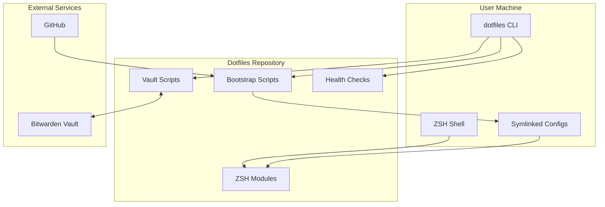
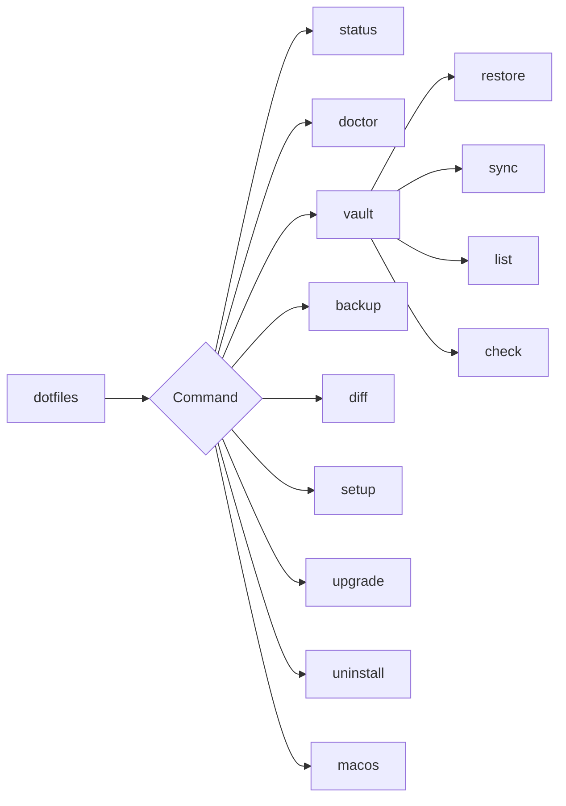
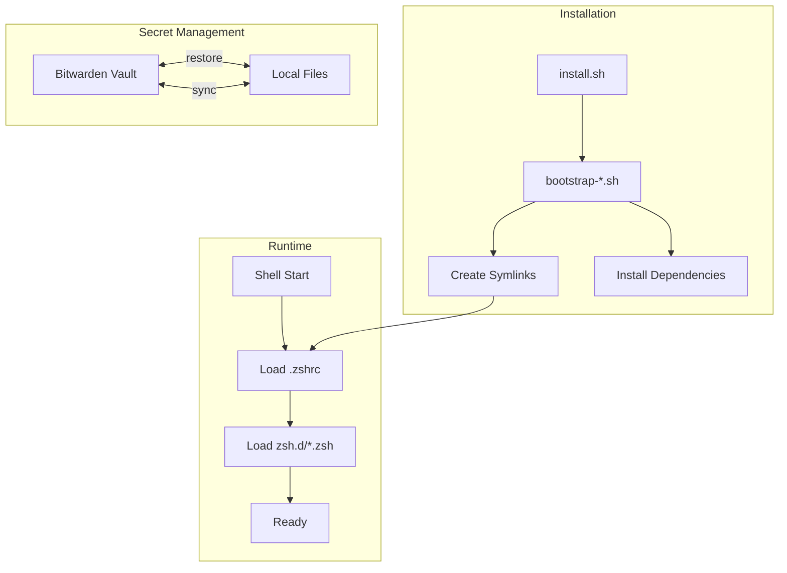
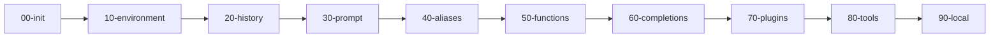
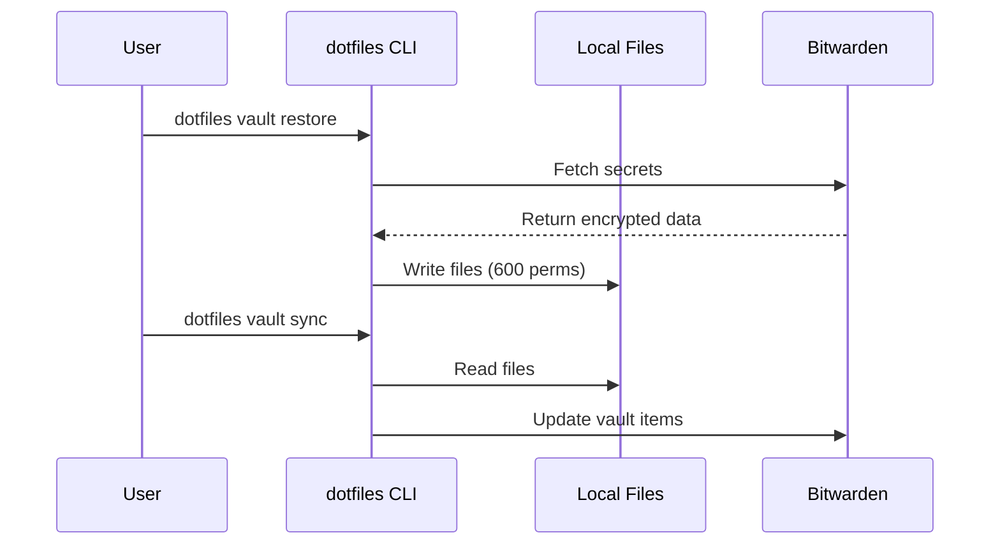
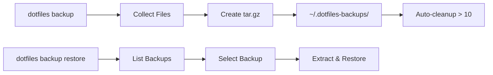
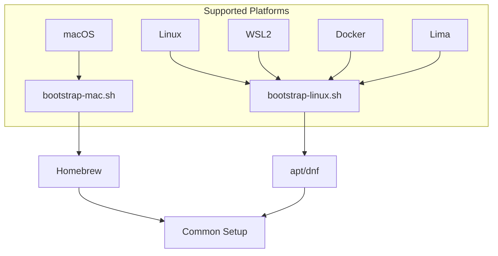

# Architecture

This page describes the high-level architecture and component interactions of the dotfiles system.

## System Overview



## Component Architecture

### CLI Entry Point

The unified `dotfiles` command provides a single entry point for all operations:



### File Flow



## Directory Structure

```
dotfiles/
├── install.sh              # One-line installer
├── bootstrap/              # Platform bootstrap scripts
│   ├── bootstrap-mac.sh    # macOS setup
│   ├── bootstrap-linux.sh  # Linux/WSL setup
│   ├── bootstrap-dotfiles.sh # Symlink setup
│   └── _common.sh          # Shared bootstrap functions
├── bin/                    # CLI tools
│   ├── dotfiles-doctor     # Health checks
│   ├── dotfiles-drift      # Vault comparison
│   ├── dotfiles-diff       # Preview changes
│   ├── dotfiles-backup     # Backup/restore
│   ├── dotfiles-setup      # Setup wizard
│   ├── dotfiles-uninstall  # Clean removal
│   └── dotfiles-metrics    # Show metrics
│
├── zsh/
│   ├── .zshrc              # Main entry (symlinked)
│   ├── .p10k.zsh           # Powerlevel10k theme
│   ├── completions/        # Tab completions
│   │   └── _dotfiles       # CLI completions
│   └── zsh.d/              # Modular config
│       ├── 00-init.zsh
│       ├── 10-environment.zsh
│       ├── 20-history.zsh
│       ├── 30-prompt.zsh
│       ├── 40-aliases.zsh  # dotfiles command
│       ├── 50-functions.zsh
│       ├── 60-completions.zsh
│       ├── 70-plugins.zsh
│       ├── 80-tools.zsh
│       └── 90-local.zsh
│
├── vault/
│   ├── _common.sh          # Shared definitions
│   ├── restore.sh          # Restore secrets
│   ├── sync-to-vault.sh
│   └── restore-*.sh        # Category restores
│
├── macos/
│   └── settings.sh         # macOS defaults
│
├── claude/
│   └── commands/           # Slash commands
│
└── docs/                   # Documentation site
```

## ZSH Module Load Order

The modular ZSH configuration loads files in numbered order:



| Module | Purpose |
|--------|---------|
| `00-init.zsh` | Strict mode, basic setup |
| `10-environment.zsh` | PATH, environment variables |
| `20-history.zsh` | History configuration |
| `30-prompt.zsh` | Powerlevel10k prompt |
| `40-aliases.zsh` | Shell aliases, `dotfiles` command |
| `50-functions.zsh` | Shell functions, `status` |
| `60-completions.zsh` | Tab completion setup |
| `70-plugins.zsh` | ZSH plugins |
| `80-tools.zsh` | Tool integrations (nvm, etc.) |
| `90-local.zsh` | Machine-specific overrides |

## Vault System

The vault system provides bidirectional sync with Bitwarden:



### Protected Items

The vault system protects certain items from accidental deletion:

- SSH keys and config
- AWS credentials
- Git configuration
- Environment secrets

### Vault Item Schema

Each vault item follows a consistent schema:

```json
{
  "name": "dotfiles-item-name",
  "type": 2,
  "notes": "item content here",
  "fields": [
    {"name": "type", "value": "config"},
    {"name": "path", "value": "$HOME/.config/file"}
  ]
}
```

## Health Check System

The `dotfiles doctor` command validates system state:


## Backup System

The backup system creates timestamped archives:



## Platform Support



## Data Flow Summary

| Flow | Source | Destination | Command |
|------|--------|-------------|---------|
| Install | GitHub | Local | `curl ... \| bash` |
| Bootstrap | Scripts | System | `dotfiles setup` |
| Restore | Bitwarden | Local | `dotfiles vault restore` |
| Sync | Local | Bitwarden | `dotfiles vault sync` |
| Backup | Config | Archive | `dotfiles backup` |
| Restore | Archive | Config | `dotfiles backup restore` |
| Upgrade | GitHub | Local | `dotfiles upgrade` |
| Remove | Local | (deleted) | `dotfiles uninstall` |
