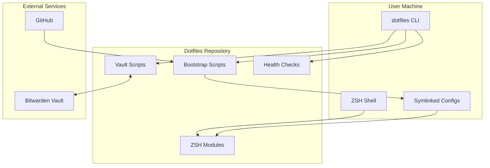
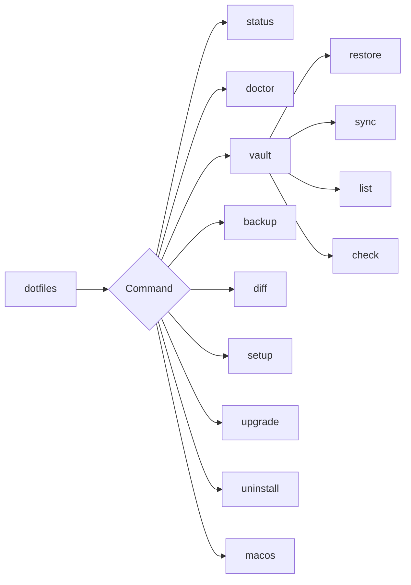
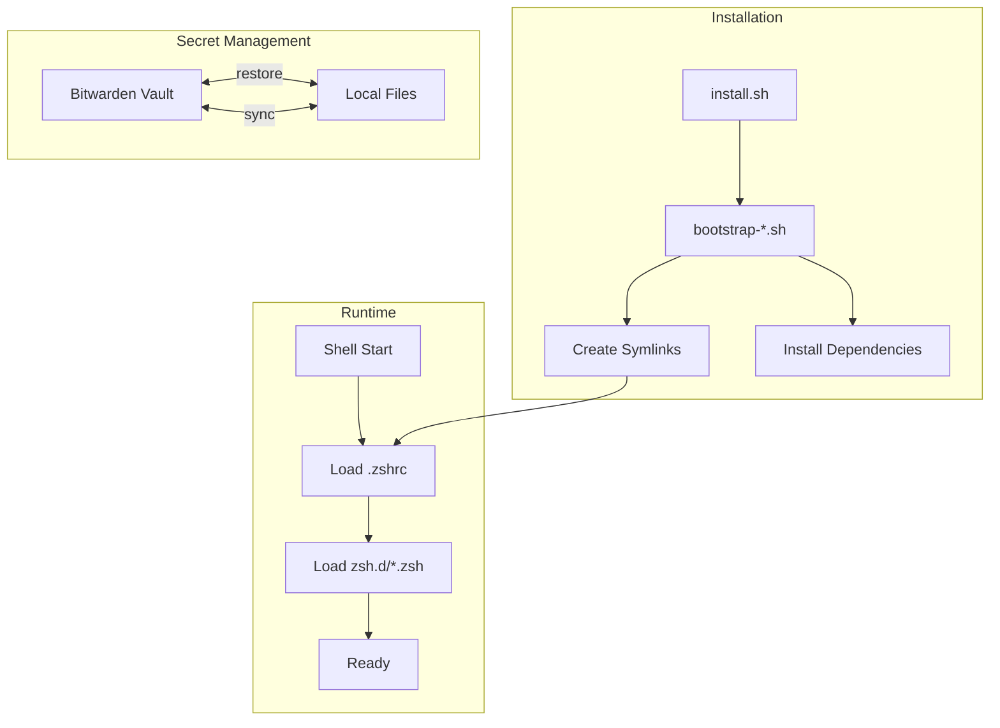
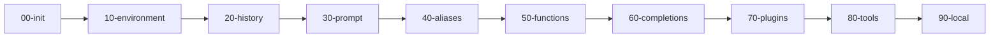
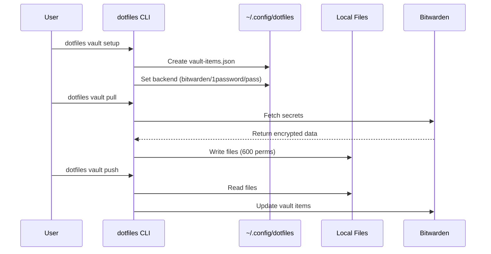
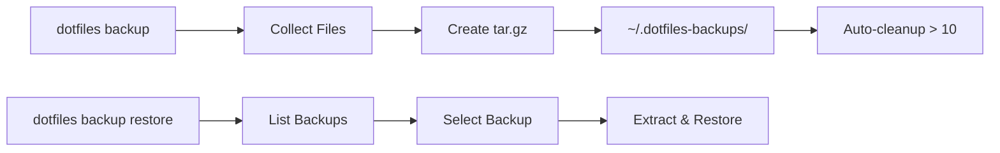
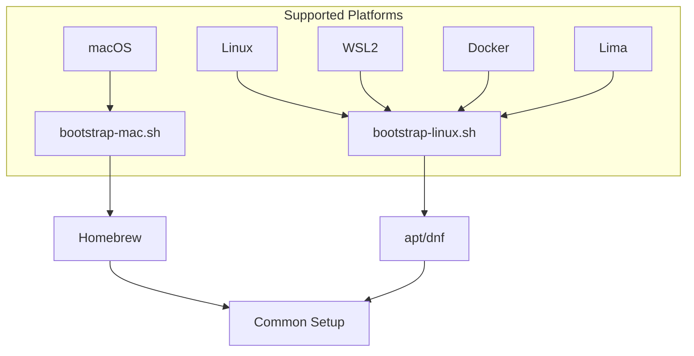

# Architecture

This page describes the high-level architecture and component interactions of the dotfiles system.

## System Overview



## Modular Architecture

**Everything is optional except shell config.** The system is designed to be fully modular, allowing users to pick only the components they need.

### Core vs. Optional Components

| Component | Type | Skip Method | Details |
|-----------|------|-------------|---------|
| **Shell Config** | **REQUIRED** | Cannot skip | ZSH configuration, plugins, prompt |
| **Homebrew + Packages** | Optional | `--minimal` flag | 80+ CLI tools (fzf, ripgrep, bat, etc.) |
| **Vault System** | Optional | Select "Skip" in wizard or `--minimal` | Multi-backend secrets (Bitwarden/1Password/pass) |
| **/workspace Symlink** | Optional | `SKIP_WORKSPACE_SYMLINK=true` | For portable Claude sessions |
| **Claude Integration** | Optional | `SKIP_CLAUDE_SETUP=true` or `--minimal` | dotclaude + hooks + settings |
| **Template Engine** | Optional | Don't run `dotfiles template` | Machine-specific configs |

### Install Modes

```bash
# Full install - Everything (recommended for Claude Code users)
curl -fsSL [...]/install.sh | bash && dotfiles setup

# Minimal install - Shell config only
curl -fsSL [...]/install.sh | bash -s -- --minimal

# Custom install - Use environment variables
SKIP_WORKSPACE_SYMLINK=true ./bootstrap/bootstrap-mac.sh
SKIP_CLAUDE_SETUP=true ./bootstrap/bootstrap-linux.sh
```

### Environment Variables

All optional components can be controlled via environment variables:

| Variable | Effect | Use Case |
|----------|--------|----------|
| `--minimal` | Skip Homebrew, vault, Claude, /workspace | Minimal shell-only install |
| `BREWFILE_TIER=minimal` | Install only essentials (18 packages, ~2 min) | CI/CD, servers, containers |
| `BREWFILE_TIER=enhanced` | Modern tools without containers (43 packages, ~5 min) | Developer workstations **← RECOMMENDED** |
| `BREWFILE_TIER=full` | Everything including Docker/Node (61 packages, ~10 min) | Full-stack development |
| `SKIP_WORKSPACE_SYMLINK=true` | Skip `/workspace` symlink | Single-machine setups |
| `SKIP_CLAUDE_SETUP=true` | Skip Claude Code integration | Non-Claude workflows |
| `DOTFILES_OFFLINE=1` | Skip all vault operations | Air-gapped/offline environments |
| `DOTFILES_SKIP_DRIFT_CHECK=1` | Skip drift detection | CI/automation pipelines |

**Note:** The `dotfiles setup` wizard now presents tier selection interactively. Environment variables are available for advanced/automated setups.

### Component Dependencies

```mermaid
graph TD
    SHELL[Shell Config<br/>REQUIRED]
    BREW[Homebrew + Packages<br/>optional]
    VAULT[Vault System<br/>optional]
    WORKSPACE[/workspace Symlink<br/>optional]
    CLAUDE[Claude Integration<br/>optional]
    TEMPLATE[Template Engine<br/>optional]

    SHELL -.->|uses if present| BREW
    SHELL -.->|uses if present| VAULT
    CLAUDE -.->|uses if present| WORKSPACE
    TEMPLATE -.->|independent| SHELL

    style SHELL fill:#4CAF50
    style BREW fill:#FFC107
    style VAULT fill:#FFC107
    style WORKSPACE fill:#FFC107
    style CLAUDE fill:#FFC107
    style TEMPLATE fill:#FFC107
```

**Key Design Principles:**
- **No hard dependencies** - Optional components gracefully degrade if missing
- **Enable later** - Started minimal? Run `dotfiles setup` to add features
- **Progressive disclosure** - Setup wizard guides you through choices
- **Safe defaults** - Full install gives best experience, minimal still works

## Component Architecture

### CLI Entry Point

The unified `dotfiles` command provides a single entry point for all operations:



### File Flow



## Directory Structure

```
dotfiles/
├── install.sh              # One-line installer
├── bootstrap/              # Platform bootstrap scripts
│   ├── bootstrap-mac.sh    # macOS setup
│   ├── bootstrap-linux.sh  # Linux/WSL setup
│   ├── bootstrap-dotfiles.sh # Symlink setup
│   └── _common.sh          # Shared bootstrap functions
├── bin/                    # CLI tools
│   ├── dotfiles-doctor     # Health checks
│   ├── dotfiles-drift      # Vault comparison
│   ├── dotfiles-diff       # Preview changes
│   ├── dotfiles-backup     # Backup/restore
│   ├── dotfiles-setup      # Setup wizard
│   ├── dotfiles-migrate    # v3.0 migration orchestrator
│   ├── dotfiles-migrate-config    # INI→JSON config migration
│   ├── dotfiles-migrate-vault-schema # v2→v3 vault schema migration
│   ├── dotfiles-uninstall  # Clean removal
│   └── dotfiles-metrics    # Show metrics
│
├── zsh/
│   ├── .zshrc              # Main entry (symlinked)
│   ├── .p10k.zsh           # Powerlevel10k theme
│   ├── completions/        # Tab completions
│   │   └── _dotfiles       # CLI completions
│   └── zsh.d/              # Modular config
│       ├── 00-init.zsh
│       ├── 10-environment.zsh
│       ├── 20-history.zsh
│       ├── 30-prompt.zsh
│       ├── 40-aliases.zsh  # dotfiles command
│       ├── 50-functions.zsh
│       ├── 60-completions.zsh
│       ├── 70-plugins.zsh
│       ├── 80-tools.zsh
│       └── 90-local.zsh
│
├── lib/                    # Shared libraries
│   ├── _logging.sh         # Logging functions
│   ├── _config.sh          # JSON config abstraction (v3.0)
│   ├── _state.sh           # Setup state management
│   ├── _vault.sh           # Vault abstraction layer
│   └── _templates.sh       # Template engine
│
├── vault/
│   ├── _common.sh          # Config loader & validation
│   ├── vault-items.example.json # Example config template
│   ├── restore.sh          # Restore secrets
│   ├── sync-to-vault.sh
│   └── restore-*.sh        # Category restores
│
├── macos/
│   └── settings.sh         # macOS defaults
│
├── claude/
│   └── commands/           # Slash commands
│
└── docs/                   # Documentation site
```

## ZSH Module Load Order

The modular ZSH configuration loads files in numbered order:



| Module | Purpose |
|--------|---------|
| `00-init.zsh` | Strict mode, basic setup |
| `10-environment.zsh` | PATH, environment variables |
| `20-history.zsh` | History configuration |
| `30-prompt.zsh` | Powerlevel10k prompt |
| `40-aliases.zsh` | Shell aliases, `dotfiles` command |
| `50-functions.zsh` | Shell functions, `status` |
| `60-completions.zsh` | Tab completion setup |
| `70-plugins.zsh` | ZSH plugins |
| `80-tools.zsh` | Tool integrations (nvm, etc.) |
| `90-local.zsh` | Machine-specific overrides |

## Vault System

The vault system provides bidirectional sync with multiple backends (Bitwarden, 1Password, pass).

### Configuration

Vault items are defined in a user-editable config file:

```
~/.config/dotfiles/vault-items.json    # v3.0 schema (single secrets[] array)
~/.config/dotfiles/config.json         # v3.0 config (vault backend, state, paths)
```

**v3.0 Schema** uses a single `secrets[]` array instead of separate `ssh_keys`, `vault_items`, `syncable_items` objects. This eliminates duplication and provides per-item control for sync, backup, and required status.

See `vault/vault-items.example.json` for the template. Run `dotfiles migrate` to upgrade from v2.x.

### Schema Validation (v3.0+)

The vault system validates `vault-items.json` before all sync operations:

```bash
dotfiles vault validate  # Manual validation
```

**Automatic validation:**
- Before `dotfiles vault push` operations
- Before `dotfiles vault pull` operations
- During setup wizard vault configuration phase

**Validates:**
- ✅ Valid JSON syntax
- ✅ Required fields (path, required, type)
- ✅ Valid type values ("file" or "sshkey")
- ✅ Naming conventions (capital letter start)
- ✅ Path format (~, /, or $ prefix)

**Interactive error recovery:**
If validation fails during setup, offers to open editor for immediate fixes with automatic re-validation after save.

### Data Flow



### Protected Items

The vault system protects certain items from accidental deletion:

- SSH keys and config
- AWS credentials
- Git configuration
- Environment secrets

### Vault Item Schema

Each vault item follows a consistent schema:

```json
{
  "name": "dotfiles-item-name",
  "type": 2,
  "notes": "item content here",
  "fields": [
    {"name": "type", "value": "config"},
    {"name": "path", "value": "$HOME/.config/file"}
  ]
}
```

## Setup Wizard (v3.0+)

The interactive setup wizard (`dotfiles setup`) guides users through installation with visual feedback:

### Progress Visualization

```
╔═══════════════════════════════════════════════════════════════╗
║ Step 3 of 6: Vault Configuration
╠═══════════════════════════════════════════════════════════════╣
║ ██████████░░░░░░░░░░ 50%
╚═══════════════════════════════════════════════════════════════╝
```

**Features:**
- **Unicode progress bars** - 20-character bar with █ (completed) and ░ (remaining)
- **Step counter** - Shows current step and total steps
- **Percentage indicator** - Exact completion percentage
- **Overview display** - All steps shown at beginning
- **Division by zero protection** - Guards against edge cases
- **Overflow protection** - Clamps progress to valid range

**Setup phases:**
1. Symlinks - Shell configuration
2. Packages - Homebrew installation
3. Vault - Backend selection
4. Secrets - Credential restoration
5. Claude Code - Optional integration
6. Templates - Machine-specific configs

### State Persistence

State is saved to `~/.config/dotfiles/config.json`:
- Setup completion status per phase
- User preferences (vault backend, package tier)
- Can resume if interrupted

See [State Management](state-management.md) for details.

## Health Check System

The `dotfiles doctor` command validates system state:


## Backup System

The backup system creates timestamped archives:



## Platform Support



## Data Flow Summary

| Flow | Source | Destination | Command |
|------|--------|-------------|---------|
| Install | GitHub | Local | `curl ... \| bash` |
| Bootstrap | Scripts | System | `dotfiles setup` |
| Pull | Bitwarden | Local | `dotfiles vault pull` |
| Push | Local | Bitwarden | `dotfiles vault push` |
| Backup | Config | Archive | `dotfiles backup` |
| Restore | Archive | Config | `dotfiles backup restore` |
| Upgrade | GitHub | Local | `dotfiles upgrade` |
| Remove | Local | (deleted) | `dotfiles uninstall` |
