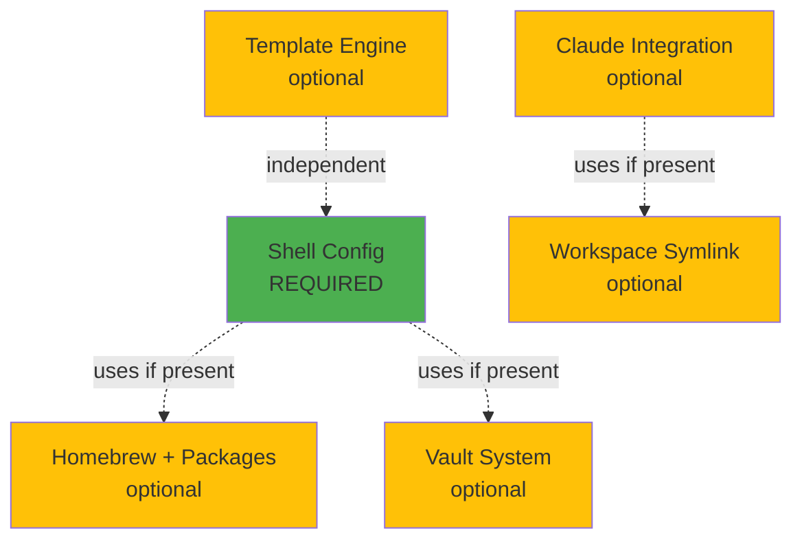

# Architecture

This page describes the architecture of blackdot—the systems that control how features are loaded, configured, and composed.

## Framework Architecture

Blackdot is a **Go-first** framework with shell integration:

1. **Feature Registry** (`internal/feature/registry.go`) - Modular control plane implemented in Go
2. **Go CLI** (`internal/cli/*.go`) - 20+ Cobra commands for all operations
3. **Vaultmux Library** - External Go library for multi-vault support (Bitwarden/1Password/pass)
4. **Shell Layer** (`zsh/`, `powershell/`) - Aliases and integrations that call the Go binary

**Key principle:** Core functionality lives in Go. Shell provides convenience wrappers and tool integrations.

These systems work together to provide a modular, extensible, cross-platform foundation for AI-assisted development.

## System Overview


## Modular Architecture

**Everything is optional except shell config.** The system is designed to be fully modular, allowing users to pick only the components they need. The **feature registry** (`internal/feature/registry.go`) provides centralized control over all optional functionality.

### Feature Registry

The feature registry is the central system for enabling and disabling optional features:

```bash
# List all features
blackdot features

# Enable a feature
blackdot features enable vault --persist

# Use a preset
blackdot features preset developer --persist
```

**Available Features:**

| Category | Features |
|----------|----------|
| **Core** | `shell` (always enabled) |
| **Optional** | `workspace_symlink`, `claude_integration`, `vault`, `encryption`, `hooks`, `templates`, `aws_helpers`, `git_hooks`, `drift_check`, `backup_auto`, `health_metrics`, `macos_settings` |
| **Integration** | `modern_cli`, `nvm_integration`, `sdkman_integration`, `dotclaude` |

**Presets:**

| Preset | Features Enabled |
|--------|------------------|
| `minimal` | `shell` |
| `developer` | `shell`, `vault`, `aws_helpers`, `git_hooks`, `modern_cli` |
| `claude` | `shell`, `workspace_symlink`, `claude_integration`, `vault`, `git_hooks`, `modern_cli` |
| `full` | All features |

See [Feature Registry](features.md) for complete documentation.

### Configuration Layers

The configuration layer system provides a 5-layer priority hierarchy for settings:

```
Priority (highest to lowest):
┌─────────────────────────────────────────────────┐
│ 1. Environment Variables   (session-specific)   │
├─────────────────────────────────────────────────┤
│ 2. Project Config          (.dotfiles.local)    │
├─────────────────────────────────────────────────┤
│ 3. Machine Config          (machine.json)       │
├─────────────────────────────────────────────────┤
│ 4. User Config             (config.json)        │
├─────────────────────────────────────────────────┤
│ 5. Defaults                (built-in)           │
└─────────────────────────────────────────────────┘
```

```bash
# Layer-aware config access
config_get_layered "vault.backend"  # Checks all layers in priority order

# Show where a setting comes from
blackdot config layers              # Displays effective config with sources
```

**Layer Files:**

| Layer | File | Use Case |
|-------|------|----------|
| Environment | `$BLACKDOT_*` vars | CI/CD, temporary overrides |
| Project | `.blackdot.local` | Repository-specific settings |
| Machine | `~/.config/blackdot/machine.json` | Per-machine preferences |
| User | `~/.config/blackdot/config.json` | User preferences |
| Defaults | `internal/config/config.go` | Built-in fallbacks |

### CLI Feature Awareness

The Go CLI adapts based on enabled features:

```bash
blackdot help  # Shows only commands for enabled features
```

**Behavior:**
- Commands for disabled features are hidden from help output
- Tab completion excludes disabled feature commands
- Running a disabled command shows an enable hint

```bash
# Example: vault feature disabled
$ blackdot vault pull
Feature 'vault' is not enabled.
Run: blackdot features enable vault
```

**Implementation:**

Feature checks are implemented in Go (`internal/cli/*.go`):
```go
// Each command checks its feature before running
func newVaultCmd() *cobra.Command {
    // Feature check happens in RunE
    if !registry.IsEnabled("vault") {
        return fmt.Errorf("Feature 'vault' is not enabled...")
    }
}
```

### Core vs. Optional Components

| Component | Type | Feature Flag | Skip Method | Details |
|-----------|------|--------------|-------------|---------|
| **Shell Config** | **REQUIRED** | `shell` | Cannot skip | ZSH configuration, plugins, prompt |
| **Homebrew + Packages** | Optional | - | `--minimal` flag | 80+ CLI tools (fzf, ripgrep, bat, etc.) |
| **Vault System** | Optional | `vault` | Select "Skip" in wizard or `--minimal` | Multi-backend secrets (Bitwarden/1Password/pass) |
| **/workspace Symlink** | Optional | `workspace_symlink` | `SKIP_WORKSPACE_SYMLINK=true` | For portable Claude sessions |
| **Claude Integration** | Optional | `claude_integration` | `SKIP_CLAUDE_SETUP=true` or `--minimal` | dotclaude + hooks + settings |
| **Template Engine** | Optional | `templates` | Don't run `blackdot template` | Machine-specific configs |

### Install Modes

```bash
# Full install - Everything (recommended for Claude Code users)
curl -fsSL [...]/install.sh | bash

# Minimal install - Shell config only
curl -fsSL [...]/install.sh | bash -s -- --minimal

# Custom install - Use environment variables
SKIP_WORKSPACE_SYMLINK=true ./bootstrap/bootstrap-mac.sh
SKIP_CLAUDE_SETUP=true ./bootstrap/bootstrap-linux.sh
```

### Environment Variables

All optional components can be controlled via environment variables:

| Variable | Effect | Use Case |
|----------|--------|----------|
| `--minimal` | Skip Homebrew, vault, Claude, /workspace | Minimal shell-only install |
| `BREWFILE_TIER=minimal` | Install only essentials (18 packages, ~2 min) | CI/CD, servers, containers |
| `BREWFILE_TIER=enhanced` | Modern tools without containers (43 packages, ~5 min) | Developer workstations **← RECOMMENDED** |
| `BREWFILE_TIER=full` | Everything including Docker/Node (61 packages, ~10 min) | Full-stack development |
| `SKIP_WORKSPACE_SYMLINK=true` | Skip `/workspace` symlink | Single-machine setups |
| `SKIP_CLAUDE_SETUP=true` | Skip Claude Code integration | Non-Claude workflows |
| `BLACKDOT_OFFLINE=1` | Skip all vault operations | Air-gapped/offline environments |
| `BLACKDOT_SKIP_DRIFT_CHECK=1` | Skip drift detection | CI/automation pipelines |

**Note:** The `blackdot setup` wizard now presents tier selection interactively. Environment variables are available for advanced/automated setups.

### Component Dependencies



**Key Design Principles:**
- **No hard dependencies** - Optional components gracefully degrade if missing
- **Enable later** - Started minimal? Run `blackdot setup` to add features
- **Progressive disclosure** - Setup wizard guides you through choices
- **Safe defaults** - Full install gives best experience, minimal still works

## Component Architecture

### CLI Entry Point

The unified `blackdot` Go binary provides a single entry point for all operations:


### File Flow


## Directory Structure

```
blackdot/
├── install.sh                    # Unix installer
├── install-windows.ps1           # Windows PowerShell installer
├── Install.ps1                   # Legacy Windows installer
├── doc.go                        # Go package documentation
│
├── cmd/blackdot/                 # Go CLI entry point
│   └── main.go                   # Binary entry point
│
├── internal/                     # Go implementation
│   ├── cli/                      # Cobra commands (20+ files)
│   │   ├── root.go               # Root command
│   │   ├── features.go           # Feature management
│   │   ├── vault.go              # Vault operations (vaultmux)
│   │   ├── doctor.go             # Health checks
│   │   ├── status.go             # System status
│   │   ├── backup.go             # Backup/restore
│   │   ├── setup.go              # Setup wizard
│   │   ├── hook.go               # Hook management
│   │   ├── config.go             # Config management
│   │   ├── shell_init.go         # Shell initialization code
│   │   ├── tools_*.go            # Developer tool integrations
│   │   └── ...                   # Other commands
│   ├── feature/                  # Feature registry
│   │   ├── registry.go           # Registry implementation
│   │   ├── registry_test.go      # Registry tests
│   │   └── presets.go            # Preset configurations
│   ├── config/                   # Configuration management
│   │   ├── config.go             # JSON config read/write
│   │   └── config_test.go        # Config tests
│   ├── shell/                    # Shell utilities
│   │   └── shell.go              # Shell detection
│   └── template/                 # Template engine
│       └── raymond_engine.go     # Handlebars templates
│
├── bin/                          # Compiled Go binary
│   └── blackdot                  # The CLI (or blackdot.exe on Windows)
│
├── lib/                          # Minimal shell helpers
│   ├── _colors.sh                # Color output functions
│   ├── _hooks.sh                 # Hook system helpers
│   └── _logging.sh               # Shell logging (info, pass, warn, fail)
│
├── zsh/                          # Zsh config (macOS/Linux)
│   ├── .zshrc                    # Main entry (symlinked to ~/)
│   ├── .p10k.zsh                 # Powerlevel10k theme
│   ├── completions/              # Tab completions
│   │   └── _blackdot             # CLI completions
│   └── zsh.d/                    # Modular config (18 files)
│       ├── 00-init.zsh           # Shell initialization, feature_enabled()
│       ├── 10-plugins.zsh        # ZSH plugins
│       ├── 20-env.zsh            # Environment variables
│       ├── 30-tools.zsh          # Tool PATH setup
│       ├── 40-aliases.zsh        # Aliases, blackdot command
│       ├── 50-functions.zsh      # Shell functions
│       ├── 60-aws.zsh            # AWS/CDK integrations
│       ├── 62-rust.zsh           # Rust tools
│       ├── 63-go.zsh             # Go tools
│       ├── 64-python.zsh         # Python/uv tools
│       ├── 65-ssh.zsh            # SSH tools
│       ├── 66-docker.zsh         # Docker tools
│       ├── 70-claude.zsh         # Claude Code integration
│       ├── 80-git.zsh            # Git aliases
│       ├── 90-integrations.zsh   # NVM, SDKMAN
│       └── 99-local.zsh.example  # Local overrides template
│
├── powershell/                   # PowerShell module (Windows)
│   ├── Blackdot.psm1             # Main module
│   ├── Blackdot.psd1             # Module manifest
│   ├── Install-Blackdot.ps1      # Module installer
│   └── Install-Packages.ps1      # Winget package installer
│
├── vault/                        # Vault configuration
│   ├── README.md                 # Vault documentation
│   └── vault-items.example.json  # Example vault schema
│
├── claude/                       # Claude Code integration
│   ├── hooks/                    # Git safety hooks
│   │   ├── git-sync-check.ps1    # PowerShell version
│   │   ├── block-dangerous-git.ps1
│   │   └── *.sh                  # Bash/Zsh versions
│   └── commands/                 # Slash commands
│
└── docs/                         # Docsify documentation site
    ├── index.html                # Docsify config
    ├── _sidebar.md               # Navigation
    ├── _coverpage.md             # Landing page
    ├── README.md                 # Homepage
    └── *.md                      # Documentation pages (29 files)
```

**Key changes from shell-based architecture:**
- `cmd/` and `internal/` contain all Go implementation
- `bin/` contains only the compiled Go binary
- `lib/` reduced to 3 files (colors, hooks, logging)
- No shell scripts in `bin/`, `vault/`, or elsewhere - all functionality in Go
- Shell layer (`zsh.d/`) calls Go binary for all operations

## ZSH Module Load Order

The modular ZSH configuration loads files in numbered order:


| Module | Purpose |
|--------|---------|
| `00-init.zsh` | Strict mode, basic setup |
| `10-environment.zsh` | PATH, environment variables |
| `20-history.zsh` | History configuration |
| `30-prompt.zsh` | Powerlevel10k prompt |
| `40-aliases.zsh` | Shell aliases, `blackdot` command |
| `50-functions.zsh` | Shell functions, `status` |
| `60-completions.zsh` | Tab completion setup |
| `70-plugins.zsh` | ZSH plugins |
| `80-tools.zsh` | Tool integrations (nvm, etc.) |
| `90-local.zsh` | Machine-specific overrides |

## PowerShell Module (Windows)

The PowerShell module provides equivalent functionality for Windows users:

```powershell
Import-Module Blackdot
```

| Component | Purpose |
|-----------|---------|
| `Blackdot.psm1` | Main module with all functions |
| `Blackdot.psd1` | Module manifest (version, exports) |
| Hooks | `Invoke-BlackdotHook`, `Enable-BlackdotHooks` |
| Git aliases | `gst`, `gd`, `gco`, `gcm`, `gp`, `gl` |
| Tool wrappers | `aws-*`, `docker-*`, `claude-*` |
| Navigation | `z` (zoxide), `fnm-*` (Node.js) |

**Installation:**
```powershell
irm https://raw.githubusercontent.com/blackwell-systems/blackdot/main/install-windows.ps1 | iex
```

Both Zsh and PowerShell modules share the same aliases where possible, so commands like `gst` (git status) work in both shells.

## Vault System

The vault system (`internal/cli/vault.go` + `vaultmux` library) provides bidirectional sync with multiple backends (Bitwarden, 1Password, pass). All vault operations are implemented in Go.

### Configuration

Vault items are defined in a user-editable config file:

```
~/.config/blackdot/vault-items.json    # Vault schema (single secrets[] array)
~/.config/blackdot/config.json         # Config (vault backend, state, paths)
```

**Vault Schema:** Uses a single `secrets[]` array for all secrets. Each item has granular control for sync, backup, and required status.

See `vault/vault-items.example.json` for the template.

### Schema Validation

The vault system validates `vault-items.json` before all sync operations:

```bash
blackdot vault validate  # Manual validation
```

**Automatic validation:**
- Before `blackdot vault push` operations
- Before `blackdot vault pull` operations
- During setup wizard vault configuration phase

**Validates:**
- ✅ Valid JSON syntax
- ✅ Required fields (path, required, type)
- ✅ Valid type values ("file" or "sshkey")
- ✅ Naming conventions (capital letter start)
- ✅ Path format (~, /, or $ prefix)

**Interactive error recovery:**
If validation fails during setup, offers to open editor for immediate fixes with automatic re-validation after save.

### Data Flow


### Protected Items

The vault system protects certain items from accidental deletion:

- SSH keys and config
- AWS credentials
- Git configuration
- Environment secrets

### Vault Item Schema

Each vault item follows a consistent schema:

```json
{
  "name": "dotfiles-item-name",
  "type": 2,
  "notes": "item content here",
  "fields": [
    {"name": "type", "value": "config"},
    {"name": "path", "value": "$HOME/.config/file"}
  ]
}
```

## Hook System

The hook system (`internal/cli/hook.go` + `lib/_hooks.sh`) allows custom behavior at lifecycle events without modifying core scripts. Go handles registration and execution, while shell helpers provide convenience functions.

### Hook Points

| Category | Hook Points |
|----------|-------------|
| **Lifecycle** | `pre_install`, `post_install`, `pre_bootstrap`, `post_bootstrap`, `pre_upgrade`, `post_upgrade` |
| **Vault** | `pre_vault_pull`, `post_vault_pull`, `pre_vault_push`, `post_vault_push` |
| **Doctor** | `pre_doctor`, `post_doctor`, `doctor_check` |
| **Shell** | `shell_init`, `shell_exit`, `directory_change` |
| **Setup** | `pre_setup_phase`, `post_setup_phase`, `setup_complete` |

### Registration Methods

1. **File-based** - Scripts in `~/.config/blackdot/hooks/<hook_point>/`
2. **JSON config** - Hooks defined in `~/.config/blackdot/hooks.json`
3. **Inline** - Registered programmatically via `hook_register`

### Integration Points


See [Hook System](hooks.md) for complete documentation.

## Setup Wizard

The interactive setup wizard (`blackdot setup`) guides users through installation with visual feedback:

### Progress Visualization

```
╔═══════════════════════════════════════════════════════════════╗
║ Step 4 of 7: Vault Configuration
╠═══════════════════════════════════════════════════════════════╣
║ ██████████░░░░░░░░░░ 57%
╚═══════════════════════════════════════════════════════════════╝
```

**Features:**
- **Unicode progress bars** - 20-character bar with █ (completed) and ░ (remaining)
- **Step counter** - Shows current step and total steps
- **Percentage indicator** - Exact completion percentage
- **Overview display** - All steps shown at beginning
- **Division by zero protection** - Guards against edge cases
- **Overflow protection** - Clamps progress to valid range

**Setup phases:**
1. Workspace - Configure workspace directory target
2. Symlinks - Shell configuration
3. Packages - Homebrew installation (tier selection)
4. Vault - Backend selection
5. Secrets - Credential restoration
6. Claude Code - Optional integration
7. Templates - Machine-specific configs

### State Persistence

State is saved to `~/.config/blackdot/config.json`:
- Setup completion status per phase
- User preferences (vault backend, package tier)
- Can resume if interrupted

See [State Management](state-management.md) for details.

## Health Check System

The `blackdot doctor` command validates system state:


## Backup System

The backup system creates timestamped archives:


## Platform Support


## Data Flow Summary

| Flow | Source | Destination | Command |
|------|--------|-------------|---------|
| Install | GitHub | Local | `curl ... \| bash` |
| Bootstrap | Scripts | System | `blackdot setup` |
| Pull | Bitwarden | Local | `blackdot vault pull` |
| Push | Local | Bitwarden | `blackdot vault push` |
| Backup | Config | Archive | `blackdot backup` |
| Restore | Archive | Config | `blackdot backup restore` |
| Upgrade | GitHub | Local | `blackdot upgrade` |
| Remove | Local | (deleted) | `blackdot uninstall` |
