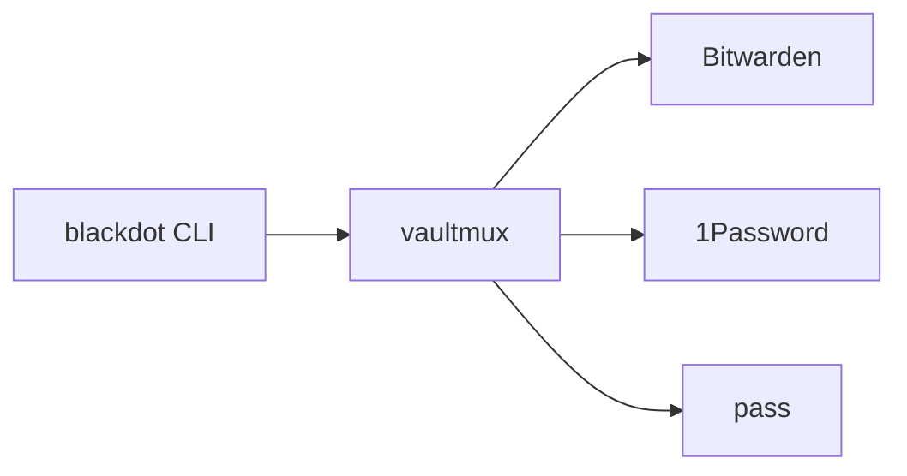

# Vault System

The vault system provides **bidirectional secret management** with multiple vault backends through the `vaultmux` library:

- **Pull** secrets from your vault → local files
- **Push** local changes → your vault
- **Validate** vault item schema
- **Backend abstraction** supporting Bitwarden, 1Password, and pass

---

## Supported Backends

| Backend | CLI Tool | Status | Description |
|---------|----------|--------|-------------|
| **Bitwarden** | `bw` | Default | Full-featured, cloud-synced |
| **1Password** | `op` | Supported | CLI with biometric auth |
| **pass** | `pass` | Supported | GPG-based, git-synced |

### Switching Backends

> **Note:** "Multi-vault" means the system **supports multiple backends**, not that you use them simultaneously. You configure **one active backend at a time**. To switch backends, reconfigure with `blackdot vault setup`.

```bash
# Set your preferred backend (stored in config.json, or override with env var)
export BLACKDOT_VAULT_BACKEND=bitwarden  # default
export BLACKDOT_VAULT_BACKEND=1password
export BLACKDOT_VAULT_BACKEND=pass

# For 1Password, optionally set vault name
export ONEPASSWORD_VAULT=Personal  # default

# For pass, optionally set prefix
export PASS_PREFIX=dotfiles  # default, items stored as dotfiles/Git-Config
```

**Switching backends:**
```bash
blackdot vault setup  # Interactive reconfiguration, updates config.json
```

All `blackdot vault` commands work identically regardless of which backend you've configured.

---

## Quick Reference

### Commands

All vault operations are accessed via the unified `blackdot vault` command:

```bash
blackdot vault setup             # Configure or reconfigure vault backend
blackdot vault pull          # Restore all secrets (checks for local drift first)
blackdot vault pull --force  # Skip drift check, overwrite local changes
blackdot vault push             # Sync local changes to vault
blackdot vault push --all       # Sync all items
blackdot vault sync             # Smart bidirectional sync (auto push/pull)
blackdot vault sync --force-local   # Force push local to vault
blackdot vault sync --force-vault   # Force pull vault to local
blackdot vault create           # Create new vault item
blackdot vault validate         # Validate vault item schema
blackdot vault delete           # Delete vault item
blackdot vault list             # List all vault items
blackdot vault check            # Validate required items exist
```

---

## Vault Schema

```json
{
  "version": 3,
  "secrets": [
    {
      "name": "SSH-GitHub",
      "path": "~/.ssh/id_ed25519",
      "type": "ssh-key",
      "required": true,
      "sync": "always",
      "backup": true
    },
    {
      "name": "Git-Config",
      "path": "~/.gitconfig",
      "type": "file",
      "required": true,
      "sync": "manual",
      "backup": true
    }
  ]
}
```

**Schema Fields:**
- `version` - Schema version (3)
- `secrets[]` - Single flat array of all secrets
- `name` - Unique identifier (used in vault item title)
- `path` - Local file path (supports `~` expansion)
- `type` - `ssh-key`, `file`, or custom
- `required` - `true` = `blackdot vault check` validates existence
- `sync` - `always` (auto-sync) or `manual` (on-demand only)
- `backup` - `true` = include in backups

---

## Backend Setup

### Bitwarden (Default)

```bash
# Install CLI
brew install bitwarden-cli

# Login (one-time)
bw login

# Verify
bw login --check
```

### 1Password

```bash
# Install CLI
brew install --cask 1password-cli

# Sign in (uses biometric on macOS)
op signin

# Set backend
export BLACKDOT_VAULT_BACKEND=1password

# Optionally specify vault
export ONEPASSWORD_VAULT=Personal
```

### pass (Standard Unix Password Manager)

```bash
# Install
brew install pass gnupg

# Initialize with your GPG key
pass init "your-gpg-id@email.com"

# Set backend
export BLACKDOT_VAULT_BACKEND=pass

# Items will be stored under dotfiles/ prefix
# e.g., dotfiles/Git-Config, dotfiles/SSH-Config
```

---

## Location Management

The setup wizard uses location-based organization - you specify where your secrets are stored rather than scanning your entire vault.

| Backend | Location Type | Example |
|---------|---------------|---------|
| Bitwarden | folder | `"dotfiles"` |
| 1Password | vault/tag | `"Personal"` |
| pass | directory | `"dotfiles"` |

The wizard (`blackdot vault setup`) offers three modes:
- **Existing Items** - Import from existing vault location
- **Fresh Start** - Create new items from local files
- **Manual** - Edit `vault-items.json` directly

Location is stored in `vault-items.json`:
```json
{
  "vault_location": { "type": "folder", "value": "dotfiles" }
}
```

---

## Configuration File

Vault items are defined in `~/.config/blackdot/vault-items.json`. Run `blackdot setup` to create it automatically, or copy the example:

```bash
cp vault/vault-items.example.json ~/.config/blackdot/vault-items.json
```

| Section | Purpose |
|---------|---------|
| `vault_items` | All managed items with metadata (path, required, type) |
| `ssh_keys` | Maps vault item names to local SSH key paths |
| `syncable_items` | Items that can sync bidirectionally |

**Item types:** `sshkey` (private + public key) or `file` (plain text config)

---

### Pre-Restore Safety Check

The restore command automatically checks if your local files have changed since the last vault push. This prevents accidental data loss:

```bash
$ blackdot vault pull
[INFO] Checking for local changes before restore...
[WARN] Local files have changed since last vault push:
  - Git-Config (~/.gitconfig)
  - SSH-Config (~/.ssh/config)

Options:
  1. Run 'blackdot vault push' first to save local changes
  2. Run restore with --force to overwrite local changes
  3. Run 'blackdot drift' to see detailed differences

[FAIL] Restore aborted to prevent data loss
```

To skip this check (for automation or when you intentionally want to overwrite):
```bash
# Use --force flag
blackdot vault pull --force

# Or set environment variable
BLACKDOT_SKIP_DRIFT_CHECK=1 blackdot vault pull
```

---

### Offline Mode

For air-gapped environments or vault outages:

```bash
BLACKDOT_OFFLINE=1 blackdot vault pull  # Exits gracefully, keeps local files
```

---

## Architecture

### vaultmux Abstraction Layer

The vault system uses `vaultmux`, a polymorphic secrets manager library that provides a unified API across all backends:



**How it works:**
1. User runs `blackdot vault <command>`
2. Go CLI loads backend based on `BLACKDOT_VAULT_BACKEND` or config.json
3. `vaultmux` provides unified API: `GetItem()`, `CreateItem()`, `UpdateItem()`, `DeleteItem()`
4. Backend-specific code handles CLI differences (bw, op, pass)

### Configuration

```
~/.config/blackdot/
├── config.json           # Vault backend preference
└── vault-items.json      # Item definitions and mappings
```

### Adding a New Backend

New backends are implemented in the `vaultmux` Go library:
- Repository: `github.com/blackwell-systems/vaultmux`
- See vaultmux documentation for backend implementation guide

---

## Common Workflows

### First Time Setup

```bash
# 1. Login to your vault
bw login                    # Bitwarden
op signin                   # 1Password
# (pass uses GPG, no login needed)

# 2. Push your existing secrets to vault
blackdot vault push --all

# 3. Verify items were created
blackdot vault list
```

### New Machine Setup

```bash
# 1. Clone dotfiles
git clone git@github.com:blackwell-systems/blackdot.git ~/workspace/dotfiles
cd ~/workspace/dotfiles

# 2. Bootstrap the system
./bootstrap/bootstrap-mac.sh  # or bootstrap-linux.sh

# 3. Login to your vault
bw login                    # Bitwarden
op signin                   # 1Password
# (pass uses GPG, no login needed)

# 4. Restore all secrets
blackdot vault pull
```

### Daily Operations

```bash
vim ~/.ssh/config              # Edit locally
blackdot vault push SSH-Config # Push to vault
```

---

## Vault Items Structure

**SSH keys** contain private key + public key (in notes field). **Config files** contain full file content.

| Item Name | Local File |
|-----------|------------|
| `SSH-Config` | `~/.ssh/config` |
| `AWS-Config` | `~/.aws/config` |
| `AWS-Credentials` | `~/.aws/credentials` |
| `Git-Config` | `~/.gitconfig` |
| `Environment-Secrets` | `~/.local/env.secrets` |

---

## Template Variables

Template variables (`~/.config/blackdot/template-variables.sh`) customize dotfiles per-machine and can be stored in vault:

```bash
blackdot vault push Template-Variables   # Store in vault
blackdot vault pull                      # Restore on new machine
blackdot template render --all           # Apply templates
```

Priority: XDG config → `templates/_variables.local.sh` → `templates/_variables.sh`

---

## Schema Validation

```bash
blackdot vault validate
```

Validates JSON syntax, required fields, type values, and path formats. Runs automatically before push/pull operations.

**Common errors:**
- `Missing required field: vault_items` → Add `"vault_items": {}`
- `Invalid type "folder"` → Use "file" or "sshkey"
- `Invalid JSON syntax` → Run `jq . ~/.config/blackdot/vault-items.json`

---

## Troubleshooting

### Session Expired

```bash
# Bitwarden: Re-unlock vault
export BW_SESSION="$(bw unlock --raw)"

# Or logout and login
bw logout
bw login

# 1Password: Re-sign in
op signin
```

### Item Not Found

```bash
# List all items to verify name
blackdot vault list

# Check for typos in item name
blackdot vault check
```

### Permission Errors

```bash
# Fix SSH key permissions
chmod 600 ~/.ssh/id_ed25519_*
chmod 644 ~/.ssh/id_ed25519_*.pub
chmod 600 ~/.ssh/config
```

---

## Security Notes

- **Session file** (`.vault-session`) is created with `600` permissions (owner read/write only)
- **SSH private keys** are set to `600` automatically
- **Protected items** (SSH-*, AWS-*, Git-Config) require confirmation before deletion
- **Vault sync** creates backups before overwriting (`.bak-YYYYMMDDHHMMSS`)

---

**Learn More:**
- [Main Documentation](/)
- [Full README](README-FULL.md)
- [GitHub Repository](https://github.com/blackwell-systems/blackdot)
